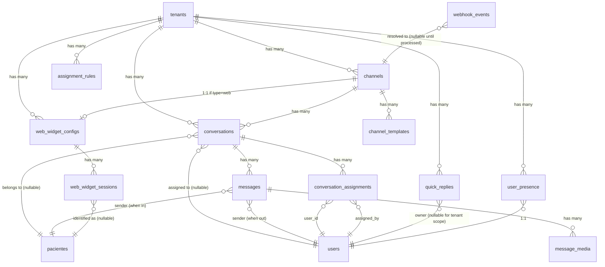

# Data Model: Fase 3 — Atendimento Omnichannel

**Branch**: `003-omnichannel-inbox` | **Data**: 2026-05-11 | **Status**: Phase 1 — completo

12 entidades novas. Schemas seguem convenções das Fases 0–2: PostgreSQL 18, `timestampsTz` + `softDeletesTz` onde aplicável, JSONB nativo, CHECK constraints emulando enum, FK explícitas com `ON DELETE` definido, índices compostos com `tenant_id` como primeira coluna sempre que `BelongsToTenant` scope aplica.

## Convenções gerais

- **Multi-tenancy**: toda tabela (exceto `webhook_events`) tem `tenant_id BIGINT NOT NULL FK→tenants ON DELETE CASCADE` + trait `BelongsToTenant` no Model.
- **Eventos `Auditable`**: alterações sensíveis disparam evento → audit + timeline (listener wildcard Fase 0).
- **Criptografia em repouso**: campos sensíveis usam cast `encrypted` Laravel (`messages.body`, `channels.credentials_encrypted`); mídia em S3 SSE.
- **Imutabilidade**: `messages` e `webhook_events` são append-only do ponto de vista de domínio (UPDATE permitido apenas em campos de status como `delivered_at`, `read_at`); sem trigger PG bloqueante porque status updates são esperados.
- **Timezone**: UTC no DB; exibição BRT.

---

## Diagrama de relações (Mermaid)

---

## 1. `messaging_channels`

Canal externo conectado (WhatsApp via Twilio / Instagram via Meta direto / Web Widget). Cada `channel` é uma instância configurada por tenant.

| Coluna | Tipo | Constraints | Notas |
|---|---|---|---|
| `id` | BIGSERIAL | PK | |
| `tenant_id` | BIGINT | NOT NULL, FK → tenants ON DELETE CASCADE | |
| `type` | VARCHAR(20) | NOT NULL, CHECK IN (`whatsapp`, `instagram`, `web`) | |
| `name` | VARCHAR(100) | NOT NULL | Display name escolhido pelo admin (ex.: "Agendamento", "Marketing") |
| `status` | VARCHAR(20) | NOT NULL, DEFAULT `'ativo'`, CHECK IN (`ativo`, `desconectado`, `invalido`, `expirado`, `degradado`, `suspenso`) | NC-1, AC-4.1.5 |
| `credentials_encrypted` | TEXT | NULL | Cast `encrypted` Laravel — JSON com tokens Twilio/Meta serializado |
| `provider_metadata` | JSONB | NOT NULL, DEFAULT `'{}'::jsonb` | Identificadores externos NÃO sensíveis: `{messaging_service_sid, whatsapp_sender}` (Twilio) ou `{page_id, ig_business_account_id, ig_username}` (Meta) ou `{public_key}` (web) |
| `quality_rating` | VARCHAR(20) | NULL, CHECK IN (`high`, `medium`, `low`, `flagged`) | Apenas WhatsApp; reportado por Twilio webhook |
| `quality_rating_updated_at` | TIMESTAMPTZ | NULL | |
| `last_health_check_at` | TIMESTAMPTZ | NULL | Última vez que `ChannelHealthCheckJob` rodou OK |
| `auto_send_disabled` | BOOLEAN | NOT NULL, DEFAULT `false` | Desabilita envios automáticos quando quality_rating cai (NC-17) |
| `created_at`, `updated_at` | TIMESTAMPTZ | | |
| `deleted_at` | TIMESTAMPTZ | NULL | Soft delete |

**Constraints/Índices**:

- `UNIQUE (tenant_id, type, provider_metadata->>'phone_number_id') WHERE type = 'whatsapp'` — 1 número WhatsApp único por tenant.
- `UNIQUE (tenant_id, type, provider_metadata->>'ig_business_account_id') WHERE type = 'instagram'` — 1 conta Instagram única por tenant.
- `UNIQUE (provider_metadata->>'public_key') WHERE type = 'web'` — chave pública do widget globalmente única.
- `INDEX (tenant_id, type, status)` — listagem por tenant (cardinalidade alta no `tenant_id`).
- `INDEX (status) WHERE status IN ('degradado', 'invalido')` — monitoring (partial index reduz tamanho).

**Justificativa de índices**: queries dominantes são "listar canais ativos do tenant X" (cobrida pelo composto) e "monitor de saúde global de canais degradados" (partial index). UNIQUE com path JSONB usa o operador `->>` indexável quando combinado com `tenant_id`.

---

## 2. `messaging_channel_templates`

Templates aprovados pela Meta (sync read-only via Twilio Content API ou Meta Graph diretamente). Tenant **não cadastra** templates aqui no MVP — só consome (NC-4.c).

| Coluna | Tipo | Constraints | Notas |
|---|---|---|---|
| `id` | BIGSERIAL | PK | |
| `tenant_id` | BIGINT | NOT NULL, FK → tenants ON DELETE CASCADE | |
| `channel_id` | BIGINT | NOT NULL, FK → messaging_channels ON DELETE CASCADE | |
| `provider_template_id` | VARCHAR(100) | NOT NULL | Twilio Content SID (`HXxxxx...`) ou Meta template name |
| `meta_template_name` | VARCHAR(100) | NOT NULL | Identificador human-readable do template (ex.: `boas_vindas`) |
| `meta_template_status` | VARCHAR(20) | NOT NULL, CHECK IN (`approved`, `pending`, `rejected`, `paused`) | |
| `language` | VARCHAR(10) | NOT NULL, DEFAULT `'pt_BR'` | |
| `category` | VARCHAR(30) | NULL | `marketing`, `utility`, `authentication` (categorias Meta) |
| `body_preview` | TEXT | NULL | Snippet do conteúdo aprovado para mostrar no seletor |
| `variables_schema` | JSONB | NOT NULL, DEFAULT `'[]'::jsonb` | Schema das variáveis `{{1}}, {{2}}` esperadas |
| `last_synced_at` | TIMESTAMPTZ | NOT NULL | Última sincronização com provider |
| `created_at`, `updated_at` | TIMESTAMPTZ | | |

**Constraints/Índices**:

- `UNIQUE (channel_id, provider_template_id)` — sync idempotente.
- `INDEX (tenant_id, channel_id, meta_template_status)` — query "templates aprovados do canal X".

**Justificativa**: UNIQUE garante sync periódico não duplica; composto cobre seletor de template na UI (filtrado por status approved).

---

## 3. `messaging_conversations`

Stream contínuo por par (paciente, canal). Decisão NC-2 — uma `conversa_id` durante toda a vida do paciente naquele canal.

| Coluna | Tipo | Constraints | Notas |
|---|---|---|---|
| `id` | BIGSERIAL | PK | |
| `tenant_id` | BIGINT | NOT NULL, FK → tenants ON DELETE CASCADE | |
| `channel_id` | BIGINT | NOT NULL, FK → messaging_channels ON DELETE RESTRICT | Não permite excluir canal com conversas |
| `patient_id` | BIGINT | NULL, FK → pacientes ON DELETE SET NULL | NULL = não identificado (NC-1) |
| `external_thread_id` | VARCHAR(255) | NOT NULL | Identificador do thread no provider: telefone E.164 (WhatsApp), IGSID (Instagram), session_id (widget) |
| `external_thread_id_normalized` | VARCHAR(255) | NOT NULL, GENERATED ALWAYS AS (`lower(external_thread_id)`) STORED | Para lookup case-insensitive |
| `status` | VARCHAR(20) | NOT NULL, DEFAULT `'aberta'`, CHECK IN (`aberta`, `pendente`, `resolvida`, `reaberta`) | NC-2 |
| `assigned_user_id` | BIGINT | NULL, FK → users ON DELETE SET NULL | NULL = fila "Sem atendente" |
| `assigned_at` | TIMESTAMPTZ | NULL | |
| `assignment_strategy` | VARCHAR(30) | NULL, CHECK IN (`manual`, `auto_round_robin`, `auto_patient_owner`, `transfer`) | |
| `ai_paused_until` | TIMESTAMPTZ | NULL | NC-5; contrato com Fase 4 |
| `ai_pause_set_by` | BIGINT | NULL, FK → users ON DELETE SET NULL | |
| `last_message_at` | TIMESTAMPTZ | NULL | Última mensagem (in ou out) para ordenar inbox |
| `last_inbound_message_at` | TIMESTAMPTZ | NULL | Última mensagem **do paciente** — usado para janela 24h (Princípio VI) |
| `opened_at` | TIMESTAMPTZ | NOT NULL, DEFAULT `now()` | Quando entrou em status `aberta` pela 1ª vez ou foi reaberta |
| `resolved_at` | TIMESTAMPTZ | NULL | |
| `resolution_mode` | VARCHAR(20) | NULL, CHECK IN (`manual`, `auto_inatividade`) | |
| `priority` | VARCHAR(10) | NOT NULL, DEFAULT `'normal'`, CHECK IN (`alta`, `normal`, `baixa`) | Placeholder Fase 4; IA preencherá |
| `received_outside_hours` | BOOLEAN | NOT NULL, DEFAULT `false` | Widget conversa iniciada fora do horário (NC-10) |
| `unread_count` | INTEGER | NOT NULL, DEFAULT `0` | Denormalizado para inbox listing (contador não-lidas) |
| `created_at`, `updated_at` | TIMESTAMPTZ | | |

**Constraints/Índices**:

- `UNIQUE (tenant_id, channel_id, external_thread_id_normalized)` — 1 conversa por par (paciente, canal), decisão NC-2 + NC-3.
- `INDEX (tenant_id, status, last_message_at DESC)` — query dominante: inbox listing filtrado por status, ordenado por recência. Cobre 80% das queries de inbox.
- `INDEX (tenant_id, assigned_user_id, status)` — "minhas conversas" do atendente.
- `INDEX (tenant_id, patient_id, last_message_at DESC) WHERE patient_id IS NOT NULL` — ficha do paciente (timeline Fase 2).
- `INDEX (tenant_id, ai_paused_until) WHERE ai_paused_until IS NOT NULL` — job de expiração de pausa.
- `INDEX (tenant_id, status, last_message_at) WHERE status IN ('aberta', 'pendente')` — auto-resolve job procura inativas (partial index reduz scan).
- `INDEX (assigned_user_id) WHERE assigned_user_id IS NULL` — fila "Sem atendente" (partial index).

**Justificativa**: composto principal `(tenant_id, status, last_message_at DESC)` cobre listagem; outros 5 são para queries específicas conhecidas. UNIQUE com coluna normalizada GENERATED garante dedup case-insensitive sem trigger.

---

## 4. `messaging_conversation_assignments`

Histórico de atribuições e transferências. Append-only (sem update; cada transferência cria nova linha).

| Coluna | Tipo | Constraints | Notas |
|---|---|---|---|
| `id` | BIGSERIAL | PK | |
| `tenant_id` | BIGINT | NOT NULL, FK → tenants ON DELETE CASCADE | |
| `conversation_id` | BIGINT | NOT NULL, FK → messaging_conversations ON DELETE CASCADE | |
| `user_id` | BIGINT | NULL, FK → users ON DELETE RESTRICT | Atendente para quem foi atribuída; NULL = "Sem atendente" (transferência para fila) |
| `assigned_by` | BIGINT | NULL, FK → users ON DELETE RESTRICT | Quem realizou a atribuição/transferência (NULL = auto) |
| `assignment_role` | VARCHAR(30) | NULL | Quando transferiu para role (NC-7) — ex.: `medico`, `atendente` |
| `assigned_at` | TIMESTAMPTZ | NOT NULL, DEFAULT `now()` | |
| `unassigned_at` | TIMESTAMPTZ | NULL | Quando esta atribuição foi sucedida por outra |
| `transfer_note` | TEXT | NULL | Nota interna (mín. 10 chars; NC-7) |
| `reason` | VARCHAR(50) | NULL | `inicial`, `manual`, `transferencia`, `reassign_offline`, `auto_atribuicao` |

**Constraints/Índices**:

- `INDEX (tenant_id, conversation_id, assigned_at DESC)` — histórico de uma conversa (ordem cronológica reversa).
- `INDEX (tenant_id, user_id, unassigned_at) WHERE unassigned_at IS NULL` — "conversas atualmente atribuídas a este usuário".

**Justificativa**: padrão "histórico imutável append-only" — cada atribuição é nova linha; `unassigned_at` preenchido quando próxima atribuição é criada.

---

## 5. `messaging_messages`

Mensagem individual. Cifrada em repouso. Coluna `body_searchable` paralela para trigram (R4 + R5).

| Coluna | Tipo | Constraints | Notas |
|---|---|---|---|
| `id` | BIGSERIAL | PK | |
| `tenant_id` | BIGINT | NOT NULL, FK → tenants ON DELETE CASCADE | |
| `conversation_id` | BIGINT | NOT NULL, FK → messaging_conversations ON DELETE CASCADE | |
| `direction` | VARCHAR(3) | NOT NULL, CHECK IN (`in`, `out`) | |
| `sender_type` | VARCHAR(20) | NOT NULL, CHECK IN (`patient`, `user`, `system`, `ai`) | `ai` reservado Fase 4 |
| `sender_id` | BIGINT | NULL | FK ambígua: `users.id` se `user`; `pacientes.id` se `patient`; NULL se `system`/`ai` |
| `body` | TEXT | NULL | Cifrado via cast `encrypted` (AES-256-CBC). NULL para mensagens só-mídia. |
| `body_searchable_normalized` | VARCHAR(2000) | NULL, GENERATED ALWAYS AS (`lower(immutable_unaccent(coalesce(body_searchable, '')))`) STORED | Coluna **plain** paralela para `pg_trgm`; R4 cobre risco LGPD |
| `body_searchable` | VARCHAR(2000) | NULL | Plain text para indexação trigram; mesma retenção que `body`; **NUNCA em log** |
| `body_preview` | VARCHAR(140) | NULL | Plain — primeiros 140 chars para inbox listing sem decriptar |
| `content_type` | VARCHAR(20) | NOT NULL, CHECK IN (`text`, `image`, `audio`, `video`, `document`, `template`, `interactive`, `location`, `contact`) | |
| `template_provider_id` | VARCHAR(100) | NULL | Quando `content_type='template'`, referência ao `provider_template_id` de `messaging_channel_templates` |
| `template_variables` | JSONB | NULL | Valores das variáveis substituídas no template |
| `external_id` | VARCHAR(255) | NULL | `MessageSid` Twilio, `message_id` Meta, `event_id` widget |
| `external_metadata` | JSONB | NOT NULL, DEFAULT `'{}'::jsonb` | Metadados provider (reactions, edited, etc.) — sem PII |
| `status` | VARCHAR(20) | NOT NULL, DEFAULT `'queued'`, CHECK IN (`queued`, `sent`, `delivered`, `read`, `failed`) | |
| `failure_reason` | VARCHAR(255) | NULL | Mensagem de erro do provider |
| `idempotency_key` | VARCHAR(64) | NULL | Para mensagens out: SHA-256 `tenant+conversation+body+timestamp_ms` |
| `sent_at`, `delivered_at`, `read_at` | TIMESTAMPTZ | NULL | |
| `created_at`, `updated_at` | TIMESTAMPTZ | | |

**Constraints/Índices**:

- `UNIQUE (tenant_id, external_id) WHERE external_id IS NOT NULL` — idempotência cross-provider.
- `UNIQUE (idempotency_key) WHERE idempotency_key IS NOT NULL` — idempotência outbound.
- `INDEX (tenant_id, conversation_id, created_at DESC)` — query dominante: histórico de uma conversa ordenado por data.
- `INDEX (tenant_id, status) WHERE status = 'queued'` — fila de envios pendentes.
- `INDEX (tenant_id, status) WHERE status = 'failed'` — retry/monitoring.
- **GIN INDEX `messages_body_trgm_idx` ON (tenant_id, body_searchable_normalized gin_trgm_ops)`** — busca full-text NC-13/R5 (p95 < 500ms para 50k conversas).
- **BRIN INDEX** `(created_at)` — particionamento/archive futuro por data.

**Justificativa**:
- Composto `(tenant_id, conversation_id, created_at DESC)` cobre 95% das queries (histórico de conversa).
- Partial indexes em `status` reduzem tamanho — `queued` e `failed` são minoria.
- GIN trigram **com `tenant_id` como primeira coluna** garante isolamento + performance (reuso direto da Fase 2 com `btree_gin` extension).
- BRIN em `created_at` viabiliza archive mensal de mensagens > 2 anos (retenção NC-14).

---

## 6. `messaging_message_media`

Mídia anexada a mensagem. Armazenada em S3; metadados aqui.

| Coluna | Tipo | Constraints | Notas |
|---|---|---|---|
| `id` | BIGSERIAL | PK | |
| `tenant_id` | BIGINT | NOT NULL, FK → tenants ON DELETE CASCADE | |
| `message_id` | BIGINT | NOT NULL, FK → messaging_messages ON DELETE CASCADE | |
| `storage_disk` | VARCHAR(20) | NOT NULL, DEFAULT `'media'` | Nome do disk Laravel (config/filesystems.php) |
| `storage_path` | VARCHAR(500) | NOT NULL | Path dentro do bucket — formato `tenant_{id}/conversa_{id}/msg_{id}/{filename}` |
| `mime_type` | VARCHAR(100) | NOT NULL | Validado contra whitelist (NC-9) |
| `size_bytes` | BIGINT | NOT NULL | |
| `original_filename` | VARCHAR(255) | NULL | Sanitizado |
| `checksum_sha256` | CHAR(64) | NOT NULL | Para detectar corrupção + dedup futuro |
| `sensitive_hint` | BOOLEAN | NOT NULL, DEFAULT `true` | Default `true` por precaução LGPD — admin pode reverter manualmente |
| `media_purged_at` | TIMESTAMPTZ | NULL | Quando job de retenção (1 ano) deletou do S3 |
| `created_at`, `updated_at` | TIMESTAMPTZ | | |

**Constraints/Índices**:

- `INDEX (tenant_id, message_id)` — listar mídia de uma mensagem.
- `INDEX (tenant_id, created_at) WHERE media_purged_at IS NULL` — job de purge mensal.

**Justificativa**: índices mínimos — query principal é "mídias da mensagem X" (acesso via FK direto); purge job usa partial index para evitar scan de mídia já purgada.

---

## 7. `messaging_quick_replies`

Respostas rápidas (escopo dual NC-8). Quando `owner_user_id IS NULL` → tenant (compartilhada); quando preenchido → privada.

| Coluna | Tipo | Constraints | Notas |
|---|---|---|---|
| `id` | BIGSERIAL | PK | |
| `tenant_id` | BIGINT | NOT NULL, FK → tenants ON DELETE CASCADE | |
| `owner_user_id` | BIGINT | NULL, FK → users ON DELETE CASCADE | NULL = tenant; preenchido = privada |
| `shortcut` | VARCHAR(50) | NOT NULL | Atalho `/preço`, `/horario` (inclui a barra) |
| `content` | TEXT | NOT NULL | Texto com variáveis `{nome_paciente}` etc. |
| `has_media` | BOOLEAN | NOT NULL, DEFAULT `false` | Sempre `false` no MVP (NC-8.d) |
| `variables_used` | JSONB | NOT NULL, DEFAULT `'[]'::jsonb` | Lista de variáveis detectadas no `content` para validação |
| `usage_count` | INTEGER | NOT NULL, DEFAULT `0` | Estatística (AC-4.7.6) |
| `created_at`, `updated_at` | TIMESTAMPTZ | | |

**Constraints/Índices**:

- `UNIQUE (tenant_id, owner_user_id, shortcut)` — atalho único por escopo (privada do user A pode coincidir com tenant ou outra privada do user B).
- `INDEX (tenant_id, owner_user_id) WHERE owner_user_id IS NOT NULL` — listar privadas de um usuário.
- `INDEX (tenant_id) WHERE owner_user_id IS NULL` — listar tenant-scope (compartilhadas).

**Justificativa**: UNIQUE composto inclui `owner_user_id` (NULL é distinto em UNIQUE no PG por padrão) — permite mesma shortcut em escopos diferentes. Partial indexes separam listagens privadas vs. compartilhadas (cardinalidade diferente).

---

## 8. `messaging_web_widget_configs`

Configuração do widget web por tenant. 1:1 com `messaging_channels` quando `type='web'`.

| Coluna | Tipo | Constraints | Notas |
|---|---|---|---|
| `id` | BIGSERIAL | PK | |
| `tenant_id` | BIGINT | NOT NULL, FK → tenants ON DELETE CASCADE | |
| `channel_id` | BIGINT | NOT NULL, FK → messaging_channels ON DELETE CASCADE | UNIQUE — 1 config por canal web |
| `public_key` | VARCHAR(64) | NOT NULL | Chave pública embedada no snippet JS (NC-10.b) |
| `allowed_origins` | JSONB | NOT NULL, DEFAULT `'[]'::jsonb` | Whitelist de domínios autorizados (NC-10.b); vazio = aceita qualquer (com aviso UX) |
| `appearance` | JSONB | NOT NULL, DEFAULT `'{}'::jsonb` | `{primary_color, logo_url, position, button_label}` |
| `initial_message` | TEXT | NULL | Mensagem automática quando widget abre (não é IA — texto fixo) |
| `business_hours` | JSONB | NOT NULL, DEFAULT `'{}'::jsonb` | `{monday: "08:00-18:00", ..., timezone: "America/Sao_Paulo"}` |
| `outside_hours_behavior` | VARCHAR(20) | NOT NULL, DEFAULT `'fila'`, CHECK IN (`bloqueia`, `fila`, `normal`) | NC-10.d |
| `pre_chat_form` | VARCHAR(30) | NOT NULL, DEFAULT `'opcional'`, CHECK IN (`opcional`, `exigido_para_iniciar`, `exigido_para_enviar`) | NC-1.c |
| `outside_hours_message` | TEXT | NULL | Mensagem mostrada quando fora do horário |
| `created_at`, `updated_at` | TIMESTAMPTZ | | |

**Constraints/Índices**:

- `UNIQUE (channel_id)` — 1:1 com canal.
- `UNIQUE (public_key)` — chave pública globalmente única (lookup no widget JS).
- `INDEX (tenant_id)` — listagem por tenant (rara — máx. 1-2 widgets por tenant).

**Justificativa**: tabela pequena (1-2 linhas por tenant); UNIQUE crítico é `public_key` (usado em runtime quando widget carrega).

---

## 9. `messaging_web_widget_sessions`

Sessões de visitantes anônimos no widget. Lead provisório que pode virar paciente (NC-1.c, NC-10.c).

| Coluna | Tipo | Constraints | Notas |
|---|---|---|---|
| `id` | BIGSERIAL | PK | |
| `tenant_id` | BIGINT | NOT NULL, FK → tenants ON DELETE CASCADE | |
| `widget_config_id` | BIGINT | NOT NULL, FK → messaging_web_widget_configs ON DELETE CASCADE | |
| `visitor_token` | VARCHAR(64) | NOT NULL | Cookie/localStorage no browser do visitante |
| `ip_hash` | CHAR(64) | NOT NULL | SHA-256 do IP (não armazenamos IP plain — LGPD) |
| `user_agent` | TEXT | NULL | Sanitizado |
| `referer_domain` | VARCHAR(255) | NULL | Domínio onde widget foi embedado (sem path) |
| `started_at` | TIMESTAMPTZ | NOT NULL, DEFAULT `now()` | |
| `last_activity_at` | TIMESTAMPTZ | NOT NULL, DEFAULT `now()` | |
| `identified_patient_id` | BIGINT | NULL, FK → pacientes ON DELETE SET NULL | Quando visitante vira paciente formal |
| `provisional_data` | JSONB | NOT NULL, DEFAULT `'{}'::jsonb` | Nome/telefone capturados no form pré-chat (não persiste em pacientes ainda) |
| `expires_at` | TIMESTAMPTZ | NOT NULL | `started_at + 30 days` (NC-10.c) |
| `created_at`, `updated_at` | TIMESTAMPTZ | | |

**Constraints/Índices**:

- `UNIQUE (visitor_token)` — token globalmente único.
- `INDEX (tenant_id, widget_config_id, last_activity_at DESC)` — sessões recentes de um widget.
- `INDEX (expires_at) WHERE identified_patient_id IS NULL` — purge job mensal.

**Justificativa**: UNIQUE em `visitor_token` é essencial para lookup direto no widget JS. Partial index em `expires_at` cobre exatamente o subset purgável (visitantes não-identificados expirados).

---

## 10. `messaging_assignment_rules`

Regra de auto-atribuição configurável por tenant (NC-6.a).

| Coluna | Tipo | Constraints | Notas |
|---|---|---|---|
| `id` | BIGSERIAL | PK | |
| `tenant_id` | BIGINT | NOT NULL, FK → tenants ON DELETE CASCADE | |
| `channel_id` | BIGINT | NULL, FK → messaging_channels ON DELETE CASCADE | NULL = aplica a todos os canais do tenant |
| `strategy` | VARCHAR(30) | NOT NULL, CHECK IN (`round_robin`, `patient_owner`, `manual`) | NC-6.a |
| `priority` | INTEGER | NOT NULL, DEFAULT `100` | Menor = maior prioridade (regras avaliadas em ordem) |
| `is_active` | BOOLEAN | NOT NULL, DEFAULT `true` | |
| `config` | JSONB | NOT NULL, DEFAULT `'{}'::jsonb` | Configuração específica da estratégia (ex.: `{exclude_user_ids: []}`) |
| `created_at`, `updated_at` | TIMESTAMPTZ | | |

**Constraints/Índices**:

- `INDEX (tenant_id, is_active, priority)` — query principal: "regras ativas do tenant ordenadas por prioridade".
- `INDEX (channel_id) WHERE channel_id IS NOT NULL` — regras específicas por canal.

**Justificativa**: MVP suporta 2 estratégias (`round_robin` e `patient_owner` com fallback round-robin — NC-6.a); tabela permite extensão futura sem nova migration. Default por tenant é criar 1 regra `round_robin` na inicialização.

---

## 11. `messaging_user_presence`

Presença online de atendentes (NC-6.b).

| Coluna | Tipo | Constraints | Notas |
|---|---|---|---|
| `id` | BIGSERIAL | PK | |
| `tenant_id` | BIGINT | NOT NULL, FK → tenants ON DELETE CASCADE | |
| `user_id` | BIGINT | NOT NULL, FK → users ON DELETE CASCADE | UNIQUE com tenant_id |
| `status` | VARCHAR(20) | NOT NULL, DEFAULT `'offline'`, CHECK IN (`online`, `away`, `offline`) | Inferido por última atividade (NC-6.b) — sem status manual no MVP |
| `last_seen_at` | TIMESTAMPTZ | NOT NULL, DEFAULT `now()` | Último heartbeat (ping WebSocket ou request HTTP) |
| `max_concurrent_conversations` | INTEGER | NOT NULL, DEFAULT `15` | Limite individual (override do `auto_assign_max_per_user` do tenant) |
| `current_assigned_count` | INTEGER | NOT NULL, DEFAULT `0` | Denormalizado para auto-atribuição rápida; recalculado periodicamente |
| `notification_preferences` | JSONB | NOT NULL, DEFAULT `'{}'::jsonb` | NC-12.d — `{sound: bool, browser_push: bool, sound_volume: int}` |
| `created_at`, `updated_at` | TIMESTAMPTZ | | |

**Constraints/Índices**:

- `UNIQUE (tenant_id, user_id)` — 1 registro por user por tenant.
- `INDEX (tenant_id, status, last_seen_at) WHERE status = 'online'` — auto-atribuição: "atendentes online com vaga".

**Justificativa**: partial index em `status = 'online'` é hot path da auto-atribuição. `current_assigned_count` denormalizado evita COUNT() em cada atribuição.

---

## 12. `messaging_webhook_events`

Eventos de webhook recebidos. Idempotência cross-provider (R9). **Sem `BelongsToTenant`** porque tenant é resolvido no job via lookup de `channel_id`.

| Coluna | Tipo | Constraints | Notas |
|---|---|---|---|
| `id` | BIGSERIAL | PK | |
| `provider` | VARCHAR(20) | NOT NULL, CHECK IN (`twilio`, `meta`, `widget`) | |
| `external_id` | VARCHAR(255) | NOT NULL | `MessageSid` Twilio, `message_id` Meta, `event_id` widget |
| `channel_id` | BIGINT | NULL, FK → messaging_channels ON DELETE SET NULL | Resolvido no job (lookup por `messaging_service_sid`, `ig_business_account_id`, ou `public_key`) |
| `tenant_id` | BIGINT | NULL, FK → tenants ON DELETE CASCADE | Preenchido após resolver canal |
| `event_type` | VARCHAR(50) | NOT NULL | `message_received`, `message_status`, `account_update`, `quality_rating_change` |
| `raw_payload_encrypted` | TEXT | NOT NULL | Cast `encrypted` — payload bruto pode conter PII |
| `signature_verified` | BOOLEAN | NOT NULL | Resultado da validação HMAC |
| `received_at` | TIMESTAMPTZ | NOT NULL, DEFAULT `now()` | |
| `status` | VARCHAR(20) | NOT NULL, DEFAULT `'received'`, CHECK IN (`received`, `processing`, `processed`, `failed`, `duplicate`) | |
| `processing_started_at` | TIMESTAMPTZ | NULL | |
| `processed_at` | TIMESTAMPTZ | NULL | |
| `attempts` | INTEGER | NOT NULL, DEFAULT `0` | |
| `failure_reason` | TEXT | NULL | |
| `created_at`, `updated_at` | TIMESTAMPTZ | | |

**Constraints/Índices**:

- `UNIQUE (provider, external_id)` — **idempotência** (R9) — INSERT ON CONFLICT DO NOTHING.
- `INDEX (status, received_at) WHERE status IN ('received', 'processing', 'failed')` — monitor de fila/retry.
- `INDEX (channel_id, received_at DESC) WHERE channel_id IS NOT NULL` — auditoria por canal.
- `INDEX (received_at) WHERE received_at < (now() - interval '30 days')` — purge job mensal (R9 — retenção curta).

**Justificativa**: UNIQUE é o coração da idempotência (gate constitucional de "0 mensagens duplicadas"). Partial indexes cobrem queries operacionais (monitor + purge) sem inflar índice global. **Sem `tenant_id` no UNIQUE** porque providers podem entregar `external_id` antes do tenant ser resolvido — dedup tem que funcionar globalmente por provider.

---

## Resumo: tabelas criadas nesta fase

| # | Tabela | Linhas estimadas/tenant (MVP) | Crescimento |
|---|---|---|---|
| 1 | `messaging_channels` | até 10 (1-3 WhatsApp + 1-2 Instagram + 1 widget) | Estável |
| 2 | `messaging_channel_templates` | ~30 (10 por canal WhatsApp) | Lento |
| 3 | `messaging_conversations` | até 50.000 | Linear com pacientes |
| 4 | `messaging_conversation_assignments` | até 200.000 (4x conversas — transferências) | Médio |
| 5 | `messaging_messages` | **até 500.000** (10 por conversa) | **Alto** — driver de capacity |
| 6 | `messaging_message_media` | até 50.000 (1 por 10 mensagens) | Médio |
| 7 | `messaging_quick_replies` | ~50 | Estável |
| 8 | `messaging_web_widget_configs` | até 5 (1 por widget) | Estável |
| 9 | `messaging_web_widget_sessions` | ~10.000 ativos + purge 30d | Médio |
| 10 | `messaging_assignment_rules` | ~5 | Estável |
| 11 | `messaging_user_presence` | até 50 (1 por user) | Estável |
| 12 | `messaging_webhook_events` | ~1.000.000 (2x mensagens — outbound + status) → purge 30d → ~100.000 ativos | **Alto** com purge curto |

**Total estimado por tenant em MVP**: ~3M linhas distribuídas. Capacity dominante: `messaging_messages` (500k) + `messaging_webhook_events` (1M antes do purge / 100k depois). Ambas têm BRIN/partial indexes para mitigar.

**Retenção configurada** (NC-14):
- Mensagens texto: 2 anos (`message_retention_months`, range 6–60).
- Mídia: 1 ano (`media_retention_months`, range 6–24).
- Webhook events: 30 dias (purge mensal — audit já está em `audit_logs`).
- Sessions widget não-identificadas: 30 dias.
- Auto-resolve de conversas: 72h sem mensagem do paciente (configurável 24–168h).

---

## Extensões PostgreSQL reusadas (já habilitadas Fase 2)

- `pg_trgm` — busca por similaridade em `messages.body_searchable_normalized`.
- `unaccent` + função wrapper `immutable_unaccent(text)` — normalização para coluna GENERATED.
- `btree_gin` — índices compostos com `tenant_id` (btree) + trigram (GIN).

**Sem novas extensões nesta fase** — toda a infra PG da Fase 2 é reaproveitada.

---

## Eventos de Domínio Emitidos (resumo dos 14 — spec § 6)

| Evento Class | `audit_logs.action` | `eventos_timeline.tipo` (Fase 2) |
|---|---|---|
| `CanalConectado` | `channel.connected` | (não vai p/ timeline) |
| `CanalDesconectado` | `channel.disconnected` | (idem) |
| `CanalComFalha` | `channel.failed` | (idem) |
| `CanalDegradado` | `channel.degraded` | (idem) |
| `ConversaCriada` | `conversa.criada` | `conversa.criada` |
| `MensagemRecebida` | `mensagem.recebida` | `mensagem.recebida` |
| `MensagemEnviada` | `mensagem.enviada` | `mensagem.enviada` |
| `ConversaAtribuida` | `conversa.atribuida` | `conversa.atribuida` |
| `ConversaTransferida` | `conversa.transferida` | `conversa.transferida` |
| `ConversaAssumidaPorHumano` | `conversa.assumida_por_humano` | `conversa.assumida_por_humano` |
| `ConversaRetomadaPelaIA` | `conversa.retomada_pela_ia` | `conversa.retomada_pela_ia` |
| `ConversaResolvida` | `conversa.resolvida` | `conversa.resolvida` |
| `ConversaReaberta` | `conversa.reaberta` | `conversa.reaberta` |
| `ConversaVinculadaAPaciente` | `conversa.vinculada_paciente` | `conversa.vinculada_paciente` |
| `WebhookFalhou` | `webhook.falhou` | (não vai p/ timeline) |

Listener wildcard da Fase 0 grava em `audit_logs`; `RegistraEventoTimelineListener` da Fase 2 grava em `eventos_timeline` quando `relatedPacienteId() != null` (eventos de canal puros não têm paciente associado, ficam só em audit).
