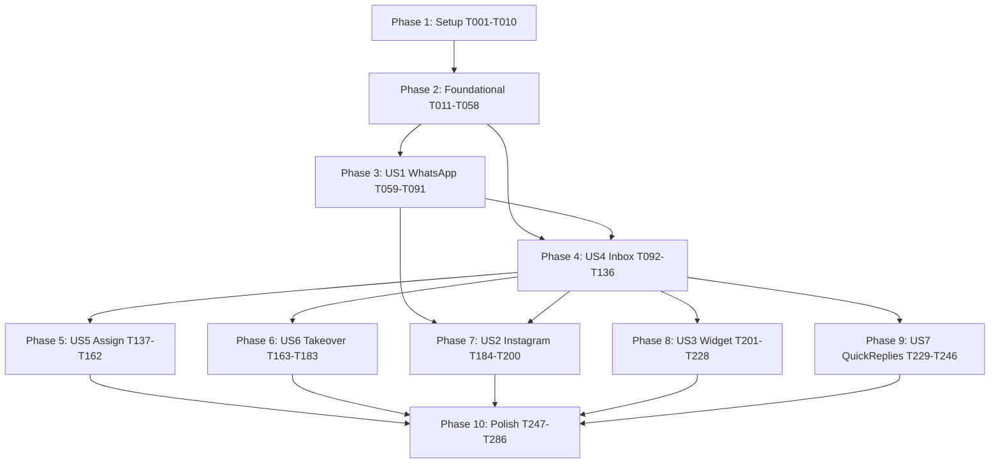

# Tasks: Fase 3 — Atendimento Omnichannel (Inbox Unificada)

**Input**: Design documents from `/specs/003-omnichannel-inbox/`
**Prerequisites**: plan.md, spec.md (Clarified — 17/17 NCs), research.md (R1–R9), data-model.md (12 entidades), contracts/openapi.yaml (36 paths, 23 schemas)

**Tests**: Obrigatórios — Princípio IV (Spec-Driven Test-First) é gate constitucional. TDD enforced em todos os 47 ACs.

**Organization**: Tasks agrupadas por user story (P1 primeiro, depois P2). Cada US tem story goal + independent test criteria + tests-first checkpoint.

## Format: `[ID] [P?] [Story] Description with file path`

- **[P]**: paralelizável (arquivos distintos, sem dependência)
- **[USx]**: rotula a US (US1=4.1, US2=4.2, US3=4.3, US4=4.4, US5=4.5, US6=4.6, US7=4.7)
- Setup / Foundational / Polish: sem rótulo de story
- Caminhos absolutos relativos ao repo root

---

## Phase 1: Setup (Shared Infrastructure)

**Purpose**: Pré-requisitos físicos da fase — packages, config, infra Docker, abilities, rate limiters.

- [x] T001 Add `twilio/sdk:^8.0` via `vendor/bin/sail composer require twilio/sdk` (research R2)
- [x] T002 [P] Create `config/messaging.php` with keys: `providers.twilio`, `providers.meta`, `retention.{message_months:24, media_months:12, webhook_events_days:30}`, `auto_resolve.hours:72`, `auto_resolve.range:[24,168]`, `ai_pause.minutes:30`, `ai_pause.range:[5,240]`, `auto_assign.max_per_user:15`, `auto_assign.user_idle_minutes:5`, `widget.public_domain`, `circuit_breaker.{threshold:5, window_seconds:60, recovery_seconds:30}`
- [x] T003 [P] Extend `config/filesystems.php` with new `media` disk (S3-compatible, SSE-S3, prefix `tenant_{id}/conversa_{id}/msg_{id}/`)
- [x] T004 [P] Add MinIO service to `docker-compose.yml` for dev (image `minio/minio`, ports 9000/9001, bucket `paciente360-media` auto-created via init script)
- [x] T005 [P] Add new rate limiters in `app/Providers/RouteServiceProvider.php`: `inbox` (60 req/min/user+tenant), `widget-public` (30 req/min/IP), `webhook-meta` (1000 req/min/global)
- [x] T006 [P] Add 8 abilities to `database/seeders/RolesSeeder.php`: `inbox.view`, `inbox.respond`, `inbox.assign`, `inbox.transfer`, `inbox.takeover_ai`, `channel.connect`, `channel.disconnect`, `quick_reply.manage` (with role bindings from spec § 2.3)
- [x] T007 [P] Add `.env.example` entries for Twilio + Meta + Widget + S3 (per quickstart.md § 3)
- [x] T008 [P] Create directory structure `app/Domain/Messaging/{Channel,Conversation,Message,Assignment,QuickReply,Presence,Widget,Infrastructure}/{Models,Services,Adapters,Events,Exceptions,Contracts,StateMachine,CircuitBreaker,Webhook,Listeners}`
- [x] T009 [P] Create `tests/Feature/Fase3/` and `tests/Unit/Messaging/` directories with empty `.gitkeep`
- [x] T010 Run `vendor/bin/sail composer dump-autoload` and verify `App\Domain\Messaging\*` autoload-able via `vendor/bin/sail artisan tinker --execute 'class_exists("App\\Domain\\Messaging\\Channel\\Models\\Channel") || echo "ok namespace structure";'`

---

## Phase 2: Foundational (Blocking Prerequisites)

**Purpose**: Database schema, multi-tenancy isolation, Reverb channels, circuit breaker — bloqueia início de qualquer US.

⚠️ **CRITICAL**: nenhuma task de US começa antes do Foundational concluir.

### Migrations (12 tabelas)

- [x] T011 [P] Create migration `2026_05_11_create_messaging_channels_table.php` per data-model.md § 1
- [x] T012 [P] Create migration `2026_05_11_create_messaging_channel_templates_table.php` per data-model.md § 2
- [x] T013 [P] Create migration `2026_05_11_create_messaging_conversations_table.php` per data-model.md § 3 (including `external_thread_id_normalized` GENERATED + 6 indexes)
- [x] T014 [P] Create migration `2026_05_11_create_messaging_conversation_assignments_table.php` per data-model.md § 4
- [x] T015 [P] Create migration `2026_05_11_create_messaging_messages_table.php` per data-model.md § 5 (with `body TEXT encrypted`, `body_searchable VARCHAR(2000)`, `body_searchable_normalized GENERATED`, `body_preview VARCHAR(140)`)
- [x] T016 [P] Create migration `2026_05_11_create_messaging_message_media_table.php` per data-model.md § 6
- [x] T017 [P] Create migration `2026_05_11_create_messaging_quick_replies_table.php` per data-model.md § 7
- [x] T018 [P] Create migration `2026_05_11_create_messaging_web_widget_configs_table.php` per data-model.md § 8
- [x] T019 [P] Create migration `2026_05_11_create_messaging_web_widget_sessions_table.php` per data-model.md § 9
- [x] T020 [P] Create migration `2026_05_11_create_messaging_assignment_rules_table.php` per data-model.md § 10
- [x] T021 [P] Create migration `2026_05_11_create_messaging_user_presence_table.php` per data-model.md § 11
- [x] T022 [P] Create migration `2026_05_11_create_messaging_webhook_events_table.php` per data-model.md § 12 (no `tenant_id` in UNIQUE; resolved post-insert)
- [x] T023 Create migration `2026_05_11_add_messaging_trigram_indexes.php` — GIN index `messages_body_trgm_idx ON messages USING GIN (tenant_id, body_searchable_normalized gin_trgm_ops)` + BRIN `messages_created_at_brin_idx ON messages USING BRIN (created_at)` (research R5)
- [x] T024 Run `vendor/bin/sail artisan migrate` and verify 13 messaging_* tables + indexes via `vendor/bin/sail artisan db:show`

### Core models + traits

- [x] T025 [P] Write `tests/Feature/Fase3/Foundational/MessagingModelsBelongsToTenantTest.php` — assert all 11 non-webhook_events models use `BelongsToTenant` trait
- [x] T026 [P] Create `app/Domain/Messaging/Channel/Models/Channel.php` with `BelongsToTenant`, casts `credentials_encrypted=>encrypted`, `provider_metadata=>AsJsonArray`, soft deletes
- [x] T027 [P] Create `app/Domain/Messaging/Channel/Models/ChannelTemplate.php` with `BelongsToTenant`, cast `variables_schema=>AsJsonArray`
- [x] T028 [P] Create `app/Domain/Messaging/Conversation/Models/Conversation.php` with `BelongsToTenant`, relations to `Channel`, `Paciente` (nullable), `User` (assigned)
- [x] T029 [P] Create `app/Domain/Messaging/Conversation/Models/ConversationAssignment.php` with `BelongsToTenant`
- [x] T030 [P] Create `app/Domain/Messaging/Message/Models/Message.php` with `BelongsToTenant`, cast `body=>encrypted`, `external_metadata=>AsJsonArray`, `template_variables=>AsJsonArray`
- [x] T031 [P] Create `app/Domain/Messaging/Message/Models/MessageMedia.php` with `BelongsToTenant`
- [x] T032 [P] Create `app/Domain/Messaging/QuickReply/Models/QuickReply.php` with `BelongsToTenant`, cast `variables_used=>AsJsonArray`
- [x] T033 [P] Create `app/Domain/Messaging/Widget/Models/WebWidgetConfig.php` with `BelongsToTenant`, cast `allowed_origins=>AsJsonArray`, `appearance=>AsJsonArray`, `business_hours=>AsJsonArray`
- [x] T034 [P] Create `app/Domain/Messaging/Widget/Models/WebWidgetSession.php` with `BelongsToTenant`, cast `provisional_data=>AsJsonArray`
- [x] T035 [P] Create `app/Domain/Messaging/Assignment/Models/AssignmentRule.php` with `BelongsToTenant`, cast `config=>AsJsonArray`
- [x] T036 [P] Create `app/Domain/Messaging/Presence/Models/UserPresence.php` with `BelongsToTenant`, cast `notification_preferences=>AsJsonArray`
- [x] T037 [P] Create `app/Domain/Messaging/Infrastructure/Webhook/WebhookEvent.php` **WITHOUT** `BelongsToTenant` (tenant resolved post-processing), cast `raw_payload_encrypted=>encrypted`
- [x] T038 Create factories for all 12 models in `database/factories/Messaging/`
- [x] T039 Run `vendor/bin/sail artisan test --filter=MessagingModelsBelongsToTenantTest` and confirm green

### Reverb broadcast channels + auth

- [x] T040 [P] Write `tests/Feature/Fase3/Foundational/ReverbChannelAuthorizationTest.php` covering: (a) user without ability rejected, (b) cross-tenant rejected, (c) médico only sees assigned conversations
- [x] T041 Add 2 broadcast channels to `routes/channels.php`: `tenant.{tenantId}.inbox` (validates `Auth::user()->tenant_id === $tenantId && user can `inbox.view`) and `tenant.{tenantId}.conversa.{conversationId}` (validates ownership/visibility per spec § 11)
- [x] T042 Run `vendor/bin/sail artisan test --filter=ReverbChannelAuthorizationTest` and confirm green

### Circuit breaker (research R6)

- [x] T043 [P] Write `tests/Unit/Messaging/CircuitBreakerServiceTest.php` covering all state transitions: closed→open (5 failures in 60s), open→half-open (30s recovery), half-open→closed (1 success), half-open→open (1 failure)
- [x] T044 Create `app/Domain/Messaging/Infrastructure/CircuitBreaker/CircuitBreakerService.php` (~150 LOC, Redis-backed via `Cache::tags(['cb', $provider])`)
- [x] T045 Create `app/Domain/Messaging/Infrastructure/CircuitBreaker/CircuitOpenException.php`
- [x] T046 Run `vendor/bin/sail artisan test --filter=CircuitBreakerServiceTest` and confirm green

### ChannelAdapter contract

- [x] T047 [P] Write `tests/Unit/Messaging/ChannelAdapterContractTest.php` asserting interface signature: `send(Channel, OutboundMessage): MessageDispatchResult`, `validateCredentials(array): bool`, `parseInboundWebhook(array): InboundMessageDto`, `getType(): string`
- [x] T048 Create `app/Domain/Messaging/Channel/Adapters/ChannelAdapter.php` interface + supporting DTOs `OutboundMessage`, `MessageDispatchResult`, `InboundMessageDto`
- [x] T049 Run `vendor/bin/sail artisan test --filter=ChannelAdapterContractTest` and confirm green

### Webhook idempotency infrastructure (research R9)

- [x] T050 [P] Write `tests/Feature/Fase3/Foundational/WebhookIdempotencyTest.php` covering: duplicate `(provider, external_id)` returns 200 without re-dispatching job; INSERT ON CONFLICT DO NOTHING works
- [x] T051 Create `app/Domain/Messaging/Infrastructure/Webhook/WebhookEventRecorder.php` service with `recordOnce(provider, externalId, payload, signatureVerified): WebhookEvent|null` using `DB::table('messaging_webhook_events')->insertOrIgnore(...)`
- [x] T052 Run `vendor/bin/sail artisan test --filter=WebhookIdempotencyTest` and confirm green

### Encryption + logging guards

- [x] T053 [P] Write `tests/Feature/Fase3/Foundational/MessageBodyEncryptionTest.php` asserting `Message::factory()->create(['body' => 'PII'])` persists encrypted (raw DB row != plain) but reads decrypted via Eloquent
- [x] T054 [P] Write `tests/Feature/Fase3/Foundational/StructuredLoggingMasksMessageBodyTest.php` asserting `Log::info(...)` with message context never logs `body` or `body_preview` plain
- [x] T055 Extend Fase 0 `LogStructuredRequestData` middleware in `app/Http/Middleware/LogStructuredRequestData.php` to mask any `body` / `message_body` / `content` field in request payloads of `/api/v1/inbox/*` and `/api/v1/webhooks/*` routes
- [x] T056 Extend Fase 2 `AuditAttributesBuilder` in `app/Support/Audit/AuditAttributesBuilder.php` to mask message content (same rule)
- [x] T057 Run both encryption + logging tests; both green

### Tenant isolation test scaffolding

- [x] T058 Create `tests/Feature/Fase3/InboxTenantIsolationTest.php` empty skeleton with `provideAuthenticatedEndpoints(): array` driver method — will be filled progressively in each US

**Checkpoint**: Foundation pronto — US tasks podem começar. **Pint clean** obrigatório aqui (`vendor/bin/sail bin pint --dirty --format agent`).

---

## Phase 3: User Story 1 — Conectar WhatsApp Business via Twilio (P1) 🎯 MVP

**Goal**: Admin Clínica conecta canal WhatsApp via Twilio com credenciais válidas; webhooks Twilio entregam mensagens à inbox.

**Independent Test**: Admin Clínica em `clinica-alfa` completa fluxo Twilio (Account SID + Sender) com número de teste; status `ativo`; webhook Twilio entrega mensagem teste → visível em `/panel/inbox`.

**ACs cobertos**: AC-4.1.1 a AC-4.1.10 (10 ACs).

### Tests for US1 (TDD — write FAILING tests first)

- [x] T059 [P] [US1] Write `tests/Feature/Fase3/US1_WhatsApp/ConnectWhatsAppEndpointTest.php` covering AC-4.1.1, AC-4.1.2, AC-4.1.6, AC-4.1.9: POST `/api/v1/inbox/channels` `type=whatsapp` valida credenciais via mock Twilio + grava `audit_logs.channel.connected` + 422 quando sender não-Business
- [x] T060 [P] [US1] Write `tests/Feature/Fase3/US1_WhatsApp/TwilioWebhookInboundTest.php` covering AC-4.1.3, AC-4.1.4: POST `/api/v1/webhooks/twilio/whatsapp` valida HMAC + persiste mensagem + dedup `MessageSid` em retry
- [x] T061 [P] [US1] Write `tests/Feature/Fase3/US1_WhatsApp/TwilioStatusCallbackTest.php` for delivered/read/failed status updates
- [x] T062 [P] [US1] Write `tests/Feature/Fase3/US1_WhatsApp/ChannelTemplateSyncTest.php` covering AC-4.1.7: `ChannelTemplateSyncJob` fetches mock Twilio Content API + upserts `messaging_channel_templates`
- [x] T063 [P] [US1] Write `tests/Feature/Fase3/US1_WhatsApp/QualityRatingDropTest.php` covering AC-4.1.8, AC-4.1.5: Quality `Low`/`Flagged` webhook → `auto_send_disabled=true` + `CanalDegradado` event + admin notification
- [x] T064 [P] [US1] Write `tests/Feature/Fase3/US1_WhatsApp/DisconnectChannelTest.php` covering AC-4.1.10: DELETE `/api/v1/inbox/channels/{id}` soft-deletes + `CanalDesconectado` event
- [x] T065 [P] [US1] Write `tests/Unit/Messaging/WhatsAppCloudAdapterTest.php` testing send/validateCredentials/parseInboundWebhook against mocked `Twilio\Rest\Client`
- [x] T066 [US1] Run all US1 tests; **all must FAIL** before implementation (`vendor/bin/sail artisan test tests/Feature/Fase3/US1_WhatsApp/ --compact`)

### Implementation for US1

- [x] T067 [P] [US1] Create events `app/Domain/Messaging/Channel/Events/{CanalConectado,CanalDesconectado,CanalComFalha,CanalDegradado}.php` implementing `Auditable` (Fase 0 contract)
- [x] T068 [P] [US1] Create `app/Domain/Messaging/Channel/Adapters/WhatsAppCloudAdapter.php` implementing `ChannelAdapter` using `Twilio\Rest\Client` wrapped in `CircuitBreakerService::for('twilio')`
- [x] T069 [US1] Create `app/Domain/Messaging/Channel/Services/ChannelService.php` with `connect(tenantId, type, name, credentials): Channel` — validates via adapter, encrypts `credentials_encrypted`, fires `CanalConectado`
- [x] T070 [US1] Create `app/Domain/Messaging/Channel/Services/QualityRatingMonitor.php` — consumes Twilio status webhook, updates `quality_rating`, toggles `auto_send_disabled` per NC-17
- [x] T071 [US1] Create `app/Domain/Messaging/Channel/Services/ChannelTemplateSyncService.php` + `app/Jobs/Messaging/SyncChannelTemplatesJob.php` (Horizon queue `default`, schedule daily)
- [x] T072 [P] [US1] Create `app/Http/Controllers/Api/V1/Inbox/ChannelsController.php` with `index`, `store`, `show`, `update`, `destroy`, `reconnect` per openapi.yaml `/inbox/channels`
- [x] T073 [P] [US1] Create `app/Http/Controllers/Api/V1/Inbox/ChannelTemplatesController.php` with `index`, `sync` actions
- [x] T074 [P] [US1] Create Form Requests `app/Http/Requests/Inbox/ConnectChannelRequest.php` (per openapi schema `ConnectChannelRequest` — `oneOf` for `TwilioCredentials`)
- [x] T075 [P] [US1] Create Resources `app/Http/Resources/V1/ChannelResource.php`, `ChannelTemplateResource.php`
- [x] T076 [P] [US1] Create `app/Policies/ChannelPolicy.php` enforcing `channel.connect`, `channel.disconnect` abilities + tenant ownership
- [x] T077 [US1] Add routes `/api/v1/inbox/channels`, `/api/v1/inbox/channels/{id}/reconnect`, `/api/v1/inbox/channels/{id}/templates`, `/api/v1/inbox/channels/{id}/templates/sync` in `routes/api.php` with `inbox` rate limiter + Sanctum stateful + `ResolveTenant` middleware
- [x] T078 [P] [US1] Create `app/Http/Controllers/Webhooks/TwilioWhatsAppWebhookController.php` with `__invoke` action: validates `X-Twilio-Signature` (HMAC SHA-256 with `TWILIO_AUTH_TOKEN`), calls `WebhookEventRecorder::recordOnce`, dispatches `ProcessInboundMessageJob`, returns 200 always
- [x] T079 [P] [US1] Create `app/Http/Controllers/Webhooks/TwilioStatusCallbackController.php` for status updates (`queued`, `sent`, `delivered`, `read`, `failed`)
- [x] T080 [P] [US1] Create `app/Http/Middleware/ValidateTwilioSignature.php` middleware
- [x] T081 [US1] Add webhook routes (NO auth, NO subdomain tenant, NO Sanctum) in `routes/api.php` group: POST `/api/v1/webhooks/twilio/whatsapp`, POST `/api/v1/webhooks/twilio/status` — apply `ValidateTwilioSignature` middleware + `webhook-meta` rate limiter
- [x] T082 [P] [US1] Create `app/Jobs/Messaging/ProcessInboundMessageJob.php` (extends `TenantAwareJob`) — resolves tenant from `MessagingServiceSid`, delegates to `PatientResolverService` (T082a), finds/creates `Conversation`, creates `Message` (direction=in, sender_type=patient), fires `MensagemRecebida` + `ConversaCriada` if new
- [x] T082a [P] [US1] **(FR-011 / NC-1.a fix)** Write `tests/Feature/Fase3/US1_WhatsApp/WhatsAppPatientResolutionTest.php` covering 3 cases: (a) telefone E.164 normalizado → match único → `conversation.patient_id` set + `ConversaVinculadaAPaciente` modo=`auto_telefone`; (b) colisão multi-paciente (caso família NC-1) → `patient_id=null` + entra na fila "Não identificado"; (c) nenhum match → `patient_id=null` sem evento de vínculo
- [x] T082b [US1] **(FR-011 / NC-1.a fix)** Create `app/Domain/Messaging/Conversation/Services/PatientResolverService.php` with `resolveForInboundChannel(channel, externalThreadId): ?Paciente` — normaliza E.164 via Fase 2 `PhoneNormalizer`, consulta `App\Services\Pacientes\DedupService::findByPhone` (Fase 2), retorna match único OR null em colisão; emite `ConversaVinculadaAPaciente` modo=`auto_telefone` quando match único; integrar com `ProcessInboundMessageJob` (T082)
- [x] T083 [P] [US1] Create `app/Domain/Messaging/Message/Events/{MensagemRecebida,MensagemEnviada}.php` + `app/Domain/Messaging/Conversation/Events/ConversaCriada.php` implementing `Auditable` + `ShouldBroadcast`
- [x] T084 [US1] Implement Vue page `resources/js/pages/Canais/Index.vue` and `resources/js/pages/Canais/ConectarWhatsApp.vue` with form fields per AC-4.1.1 + integração com `api.js` axios from Fase 0
- [x] T085 [US1] Implement Vue component `resources/js/components/Canais/ChannelStatusBadge.vue` rendering status `ativo`/`desconectado`/`invalido`/`expirado`/`degradado`
- [x] T086 [US1] Add Pinia store `resources/js/stores/canais.js` for channel list + connect/disconnect actions
- [x] T087 [US1] Add i18n strings to `resources/lang/pt-BR/canais.json` (status labels, error messages, validation)
- [x] T088 [US1] Add channel routes to `resources/js/router/index.js` (`/panel/canais`, `/panel/canais/conectar-whatsapp`, `/panel/canais/{id}`)
- [x] T089 [US1] Update `tests/Feature/Fase3/InboxTenantIsolationTest.php` adding 8 endpoints from US1 (channels CRUD + templates sync)
- [x] T090 [US1] Run all US1 tests; **all must PASS** (`vendor/bin/sail artisan test tests/Feature/Fase3/US1_WhatsApp/ tests/Unit/Messaging/WhatsAppCloudAdapterTest.php --compact`)
- [x] T091 [US1] Run `vendor/bin/sail bin pint --dirty --format agent`

**Checkpoint US1**: WhatsApp via Twilio connectable; webhook inbound funcional; templates sincronizam; quality rating monitor ativo. **Não verificável end-to-end ainda — inbox UI vem em US4.**

---

## Phase 4: User Story 4 — Caixa de Entrada Unificada (P1) 🎯 MVP

**Goal**: Atendente vê inbox unificada com conversas dos canais conectados; tempo real via Reverb; filtros + busca trigram funcionam.

**Independent Test**: Atendente abre `/panel/inbox`; vê conversa criada em US1; outro atendente em outra aba vê atualização < 2s.

**ACs cobertos**: AC-4.4.1 a AC-4.4.12 (12 ACs).

### Tests for US4

- [x] T092 [P] [US4] Write `tests/Feature/Fase3/US4_Inbox/InboxListConversationsTest.php` covering AC-4.4.1 + AC-4.4.8: GET `/api/v1/inbox/conversations` with status/channel/assigned_user/patient/q filters
- [x] T093 [P] [US4] Write `tests/Feature/Fase3/US4_Inbox/InboxTrigramSearchTest.php` covering AC-4.4.9: 50k messages seeded, `q=consulta retorno` returns p95 < 500ms (assert via `microtime`), match highlight in `body_preview`
- [x] T094 [P] [US4] Write `tests/Feature/Fase3/US4_Inbox/ConversationDetailTest.php` covering AC-4.4.3: GET `/api/v1/inbox/conversations/{id}` + GET `/messages` cursor pagination
- [x] T095 [P] [US4] Write `tests/Feature/Fase3/US4_Inbox/SendOutboundMessageTest.php` covering AC-4.4.4: POST `/messages` with `content_type=text` enqueues job + creates message status `queued`
- [x] T096 [P] [US4] Write `tests/Feature/Fase3/US4_Inbox/Window24hBlockerTest.php` covering AC-4.4.5 (Princípio VI): conversation with `last_inbound_message_at > 24h` + text message → 422 `mensagem.bloqueada_fora_janela` + audit log; template message → 201
- [x] T097 [P] [US4] Write `tests/Feature/Fase3/US4_Inbox/MarkAsReadTest.php` for POST `/conversations/{id}/read` + Reverb broadcast
- [x] T098 [P] [US4] Write `tests/Feature/Fase3/US4_Inbox/ConversationStateMachineTest.php` covering NC-2: resolve manual + auto-resolve after 72h + reopen on new inbound message
- [x] T099 [P] [US4] Write `tests/Feature/Fase3/US4_Inbox/ReverbBroadcastIsolationTest.php` covering AC-4.4.12: tenant A subscriber receives only `tenant.A.*` events, never `tenant.B.*` (100% endpoint coverage)
- [x] T100 [P] [US4] Write `tests/Feature/Fase3/US4_Inbox/MedicoVisibilityScopeTest.php` covering spec § 2.3 nuance: médico vê apenas conversas atribuídas a ele OR com paciente cujo `profissional_responsavel_id = médico.id`
- [x] T101 [P] [US4] Write `tests/Unit/Messaging/MessageDispatchServicePrincipioVITest.php` covering Princípio VI in isolation (domain service layer)
- [x] T102 [P] [US4] Write `tests/Unit/Messaging/ConversationStatusTransitionsTest.php` testing all state machine paths
- [x] T103 [US4] Run US4 test suite; **all must FAIL**

### Implementation for US4

- [x] T104 [P] [US4] Create `app/Domain/Messaging/Conversation/StateMachine/ConversationStatusTransitions.php` enum + transition validation (`aberta → pendente`, `aberta → resolvida`, `pendente → resolvida`, `resolvida → reaberta`, `reaberta → aberta` implicit on next inbound)
- [x] T105 [P] [US4] Create `app/Domain/Messaging/Conversation/Services/ConversationService.php` with `findOrCreateForInbound`, `resolve(Conversation, mode)`, `reopen`, `linkToPatient` (fires `ConversaVinculadaAPaciente`)
- [x] T106 [P] [US4] Create `app/Domain/Messaging/Conversation/Events/{ConversaResolvida,ConversaReaberta,ConversaVinculadaAPaciente}.php`
- [x] T107 [P] [US4] Create `app/Jobs/Messaging/AutoResolveConversationsJob.php` — runs hourly; finds conversations with `status IN (aberta, pendente)` + `last_inbound_message_at < now() - 72h`; transitions to resolvida + fires event
- [x] T108 [P] [US4] Create `app/Domain/Messaging/Message/Services/MessageDispatchService.php` with `send(Conversation, OutboundMessage)` — **Princípio VI runtime gate**: throws `WindowExpiredWithoutTemplateException` (mapped to 422 in controller) when last inbound > 24h and not template
- [x] T109 [P] [US4] Create `app/Domain/Messaging/Message/Exceptions/{WindowExpiredWithoutTemplateException,ChannelDegradedException,UnsupportedMediaTypeException}.php`
- [x] T110 [P] [US4] Create `app/Domain/Messaging/Message/Services/MessageSearchService.php` with hybrid query `WHERE tenant_id=:t AND (body_searchable_normalized % :q OR body_searchable_normalized ILIKE :q_like) ORDER BY similarity(...) DESC LIMIT 50`
- [x] T111 [P] [US4] Create `app/Jobs/Messaging/SendOutboundMessageJob.php` (extends `TenantAwareJob`) — calls `ChannelAdapter::send` wrapped in circuit breaker, updates message status, fires `MensagemEnviada`
- [x] T112 [P] [US4] Create broadcast events `app/Domain/Messaging/Conversation/Broadcast/{MensagemRecebidaParaInbox,MensagemEnviadaParaInbox,ConversaCriadaParaInbox,ConversaAtribuidaParaInbox,UsuarioDigitando,MensagemLida}.php` — `ShouldBroadcast` only, NOT `Auditable` (separação domínio/transporte per research R1)
- [x] T113 [P] [US4] Add listener `app/Domain/Messaging/Infrastructure/Listeners/BroadcastDomainMensagensListener.php` — subscribes to domain `MensagemRecebida`/`MensagemEnviada` events and dispatches paired broadcast events
- [x] T114 [US4] Create `app/Http/Controllers/Api/V1/Inbox/ConversationsController.php`: `index` (with filters), `show`, `resolve`, `reopen`, `linkPatient`, `read`
- [x] T115 [US4] Create `app/Http/Controllers/Api/V1/Inbox/MessagesController.php`: `index` (cursor-paginated), `store` (with `Idempotency-Key` header) — maps `WindowExpiredWithoutTemplateException` to 422 with `WindowExpiredErrorResponse` schema
- [x] T116 [P] [US4] Create Form Request `app/Http/Requests/Inbox/SendMessageRequest.php` (per openapi `SendMessageRequest`)
- [x] T117 [P] [US4] Create Form Request `app/Http/Requests/Inbox/ListConversationsRequest.php`
- [x] T118 [P] [US4] Create Resources `app/Http/Resources/V1/{ConversationResource,MessageResource,MessageMediaResource}.php` + `ConversationListResource.php` (with aggregations `{by_status, unassigned, mine}` for badges)
- [x] T119 [P] [US4] Create Policies `app/Policies/ConversationPolicy.php` + `MessagePolicy.php` enforcing `inbox.view`, `inbox.respond`, médico scope
- [x] T120 [US4] Add routes for `/api/v1/inbox/conversations`, `/conversations/{id}`, `/conversations/{id}/messages`, `/conversations/{id}/{read,resolve,reopen,link-patient}` in `routes/api.php`
- [x] T121 [US4] Add long-polling fallback route `GET /api/v1/inbox/poll?since={cursor}` in `routes/api.php` (NC-11.c) + `app/Http/Controllers/Api/V1/Inbox/InboxPollController.php`
- [x] T122 [US4] Create Vue page `resources/js/pages/Inbox/Index.vue` (3-pane layout: filters/list/conversation-detail)
- [x] T123 [P] [US4] Create Vue component `resources/js/components/Inbox/ConversationListItem.vue` (avatar, channel badge, preview, unread count, priority placeholder)
- [x] T124 [P] [US4] Create Vue component `resources/js/components/Inbox/MessageBubble.vue` with status icons (sent ✓, delivered ✓✓ gray, read ✓✓ blue) per AC-4.4.7
- [x] T125 [P] [US4] Create Vue component `resources/js/components/Inbox/MessageInput.vue` with 4096 char limit (AC-4.4.4) + window 24h badge (AC-4.4.5 + NC-4.a colors verde/amarelo/vermelho/cadeado)
- [x] T126 [P] [US4] Create Vue component `resources/js/components/Inbox/InboxFilters.vue` with 7 filter dimensions (canal, status, atendente, profissional, tag, mídia, idade) per AC-4.4.8
- [x] T127 [P] [US4] Create Vue component `resources/js/components/Inbox/InboxSearch.vue` with 350ms debounce + highlighted matches per AC-4.4.9
- [x] T128 [P] [US4] Create Pinia store `resources/js/stores/inbox.js` with `conversations`, `selectedConversation`, `messages`, `filters`, `cursor` + actions
- [x] T129 [P] [US4] Create composable `resources/js/composables/useReverbConnection.js` — subscribes to `tenant.{id}.inbox` on mount, `tenant.{id}.conversa.{cid}` on conversation open, backoff exponencial 1→2→4→8→16→30s infinito per NC-11.b
- [x] T130 [P] [US4] Create composable `resources/js/composables/useLongPollingFallback.js` — detects WebSocket failure > 2min, switches to `GET /inbox/poll` every 10s with banner UI per NC-11.c
- [x] T131 [P] [US4] Create composable `resources/js/composables/useInboxFilters.js` syncing filters with `useRoute().query` (URL share-friendly)
- [x] T132 [US4] Add i18n strings `resources/lang/pt-BR/inbox.json`
- [x] T133 [US4] Update `routes/web.php` or SPA router with `/panel/inbox` route + guard `ability:inbox.view`
- [x] T133a [P] [US4] **(FR-017 fix)** Write `tests/Feature/Fase3/US4_Inbox/ConversasMigramOnPacienteMescladoTest.php` covering FR-017 + spec § 2.4: dispatch Fase 2 `PacienteMesclado(origem_ids:[7], alvo_id:5)` → todas conversations com `patient_id IN (7)` migram para `patient_id=5`; mensagens preservadas; reversão via `PacienteMesclagemRevertida` restaura `patient_id` original
- [x] T133b [US4] **(FR-017 fix)** Create `app/Domain/Messaging/Infrastructure/Listeners/MigraConversasOnPacienteMescladoListener.php` subscribing to Fase 2 `App\Events\Pacientes\PacienteMesclado` and `PacienteMesclagemRevertida`; updates `conversations.patient_id` em lote dentro de transaction; fires `ConversaVinculadaAPaciente` modo=`auto_merge` para cada conversa migrada; bind no `EventServiceProvider`
- [x] T134 [US4] Update `InboxTenantIsolationTest` adding ~10 new conversation/message endpoints
- [x] T135 [US4] Run all US4 tests; **all PASS**
- [x] T136 [US4] Run `vendor/bin/sail bin pint --dirty --format agent`

**Checkpoint US4**: Inbox visível em `/panel/inbox`, tempo real funciona com 2 atendentes, busca trigram p95 < 500ms.

---

## Phase 5: User Story 5 — Atribuir e Transferir Conversa (P1)

**Goal**: Atendente atribui conversa manualmente ou via regra automática (round-robin / patient owner); transfere com nota obrigatória.

**Independent Test**: Atendente A pega conversa → transfere para Médico M com nota "Encaminhando para exame" → M recebe notificação + vê a conversa em sua fila.

**ACs cobertos**: AC-4.5.1 a AC-4.5.9 (9 ACs).

### Tests for US5

- [x] T137 [P] [US5] Write `tests/Feature/Fase3/US5_Assignment/AssignManualTest.php` covering AC-4.5.1, AC-4.5.8: assign respects `auto_assign_max_per_user`
- [x] T138 [P] [US5] Write `tests/Feature/Fase3/US5_Assignment/AssignAutoRoundRobinTest.php` covering AC-4.5.2 NC-6: round-robin escolhe next online user com vaga
- [x] T139 [P] [US5] Write `tests/Feature/Fase3/US5_Assignment/AssignAutoPatientOwnerTest.php` covering AC-4.5.2: estratégia `profissional_vinculado` com fallback round-robin
- [x] T140 [P] [US5] Write `tests/Feature/Fase3/US5_Assignment/TransferWithNoteTest.php` covering AC-4.5.3, AC-4.5.4: nota mín 10 chars + histórico append-only + 422 quando < 10 chars
- [x] T141 [P] [US5] Write `tests/Feature/Fase3/US5_Assignment/TransferToRoleTest.php` covering AC-4.5.7: transferir para role → first online with capacity
- [x] T142 [P] [US5] Write `tests/Feature/Fase3/US5_Assignment/CrossTenantTransferBlockedTest.php` covering AC-4.5.6 (Princípio II): 403 + audit log
- [x] T143 [P] [US5] Write `tests/Feature/Fase3/US5_Assignment/AssignmentRulesCrudTest.php` for PUT `/api/v1/inbox/assignment-rules`
- [x] T144 [P] [US5] Write `tests/Unit/Messaging/RoundRobinStrategyTest.php` + `PatientOwnerStrategyTest.php`
- [x] T145 [US5] Run US5 tests; all FAIL

### Implementation for US5

- [x] T146 [P] [US5] Create `app/Domain/Messaging/Assignment/Services/AssignmentService.php` with `assignManual`, `assignAuto`, `transfer` + pessimistic lock (`DB::transaction + lockForUpdate`) per spec § R9
- [x] T147 [P] [US5] Create `app/Domain/Messaging/Assignment/Services/Strategies/RoundRobinStrategy.php` implementing `AssignmentStrategy` interface
- [x] T148 [P] [US5] Create `app/Domain/Messaging/Assignment/Services/Strategies/PatientOwnerStrategy.php` (with fallback to RoundRobin)
- [x] T149 [P] [US5] Create `app/Domain/Messaging/Assignment/Events/{ConversaAtribuida,ConversaTransferida}.php`
- [x] T150 [P] [US5] Create `app/Http/Controllers/Api/V1/Inbox/AssignmentsController.php`: `assign`, `transfer`, `assignments` (history)
- [x] T151 [P] [US5] Create `app/Http/Controllers/Api/V1/Inbox/AssignmentRulesController.php`: `index`, `update` (replace set)
- [x] T152 [P] [US5] Create Form Requests `app/Http/Requests/Inbox/{AssignConversationRequest,TransferConversationRequest,UpdateAssignmentRulesRequest}.php`
- [x] T153 [P] [US5] Create Resources `app/Http/Resources/V1/{AssignmentResource,AssignmentRuleResource}.php`
- [x] T154 [P] [US5] Create `app/Policies/AssignmentPolicy.php` enforcing `inbox.assign`, `inbox.transfer` + tenant + ownership
- [x] T155 [US5] Add routes for `/conversations/{id}/{assign,transfer,assignments}` + `/assignment-rules` in `routes/api.php`
- [x] T156 [P] [US5] Create Vue component `resources/js/components/Inbox/AssignDialog.vue` (manual or auto)
- [x] T157 [P] [US5] Create Vue component `resources/js/components/Inbox/TransferDialog.vue` (user OR role + nota obrigatória)
- [x] T158 [P] [US5] Create Vue component `resources/js/components/Inbox/AssignmentHistoryDrawer.vue`
- [x] T159 [P] [US5] Create Vue page `resources/js/pages/Inbox/RegrasAtribuicao.vue` for `/panel/inbox/regras-atribuicao`
- [x] T160 [US5] Add notification dispatch in `AssignmentService` → in-app + Reverb event `ConversaAtribuidaParaInbox` for AC-4.5.5
- [x] T161 [US5] Update `InboxTenantIsolationTest` adding 5 new assignment endpoints
- [x] T162 [US5] Run all US5 tests; all PASS

**Checkpoint US5**: Atribuição manual + auto + transferência com nota; cross-tenant bloqueado.

---

## Phase 6: User Story 6 — Modo "Humano Assume" (P1)

**Goal**: Atendente pausa IA explicitamente ou implicitamente; contrato pronto para Fase 4.

**Independent Test**: Click "Assumir" → `ai_paused_until = now()+30min`; envio manual seta automaticamente; expiração dispara `ConversaRetomadaPelaIA`.

**ACs cobertos**: AC-4.6.1 a AC-4.6.8 (8 ACs).

### Tests for US6

- [x] T163 [P] [US6] Write `tests/Feature/Fase3/US6_Takeover/TakeoverManualTest.php` covering AC-4.6.1, AC-4.6.4: POST `/conversations/{id}/takeover` sets `ai_paused_until` + emits `ConversaAssumidaPorHumano` motivo=`manual_click`
- [x] T164 [P] [US6] Write `tests/Feature/Fase3/US6_Takeover/TakeoverImplicitTest.php` covering AC-4.6.2: enviar mensagem manual seta `ai_paused_until` automaticamente, evento com motivo=`mensagem_enviada`
- [x] T165 [P] [US6] Write `tests/Feature/Fase3/US6_Takeover/TakeoverRepriseTest.php` covering AC-4.6.2b: reprise estende timer, não acumula
- [x] T166 [P] [US6] Write `tests/Feature/Fase3/US6_Takeover/TakeoverExpirationTest.php` covering AC-4.6.3: job periodic detecta expiração + emite `ConversaRetomadaPelaIA` motivo=`timeout`
- [x] T167 [P] [US6] Write `tests/Feature/Fase3/US6_Takeover/ReleaseToAiTest.php` covering AC-4.6.4: zera `ai_paused_until` + motivo=`manual`
- [x] T168 [P] [US6] Write `tests/Unit/Messaging/ConversaIATogglingContractTest.php` — **CONGELA contrato para Fase 4**: testa que `ConversaAssumidaPorHumano` e `ConversaRetomadaPelaIA` têm payload schema estável (campos esperados pela Fase 4)
- [x] T169 [US6] Run US6 tests; all FAIL

### Implementation for US6

- [x] T170 [P] [US6] Create `app/Domain/Messaging/Conversation/Contracts/ConversaIATogglingContract.php` interface defining `pauseAi(conversation, duration|until, reason)`, `resumeAi(conversation, mode)`
- [x] T171 [US6] Create `app/Domain/Messaging/Conversation/Services/HumanTakeoverService.php` implementing `ConversaIATogglingContract`
- [x] T172 [P] [US6] Create `app/Domain/Messaging/Conversation/Events/{ConversaAssumidaPorHumano,ConversaRetomadaPelaIA}.php` implementing `Auditable`
- [x] T173 [P] [US6] Add observer/listener in `app/Domain/Messaging/Infrastructure/Listeners/SetAiPausedOnOutboundMessageListener.php` — subscribes to `MensagemEnviada` event with `sender_type=user`, calls `HumanTakeoverService::pauseAi` with motivo=`mensagem_enviada`
- [x] T174 [P] [US6] Create `app/Jobs/Messaging/ExpireAiPausesJob.php` — runs every minute; finds `conversations.ai_paused_until < now() AND ai_paused_until IS NOT NULL`; zeros field + fires `ConversaRetomadaPelaIA` motivo=`timeout`
- [x] T175 [US6] Add `ExpireAiPausesJob` to schedule (every minute) — in `routes/console.php`
- [x] T176 [P] [US6] Create `app/Http/Controllers/Api/V1/Inbox/TakeoverController.php`: `takeover`, `releaseToAi`
- [x] T177 [P] [US6] Create Form Request `app/Http/Requests/Inbox/TakeoverRequest.php` (duration_hours 1-24 OR until)
- [x] T178 [US6] Add routes `/conversations/{id}/takeover` + `/release-to-ai` with policy `inbox.takeover_ai`
- [x] T179 [P] [US6] Create Vue component `resources/js/components/Inbox/AiPauseBadge.vue` displaying countdown when `ai_paused_until > now()` per AC-4.6.5
- [x] T180 [P] [US6] Create Vue component `resources/js/components/Inbox/TakeoverButton.vue` and `ReleaseAiButton.vue`
- [x] T181 [US6] Add tenant setting `ai_pause_minutes` (default 30, range 5-240) — migration `add_settings_to_tenants_table` + `Tenant::getInboxAiPauseMinutes()`
- [x] T182 [US6] Update `InboxTenantIsolationTest` adding 2 new takeover endpoints
- [x] T183 [US6] Run all US6 tests; all PASS — especially `ConversaIATogglingContractTest` (gate da Fase 4)

**Checkpoint US6**: Takeover funcional; contrato congelado por teste.

---

## Phase 7: User Story 2 — Conectar Instagram Direct (P2)

**Goal**: Admin Clínica conecta Instagram via Meta Graph API direta; DMs entram na inbox.

**Independent Test**: Admin completa Facebook Login + IG profissional vinculado; envia DM; aparece em `/panel/inbox` com canal "Instagram".

**ACs cobertos**: AC-4.2.1 a AC-4.2.7 (7 ACs).

### Tests for US2

- [x] T184 [P] [US2] Write `tests/Feature/Fase3/US2_Instagram/ConnectInstagramTest.php` covering AC-4.2.1, AC-4.2.2: rejeita conta pessoal
- [x] T185 [P] [US2] Write `tests/Feature/Fase3/US2_Instagram/MetaWebhookVerifyHandshakeTest.php` covering GET `/api/v1/webhooks/instagram?hub.mode=subscribe...`
- [x] T186 [P] [US2] Write `tests/Feature/Fase3/US2_Instagram/MetaWebhookInboundTest.php` covering AC-4.2.3, AC-4.2.4: HMAC X-Hub-Signature-256 valid + dedup `message_id`
- [x] T187 [P] [US2] Write `tests/Unit/Messaging/InstagramGraphAdapterTest.php` testing send/validateCredentials with mocked Guzzle
- [x] T188 [US2] Run US2 tests; all FAIL

### Implementation for US2

- [x] T189 [P] [US2] Create `app/Domain/Messaging/Channel/Adapters/InstagramGraphAdapter.php` implementing `ChannelAdapter` using Guzzle (no official SDK) — pinned `META_GRAPH_API_VERSION=v21.0` per research R7
- [x] T190 [P] [US2] Extend `ConnectChannelRequest` `oneOf` schema with `InstagramCredentials` per openapi.yaml
- [x] T191 [P] [US2] Update `ChannelService::connect` to dispatch to correct adapter via `type` discriminator
- [x] T192 [P] [US2] Create `app/Http/Controllers/Webhooks/MetaInstagramWebhookController.php` with `verify` (handshake GET) + `__invoke` (POST events)
- [x] T193 [P] [US2] Create `app/Http/Middleware/ValidateMetaSignature.php` (HMAC SHA-256 with `META_APP_SECRET`)
- [x] T194 [US2] Add Instagram webhook routes (GET handshake + POST events) with `ValidateMetaSignature` + `webhook-meta` rate limiter
- [x] T195 [P] [US2] Update `ProcessInboundMessageJob` to handle Instagram payload shape (igsid, message text/media)
- [x] T196 [P] [US2] Add health-check command `app/Console/Commands/MetaGraphHealthCheckCommand.php` — calls `GET /me` monthly; alert Sentry if `X-Fb-Api-Version-Mismatch` header present (research R7 monitoring)
- [x] T197 [P] [US2] Create Vue page `resources/js/pages/Canais/ConectarInstagram.vue` with Facebook Login button (OAuth flow + token exchange to long-lived)
- [x] T198 [US2] Add doc string explaining Instagram 24h window in `resources/lang/pt-BR/canais.json` per AC-4.2.5
- [x] T199 [US2] Update `InboxTenantIsolationTest` adding 2 webhook endpoints + 1 connect endpoint (Instagram-specific shape)
- [x] T200 [US2] Run all US2 tests; all PASS

**Checkpoint US2**: Instagram DM funcional na inbox.

---

## Phase 8: User Story 3 — Widget de Chat Web Embutível (P2)

**Goal**: Admin gera snippet JS embedável; visitante anônimo inicia conversa que entra na inbox.

**Independent Test**: Admin cria widget, cola snippet em HTML estático, abre página, envia mensagem como visitante → aparece em `/panel/inbox` com canal "Web".

**ACs cobertos**: AC-4.3.1 a AC-4.3.8 (8 ACs).

### Tests for US3 — Painel admin

- [x] T201 [P] [US3] Write `tests/Feature/Fase3/US3_Widget/CreateWebChannelTest.php` covering AC-4.3.1: POST `/api/v1/inbox/channels` `type=web` generates `public_key` + creates `WebWidgetConfig` row
- [x] T202 [P] [US3] Write `tests/Feature/Fase3/US3_Widget/UpdateWidgetConfigTest.php` covering AC-4.3.5, AC-4.3.6: business hours, outside_hours_behavior, allowed_origins whitelist
- [x] T203 [P] [US3] Write `tests/Feature/Fase3/US3_Widget/SnippetEndpointTest.php` for GET `/widget-configs/{channel_id}/snippet` returning HTML/JS

### Tests for US3 — Widget público

- [x] T204 [P] [US3] Write `tests/Feature/Fase3/US3_Widget/WidgetPublicConfigTest.php` for GET `/widget/v1/{public_key}/config` validates `Origin` against `allowed_origins`
- [x] T205 [P] [US3] Write `tests/Feature/Fase3/US3_Widget/WidgetSessionStartTest.php` covering AC-4.3.2, AC-4.3.3: POST `/widget/v1/{public_key}/sessions` cria session + lead provisório com `pre_chat_data`
- [x] T206 [P] [US3] Write `tests/Feature/Fase3/US3_Widget/WidgetMessagePublicTest.php` covering AC-4.3.4: POST `/widget/v1/{public_key}/messages` cria mensagem → entra na inbox
- [x] T207 [P] [US3] Write `tests/Feature/Fase3/US3_Widget/WidgetOutsideHoursTest.php` covering AC-4.3.5: 3 modos `bloqueia/fila/normal`
- [x] T208 [P] [US3] Write `tests/Feature/Fase3/US3_Widget/WidgetRateLimitTest.php` covering Princípio VII: 30 req/min/IP returns 429
- [x] T209 [US3] Run US3 tests; all FAIL

### Implementation for US3 — Backend

- [x] T210 [P] [US3] Create `app/Domain/Messaging/Widget/Services/WidgetAuthService.php` (origin validation, public_key resolution)
- [x] T211 [P] [US3] Create `app/Domain/Messaging/Widget/Services/WidgetSessionService.php` (start session, persist visitor_token cookie/localStorage flow, 30d expiration job)
- [x] T212 [P] [US3] Create `app/Domain/Messaging/Channel/Adapters/WebWidgetAdapter.php` implementing `ChannelAdapter`
- [x] T213 [P] [US3] Create `app/Http/Controllers/Widget/WidgetConfigController.php` (admin: index, update, snippet)
- [x] T214 [P] [US3] Create `app/Http/Controllers/Widget/WidgetPublicController.php` (public, no auth: js bundle, config, sessions, messages, messages/stream SSE fallback)
- [x] T215 [P] [US3] Create `app/Http/Middleware/ValidateWidgetOrigin.php`
- [x] T216 [US3] Add widget routes (admin in `routes/api.php`, public in `routes/widget.php`)
- [x] T217 [P] [US3] Create `app/Jobs/Messaging/PurgeExpiredWidgetSessionsJob.php` (mensal — visitor not identified > 30d) per NC-10.c
- [x] T218 [P] [US3] Create `app/Domain/Messaging/Widget/Services/BusinessHoursEvaluator.php` (timezone America/Sao_Paulo, 3 modes)

### Implementation for US3 — Widget JS bundle (Vite library mode)

- [x] T219 [P] [US3] Create `resources/widget/src/widget.js` (entry point — loads config + boots UI)
- [x] T220 [P] [US3] Create `resources/widget/src/ui.js` (vanilla DOM — chat bubble, panel, message bubbles, input)
- [x] T221 [P] [US3] Create `resources/widget/src/transport.js` (Reverb client with cross-origin handling + SSE fallback)
- [x] T222 [P] [US3] Create `resources/widget/src/auth.js` (visitor_token persistence + Origin header)
- [x] T223 [P] [US3] Create `resources/widget/src/i18n.js` (pt-BR strings inline — no external lib)
- [x] T224 [P] [US3] Create `resources/widget/vite.config.widget.js` (library mode, target ~30KB gzip)
- [x] T225 [US3] Add npm script `widget:build` to `package.json` that outputs to `public/widget/v1/_bundle/widget.iife.js`
- [x] T226 [P] [US3] Create Vue page `resources/js/pages/Canais/Widget/Editar.vue` for admin config (cores, logo, horário, allowed_origins)
- [x] T227 [US3] Update `InboxTenantIsolationTest` adding admin widget endpoints (public endpoints excluded — by design no auth)
- [x] T228 [US3] Run all US3 tests; all PASS

**Checkpoint US3**: Widget embarcado em HTML externo → mensagem chega na inbox; bundle < 30KB.

---

## Phase 9: User Story 7 — Respostas Rápidas (P2)

**Goal**: Atendente cadastra resposta rápida com variáveis; digita `/atalho` → autocomplete + substitui variáveis no envio.

**Independent Test**: Atendente cria `/preço` com texto `"Olá {primeiro_nome_paciente}, ..."`; digita `/preço` em conversa de Maria → texto renderizado.

**ACs cobertos**: AC-4.7.1 a AC-4.7.6 (6 ACs).

### Tests for US7

- [x] T229 [P] [US7] Write `tests/Feature/Fase3/US7_QuickReplies/QuickReplyCrudTest.php` covering AC-4.7.1: tenant scope + privada + 409 duplicado
- [x] T230 [P] [US7] Write `tests/Feature/Fase3/US7_QuickReplies/QuickReplyPrivateOverridesTenantTest.php` covering AC-4.7.2: privada vence em conflito
- [x] T231 [P] [US7] Write `tests/Feature/Fase3/US7_QuickReplies/QuickReplyRenderVariablesTest.php` covering AC-4.7.3 + NC-8.b: 6 variáveis substituídas; `{data_proxima_consulta}` renderiza vazio
- [x] T232 [P] [US7] Write `tests/Feature/Fase3/US7_QuickReplies/QuickReplyUsageCountTest.php` covering AC-4.7.6
- [x] T233 [P] [US7] Write `tests/Unit/Messaging/VariableSubstitutorTest.php` testing each of the 6 variables in isolation
- [x] T234 [US7] Run US7 tests; all FAIL

### Implementation for US7

- [x] T235 [P] [US7] Create `app/Domain/Messaging/QuickReply/Services/VariableSubstitutor.php` — 6 variables: `{nome_paciente}`, `{primeiro_nome_paciente}`, `{nome_profissional}`, `{nome_clinica}`, `{nome_atendente}`, `{data_proxima_consulta}` (placeholder Fase 5)
- [x] T236 [P] [US7] Create `app/Domain/Messaging/QuickReply/Services/QuickReplyService.php` with `listVisible(user, tenant)` returning tenant scope + private of user, with **private overriding tenant** when same shortcut
- [x] T237 [P] [US7] Create `app/Http/Controllers/Api/V1/Inbox/QuickRepliesController.php`: `index`, `store`, `update`, `destroy`, `render`
- [x] T238 [P] [US7] Create Form Requests + Resources for quick replies
- [x] T239 [P] [US7] Create `app/Policies/QuickReplyPolicy.php` enforcing `quick_reply.manage` (tenant scope) + ownership (private)
- [x] T240 [US7] Add routes `/api/v1/inbox/quick-replies/*` in `routes/api.php`
- [x] T241 [P] [US7] Create Vue page `resources/js/pages/Inbox/RespostasRapidas.vue` (2 tabs: Da equipe / Minhas)
- [x] T242 [P] [US7] Create Vue component `resources/js/components/Inbox/QuickReplyAutocomplete.vue` listening to `/` trigger in `MessageInput.vue`, with private 🔒 / tenant 🏢 indicator
- [x] T243 [P] [US7] Create Vue component `resources/js/components/Inbox/QuickReplyPreview.vue` showing rendered variables before send
- [x] T244 [US7] Integrate autocomplete with `MessageInput.vue` (US4) — on send, call `/quick-replies/{id}/render` server-side to substitute variables, then send body
- [x] T245 [US7] Update `InboxTenantIsolationTest` adding 5 quick-reply endpoints
- [x] T246 [US7] Run all US7 tests; all PASS

**Checkpoint US7**: Quick replies funcionam com `/` autocomplete; variáveis renderizam server-side.

---

## Phase 10: Polish & Cross-Cutting Concerns

### Media upload flow

- [x] T247 [P] Write `tests/Feature/Fase3/Media/MediaUploadFlowTest.php` covering FR-020, NC-9: POST `/inbox/media/upload` returns pre-signed S3 URL + `media_token`; rejects MIME outside whitelist + size > limits
- [x] T248 [P] Write `tests/Feature/Fase3/Media/MediaSignedDownloadTest.php` for GET `/inbox/media/{id}` returns 24h-signed URL; 410 if `media_purged_at IS NOT NULL`
- [x] T249 Create `app/Domain/Messaging/Message/Services/MediaUploadService.php` (pre-signed URL generation, MIME whitelist validation, 16MB/100MB limits per NC-9.a)
- [x] T250 Create `app/Http/Controllers/Api/V1/Inbox/MediaController.php`: `upload`, `show`
- [x] T251 Create `app/Jobs/Messaging/PurgeExpiredMediaJob.php` (monthly — 1 year retention per NC-14)
- [x] T252 Run media tests; all PASS

### LGPD anonymization listener

- [x] T253 [P] Write `tests/Feature/Fase3/LGPD/AnonimizaMensagensDoPacienteJobTest.php` covering FR-018, NC-14.b: `PacienteAnonimizado` event triggers job → recebidas apagam content + delete S3 media; enviadas preserved
- [x] T254 Create `app/Jobs/Messaging/AnonimizaMensagensDoPacienteJob.php` (extends `TenantAwareJob`)
- [x] T255 Add listener `app/Domain/Messaging/Infrastructure/Listeners/AnonimizaMensagensOnPacienteAnonimizadoListener.php` subscribing to Fase 2 `PacienteAnonimizado` event
- [x] T256 Run LGPD anonymization test; PASS

### Retention purge jobs

- [x] T257 [P] Create `app/Jobs/Messaging/PurgeExpiredMessagesJob.php` (monthly — 2 years default per FR-039)
- [x] T258 [P] Create `app/Jobs/Messaging/PurgeWebhookEventsJob.php` (monthly — 30 days per research R9)
- [x] T259 Add all 4 purge jobs to `routes/console.php` schedule (monthly at 03:00 BRT)

### Presence + heartbeat

- [x] T260 [P] Write `tests/Feature/Fase3/Presence/PresenceHeartbeatTest.php` for POST `/inbox/presence/heartbeat` updates `last_seen_at`
- [x] T261 [P] Write `tests/Feature/Fase3/Presence/PresenceListTest.php` for GET `/inbox/presence` returns tenant attendants with `online` inferred ≤ 5min per NC-6.b
- [x] T262 Create `app/Domain/Messaging/Presence/Services/PresenceTrackerService.php`
- [x] T263 Create `app/Http/Controllers/Api/V1/Inbox/PresenceController.php`: `heartbeat`, `index`, `updateMe`
- [x] T264 Create Vue composable `resources/js/composables/usePresenceHeartbeat.js` (calls heartbeat every 60s while inbox open)
- [x] T265 Run presence tests; PASS

### Reverb timeline integration (Fase 2 reuse)

- [x] T266 [P] Write `tests/Feature/Fase3/Timeline/MessagingEventsAppearInTimelineTest.php` asserting `RegistraEventoTimelineListener` (Fase 2 wildcard) projects `MensagemRecebida`/`MensagemEnviada` to `eventos_timeline` when paciente_id present
- [x] T267 Verify no code change needed (wildcard listener should auto-pick up); add `relatedPacienteId()` method to all conversation/message events that have paciente_id
- [x] T268 Run timeline test; PASS

### Prometheus metrics (research R7)

- [x] T269 [P] Add 6 metrics to `app/Support/Metrics/MessagingMetrics.php`: `webhook_received_total{provider,status}`, `webhook_processing_duration_seconds{provider}`, `outbound_message_total{provider,status}`, `queue_size{queue}`, `circuit_breaker_state{provider}`, `conversations_active{tenant_id,channel}`
- [x] T270 Wire metrics emission in webhook controllers, jobs, circuit breaker, queue listeners
- [x] T271 Add to `/metrics` Prometheus endpoint (Fase 0 base)

### Sentry context

- [x] T272 Extend Sentry contexts in `app/Providers/AppServiceProvider.php` with `conversation_id`, `channel_id`, `message_id` whenever set via job/middleware

### OpenAPI Scribe

- [x] T273 Run `vendor/bin/sail artisan scribe:generate` and verify all 36 Fase 3 paths documented; run `vendor/bin/sail artisan openapi:check` → exit 0 (Fase 0+2+3 mergeados)

### Stress test scaffolding (research R8)

- [x] T274 [P] Create `tests/load/inbox-load.yaml` Artillery scenario (50 tenants × 20 atendentes × 200 conversas → inbox listing tempo real < 2s)
- [x] T275 [P] Create `tests/load/webhook-flood.yaml` (1000 webhooks/60s; queue `webhooks-meta` < 100 pending)
- [x] T276 [P] Create `tests/load/outbound-burst.yaml` (100 mensagens/s; respect Twilio 5 req/s)
- [x] T277 [P] Create `tests/load/reverb-broadcast.yaml` (5000 subscribers; p95 < 2s)
- [x] T278 Create `app/Console/Commands/MessagingLoadRunCommand.php` (`messaging:load-run --scenario=...`) that invokes Artillery and stores PDF report in `storage/load-reports/`

### Seeder updates

- [x] T279 Extend `database/seeders/DevSeeder.php` adding 2 sandbox channels (1 WhatsApp + 1 widget) for `clinica-alfa` for manual quickstart testing

### E2E Playwright

- [x] T280 Create `tests/e2e/inbox-whatsapp-roundtrip.spec.ts` covering: fixture sends webhook payload Twilio → atendente vê na inbox via Reverb → responde → status sent→delivered→read via fixture status callback

### Filament super admin widget

- [x] T281 Create `app/Filament/Resources/Widgets/TenantMessagingStatsWidget.php` showing aggregated message counts per tenant per channel (NO PII per spec § 2.3 — Super Admin sees only counters)

### Final regression + cleanup

- [x] T282 Run full regression suite: `vendor/bin/sail artisan test --compact`
- [x] T283 Run `vendor/bin/sail bin pint --dirty --format agent`
- [x] T284 Run coverage check: `vendor/bin/sail artisan test --coverage --min=70` (global gate) — Fase 3 specific ≥ 75%
- [x] T285 Verify `vendor/bin/sail artisan openapi:check` returns exit 0
- [x] T286 Update `specs/003-omnichannel-inbox/quickstart.md` § 17 Definição de Pronto with actual results (test counts, coverage %)

---

## Dependencies

**Story-level dependencies**:
- US1 blocks US4 (inbox needs at least 1 channel to display content)
- US4 is the hub: blocks US5, US6, US2, US3, US7 (all need conversations existing)
- US5 and US6 are independent of each other after US4
- US2, US3, US7 are independent of each other after US4 (P2 batch — parallelizable when US4 done)

**Parallel opportunities**:
- **Phase 1**: T002–T009 all [P] (independent files)
- **Phase 2**: T011–T022 all [P] (12 migrations independent); T025–T037 [P] (12 models); T040, T043, T047, T050, T053, T054 [P] (test scaffolding)
- **Phase 3** (US1): T059–T065 [P] (7 test files); T067, T068 [P]; T072–T076 [P] (controllers/requests/resources/policy); T078–T080 [P]; T082–T083 [P]
- **Phase 4** (US4): T092–T102 [P] (11 test files); T104–T113 [P]; T116–T119 [P]; T123–T131 [P] (Vue components in different files)
- **Phase 5** (US5): T137–T144 [P]; T146–T149 [P]; T150–T154 [P]; T156–T159 [P]
- **Phase 6** (US6): T163–T168 [P]; T170, T172, T173, T174, T176, T177, T179, T180 [P]
- **Phase 7** (US2): T184–T187 [P]; T189–T193 [P]; T195–T197 [P]
- **Phase 8** (US3): T201–T208 [P]; T210–T215, T217, T218 [P]; T219–T224 [P] (widget JS bundle modules); T226 [P]
- **Phase 9** (US7): T229–T233 [P]; T235–T239 [P]; T241–T243 [P]
- **Phase 10**: T247, T248 [P]; T253 [P]; T257, T258 [P]; T260, T261 [P]; T266 [P]; T269 [P]; T274–T277 [P]

---

## Implementation Strategy

### MVP scope (entrega mínima viável da fase)

**Recomendado**: completar **Phase 1 + 2 + 3 (US1) + 4 (US4)** — produto demonstrável com WhatsApp + inbox tempo real. Bloqueia release público mas pode ir para staging para validação com tenant piloto.

Após MVP, sequenciar P1 restantes (US5 + US6), depois P2 em paralelo (US2 + US3 + US7), depois Polish.

### Lotes propostos (orquestração de implementação)

| Lote | Phase(s) | Tasks | Foco | Subagents recomendados |
|---|---|---|---|---|
| A | Setup + Foundational migrations | T001–T024 | Schema PG + config + abilities | database-architect, multi-tenancy-architect |
| B | Foundational models + Reverb + CB + adapters | T025–T058 | Domínio base + isolamento | laravel-backend-architect, realtime-broadcasting-engineer |
| C | US1 WhatsApp tests | T059–T066 | TDD red | test-engineer |
| D | US1 WhatsApp impl backend | T067–T083 | Adapter + webhook + jobs | omnichannel-integrator, laravel-backend-architect |
| E | US1 WhatsApp UI | T084–T091 | Vue painel canais | vue-frontend-engineer |
| F | US4 Inbox tests | T092–T103 | TDD red massivo | test-engineer |
| G | US4 Inbox backend | T104–T121 | State machine + dispatch + search | laravel-backend-architect, scheduling-engineer |
| H | US4 Inbox UI + Reverb | T122–T136 | SPA inbox + tempo real | vue-frontend-engineer, realtime-broadcasting-engineer |
| I | US5 Assign | T137–T162 | Auto-assign + transfer | laravel-backend-architect |
| J | US6 Takeover | T163–T183 | Contrato Fase 4 | laravel-backend-architect |
| K | US2 Instagram | T184–T200 | Adapter Meta + webhook | omnichannel-integrator |
| L | US3 Widget | T201–T228 | JS bundle Vite + backend | vue-frontend-engineer, laravel-backend-architect |
| M | US7 Quick replies | T229–T246 | CRUD + autocomplete | laravel-backend-architect, vue-frontend-engineer |
| N | Polish: media + LGPD + retention | T247–T268 | LGPD + jobs | lgpd-compliance-auditor, laravel-backend-architect |
| O | Polish: metrics + Sentry + OpenAPI | T269–T273 | Observabilidade | devops-deployment |
| P | Polish: stress + E2E + Filament | T274–T281 | Carga + Playwright | test-engineer, filament-admin-builder |
| Q | Final: regression + coverage | T282–T286 | Gate de merge | test-engineer |

### Provisionamento externo — checkpoint

**Antes do Lote D iniciar**, levantar com o usuário o checklist do quickstart.md § 18:
- Conta Twilio + WhatsApp Sandbox pareado
- `TWILIO_ACCOUNT_SID`, `TWILIO_AUTH_TOKEN`, Messaging Service SID
- ngrok domínio fixo configurado
- `.env` com Twilio + URLs ngrok

**Antes do Lote K iniciar**, levantar:
- App Meta for Developers criado
- `META_APP_ID`, `META_APP_SECRET`, Page Access Token longo, IG Business Account ID
- `META_WEBHOOK_VERIFY_TOKEN` gerado
- Webhook Instagram configurado no painel Meta apontando para ngrok

**Antes do Lote L iniciar**, levantar:
- Bucket S3/MinIO `paciente360-media` provisionado
- Domínio `widget.lvh.me` configurado no `/etc/hosts` ou compose

---

## Resumo

**Total**: **290 tasks** distribuídas em 10 phases (286 sequenciais + 4 inseridas pós-analyze: T082a/T082b para FR-011 e T133a/T133b para FR-017).

**Tasks por user story**:
- US1 (WhatsApp): 35 tasks (T059–T091 + T082a/T082b)
- US4 (Inbox): 47 tasks (T092–T136 + T133a/T133b) — maior fase, hub do produto
- US5 (Assign): 26 tasks (T137–T162)
- US6 (Takeover): 21 tasks (T163–T183)
- US2 (Instagram): 17 tasks (T184–T200)
- US3 (Widget): 28 tasks (T201–T228)
- US7 (Quick Replies): 18 tasks (T229–T246)
- Setup + Foundational: 58 tasks (T001–T058)
- Polish: 40 tasks (T247–T286)

**Independent test criteria por US** (recap):
- **US1**: Admin conecta canal Twilio → status `ativo` → webhook entrega mensagem teste → visível na inbox.
- **US2**: Admin conecta IG → DM real chega na inbox unificada.
- **US3**: Snippet em HTML externo → visitante envia → atendente vê em `/panel/inbox`.
- **US4**: 2 atendentes simultâneos veem update < 2s + filtros funcionam + busca trigram < 500ms.
- **US5**: Atribuição manual + auto round-robin + transferência com nota ≥ 10 chars + cross-tenant 403.
- **US6**: Click "Assumir" pausa IA 30min + envio implícito pausa + expiração dispara `ConversaRetomadaPelaIA`.
- **US7**: Atalho `/` autocomplete + 6 variáveis substituídas + privada vence tenant.

**Paralelização máxima estimada**: ~40% das tasks `[P]` — significa que com 2 subagents trabalhando concorrente em arquivos distintos, throughput pode ser ~1.6x.

**Coverage target**: ≥ 75% Fase 3, ≥ 70% global; verificado em T284.

**Princípios constitucionais gate** validados em tasks específicas:
- Princípio I (LGPD) — T053–T057, T247–T256
- Princípio II (Multi-tenant) — T040–T042, T058 + InboxTenantIsolationTest atualizado em cada US
- Princípio III (IA auditável) — T168, T170, T183 (contrato congelado)
- Princípio IV (Spec-Driven TDD) — todos os Tests-first checkpoints (T066, T103, T145, T169, T188, T209, T234)
- Princípio V (Observabilidade) — T269–T272
- Princípio VI (Conformidade Meta) — T096, T101, T108, T115 (Window 24h runtime block + audit)
- Princípio VII (Segurança operacional) — T005 (rate limiters), T078–T080, T193, T215 (webhook signatures), T053 (cripto repouso)

**Pronto para `/speckit.analyze`** após geração ou pular direto para `/speckit.implement` por lote.
