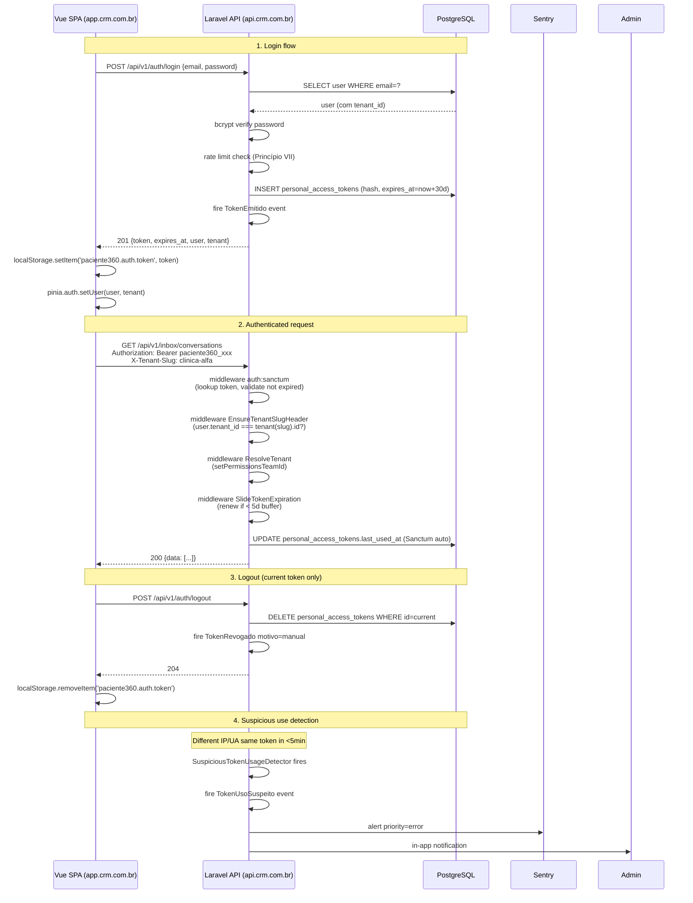

# Data Model: Fase 4 — Token Auth Migration

**Branch**: `004-token-auth-migration` | **Data**: 2026-05-12 | **Status**: Phase 1 — completo

Esta fase é primariamente **refactor de auth flow** — não introduz entidades novas significativas. Mudanças de schema são pontuais e cirúrgicas.

## Convenções gerais

- **Reuso de tabela existente** `personal_access_tokens` (Sanctum padrão, criada em Fase 0).
- **Migration nova** única: UNIQUE constraint em `users.email` global (cross-tenant).
- **4 eventos `Auditable`** novos publicados para audit_logs.
- **Sem mudança** em schema da Fase 3 (messaging) — preserved.

---

## 1. `personal_access_tokens` (Sanctum — REUSO)

Tabela já existente via Sanctum migration original. Schema oficial:

| Coluna | Tipo | Constraints | Notas |
|---|---|---|---|
| `id` | BIGSERIAL | PK | |
| `tokenable_type` | VARCHAR(255) | NOT NULL | Sempre `'App\Models\User'` no caso da API tenant |
| `tokenable_id` | BIGINT | NOT NULL | FK conceitual para users.id |
| `name` | VARCHAR(255) | NOT NULL | Nome amigável do token (ex.: "SPA Login", "Mobile App", "Postman Dev") |
| `token` | VARCHAR(64) | UNIQUE, NOT NULL | **Hash SHA-256** do plain token (Sanctum gerencia) |
| `abilities` | TEXT | NULL | JSON array de abilities. Default `["*"]` para tokens de login completo |
| `last_used_at` | TIMESTAMPTZ | NULL | Auto-atualizado pelo Sanctum em cada request com token |
| `expires_at` | TIMESTAMPTZ | NULL | Sliding expiration — atualizada por `SlideTokenExpiration` middleware |
| `created_at`, `updated_at` | TIMESTAMPTZ | | |

**Constraints existentes** (Sanctum):
- `UNIQUE (token)` — token hash globalmente único.
- `INDEX (tokenable_type, tokenable_id)` — lookup por user.

**Novos índices** (migration `2026_05_12_HHMMSS_add_messaging_token_indexes.php`):
- `INDEX (tokenable_type, tokenable_id, expires_at)` — lookup de tokens ativos por user (otimiza `GET /auth/tokens`).
- `INDEX (expires_at)` WHERE `expires_at < NOW()` — partial index para purge job (otimiza `auth:tokens-purge-expired`).

**Não modificada**: schema existente preservado para evitar breaking change com Sanctum upgrades futuros.

---

## 2. `users` — UNIQUE constraint global em `email` (NOVO — migration crítica)

### Mudança de schema

Migration `2026_05_12_HHMMSS_add_unique_email_global_constraint.php`:

```sql
-- Antes: UNIQUE (tenant_id, email) — permitia mesmo email em tenants distintos
-- Depois: UNIQUE (email) global — força emails únicos cross-tenant

ALTER TABLE users DROP CONSTRAINT users_tenant_id_email_unique;
ALTER TABLE users ADD CONSTRAINT users_email_unique UNIQUE (email);
```

### Fluxo da migration (pré-flight obrigatório)

1. **Detect duplicates** via `users:dedupe-emails-cross-tenant` command:
   ```bash
   vendor/bin/sail artisan users:dedupe-emails-cross-tenant --check
   ```
   - Lista emails que aparecem em > 1 tenant
   - Output: tabela `[email, tenants_envolvidos, users_count, last_login_per_tenant]`
   - Exit 1 se há duplicatas (bloqueia migration); exit 0 se sem duplicatas (migration pode aplicar)

2. **Resolve duplicates** (interativo OU automático):
   - **Modo interativo** (default): para cada email duplicado, pergunta:
     - Manter email no tenant mais ativo (mais recente `last_login_at`)? → Outros tenants recebem sufixo `.tenant-{slug}` (ex.: `maria@example.com` → `maria@example.com.tenant-clinica-beta`)
     - Marcar manualmente quais ficam vs. mudam?
     - Skip (manter como erro — migration vai falhar)
   - **Modo auto** (`--auto`): aplica regra "manter no tenant mais ativo".
   - Cada mudança gera audit log + notifica admins dos tenants afetados via in-app + email (placeholder).

3. **Aplica migration** apenas após `--check` retornar exit 0.

4. **Rollback**: se migration aplicada e precisar reverter, comando `users:rollback-email-dedupe` restaura emails originais (audit log preserva mapeamento).

### Justificativa

NC-4 (clarify Q4): login resolve tenant via lookup `users.email`. Sem UNIQUE global, query pode retornar múltiplos rows → ambiguidade. Constraint força resolução no nível do schema.

---

## 3. Eventos de Domínio — NOVOS (4 Auditable events)

### `TokenEmitido`

Disparado após `LoginController::store` bem-sucedido.

| Campo | Tipo | Notas |
|---|---|---|
| `user_id` | int | User para quem o token foi emitido |
| `token_id` | int | ID do row em `personal_access_tokens` |
| `token_id_prefix` | string | Primeiros 8 chars do plain token (audit visibility sem leak) |
| `ip` | string | IP de origem do login |
| `user_agent` | string | UA do client |
| `expires_at` | datetime | Janela de sliding inicial |
| `abilities` | array | Default `['*']` |

**Audit action**: `auth.token_emitido`
**Timeline**: NÃO projeta (eventos de auth não vão pra timeline do paciente).

### `TokenRevogado`

Disparado em `LogoutController`, `LogoutAllController`, `TokensController::destroy`, e `AuthTokensPurgeExpiredCommand`.

| Campo | Tipo | Notas |
|---|---|---|
| `user_id` | int | Owner do token |
| `token_id` | int | ID revogado |
| `motivo` | string | enum: `manual` (logout) | `logout_all` | `admin_force` | `expired` | `suspicious_use` |
| `executor_id` | int? | NULL se sistema (purge job, expiration); preenchido se admin force |

**Audit action**: `auth.token_revogado`

### `LoginFalhouViaToken`

Disparado em middleware `auth:sanctum` quando token inválido/expirado é apresentado.

| Campo | Tipo | Notas |
|---|---|---|
| `ip` | string | IP do request |
| `token_id_prefix` | string | Primeiros 8 chars do token apresentado (NÃO o token plain inteiro) |
| `path` | string | Rota tentada |
| `motivo` | string | enum: `invalid` | `expired` | `revoked` |

**Audit action**: `auth.login_falhou_token`

### `TokenUsoSuspeito` — MITIGAÇÃO R1 ativa

Disparado por `SuspiciousTokenUsageDetector` (listener pós-auth) quando mesma `token_id` aparece em 2+ IPs distintos OU 2+ UAs distintos em janela <5min (Redis cache).

| Campo | Tipo | Notas |
|---|---|---|
| `user_id` | int | Owner |
| `token_id` | int | Token suspeito |
| `ip_atual` | string | IP do request corrente |
| `ip_anterior` | string | IP do request anterior (dentro da janela 5min) |
| `ua_atual` | string | UA corrente |
| `ua_anterior` | string | UA anterior |
| `janela_segundos` | int | Diff de segundos entre os 2 acessos |

**Audit action**: `auth.token_uso_suspeito`
**Side effect**: Sentry alerta com prioridade `error`; admin clínica notificado in-app. **Token NÃO é auto-revogado** (false positive risk com NAT/CGNAT/VPN). Admin decide via `/auth/tokens` page.

---

## 4. Schema config — `config/auth.php` updates

```php
'defaults' => [
    'guard' => 'web',  // Mantém web como default (Filament admin)
    'passwords' => 'users',
],

'guards' => [
    'web' => [
        'driver' => 'session',
        'provider' => 'users',
    ],
    'sanctum' => [
        'driver' => 'sanctum',
        'provider' => 'users',
    ],
],
```

API tenant routes explicitam `auth:sanctum` em middleware. Filament continua `auth` default (`web`).

---

## 5. Schema config — `config/sanctum.php` updates

```php
'expiration' => 60 * 24 * 30,  // 30 dias em minutos
'token_prefix' => env('SANCTUM_TOKEN_PREFIX', 'paciente360_'),

'middleware' => [
    'authenticate_session' => Laravel\Sanctum\Http\Middleware\AuthenticateSession::class,
    'encrypt_cookies' => App\Http\Middleware\EncryptCookies::class,
    'validate_csrf_token' => Illuminate\Foundation\Http\Middleware\ValidateCsrfToken::class,
],
```

**Mudanças vs Fase 3**:
- `expiration` agora explícito (não null) → sliding service tem default para renovar
- `token_prefix` para identificar tokens em audit logs (`paciente360_xxxxx`)

---

## 6. Schema config — `config/cors.php` (NOVO ou atualizado)

```php
return [
    'paths' => ['api/*', 'broadcasting/auth', 'sanctum/csrf-cookie'],
    'allowed_methods' => ['*'],
    'allowed_origins' => explode(',', env('CORS_ALLOWED_ORIGINS', 'http://localhost:5173,http://localhost:3000')),
    'allowed_origins_patterns' => [],
    'allowed_headers' => ['*'],
    'exposed_headers' => ['X-Request-Id', 'Authorization'],
    'max_age' => 3600,
    'supports_credentials' => false,  // Bearer auth, não cookie
];
```

`CORS_ALLOWED_ORIGINS` env por ambiente:
- **dev**: `http://localhost:5173,http://localhost:3000,http://clinica-alfa.lvh.me`
- **staging**: `https://staging.app.crm.com.br`
- **prod**: `https://app.crm.com.br`

---

## 7. Diagrama de fluxo (login + uso)



---

## 8. Não-mudanças

Para clareza explícita: o que **não** é alterado:

- ✅ Schema `messaging_*` (Fase 3) — preservado
- ✅ Schema `pacientes`, `eventos_timeline`, `audit_logs` (Fase 2) — preservado
- ✅ Schema `tenants`, `roles`, `permissions` (Fase 0) — preservado
- ✅ Filament admin schema — preservado (continua cookie)
- ✅ Reverb broadcast channels (`routes/channels.php`) — preservado (apenas auth guard muda)
- ✅ Migrations existentes — imutáveis (Princípio IV)
- ✅ Eventos Fase 0/2/3 — todos preservados (incluindo `ConversaIATogglingContract` Fase 4 IA)

## 9. Volume estimado

| Entidade | Linhas estimadas/tenant (MVP) | Crescimento |
|---|---|---|
| `personal_access_tokens` | ~50 (1-2 por user ativo + revoked acumulado) | Linear com users; purge 90d limita |
| `users` (UNIQUE email check) | até 50 (sem mudança volumétrica) | Estável |

**Auth events em audit_logs** (TokenEmitido + TokenRevogado + LoginFalhouViaToken + TokenUsoSuspeito):
- ~10 events/user/dia (login matinal + ações administrativas + occasional revogação)
- 1000 atendentes × 10 events = 10k rows/dia em audit_logs (cabe na retenção 2 anos)

## 10. Extensões PostgreSQL

**Sem novas extensões**. `pg_trgm`, `unaccent`, `btree_gin` (Fases 2/3) inalterados.
