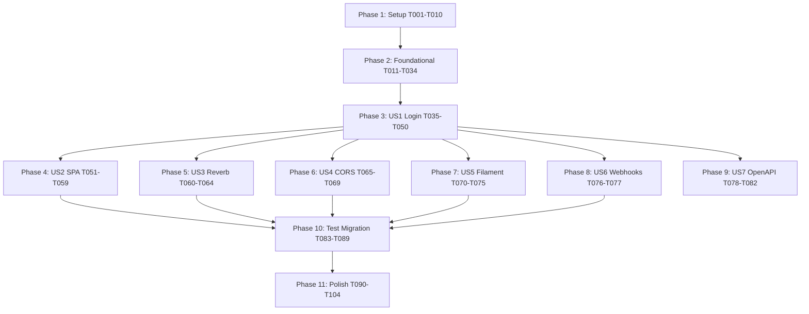

# Tasks: Fase 4 — Token Auth Migration (Cookie → Bearer)

**Input**: Design documents from `/specs/004-token-auth-migration/`
**Prerequisites**: plan.md (309 linhas), spec.md (Clarified — 5/5 NCs resolvidos), research.md (R1-R6), data-model.md, contracts/openapi.yaml (6 paths, 9 schemas), constitution.md v1.4.0 (amendment aplicado em commit `2791c54`)

**Tests**: Obrigatórios — Princípio IV (Spec-Driven Test-First) é gate constitucional. TDD enforced em todos os 16 ACs novos. Adicionalmente: **migração de ~650 testes existentes** (Fases 0/2/3) é parte do escopo (Phase 10).

**Organization**: Tasks agrupadas por user story (P1 primeiro, depois P2, P3). Lote A (Setup) prepara tudo; Lote B (Foundational) cobre eventos + serviços + middleware antes de qualquer endpoint.

## Format: `[ID] [P?] [Story?] Description with file path`

- **[P]**: paralelizável (arquivos distintos, sem dependência)
- **[USx]**: US1 = Login emits Bearer; US2 = SPA armazena token; US3 = Reverb Bearer auth; US4 = CORS; US5 = Filament cookie preservado; US6 = Webhooks preservados; US7 = OpenAPI bearerAuth scheme
- Setup / Foundational / Polish: sem rótulo de story
- Caminhos absolutos relativos ao repo root

---

## Phase 1: Setup (Pré-requisitos físicos)

**Purpose**: Confirmar amendment + provisionar configs + bounded context + dependências.

- [x] T001 **Confirmar constitution v1.4.0 aplicado** — verificar `.specify/memory/constitution.md` linha `**Version**: 1.4.0` (já feito em commit `2791c54`). Se não, ABORT — não prosseguir
- [x] T002 [P] Adicionar deps NPM: `vendor/bin/sail npm install dompurify@^3.0 eslint-plugin-no-unsanitized@^4.0 --save-dev` (DOMPurify runtime + ESLint plugin devDep)
- [x] T003 [P] Atualizar `config/sanctum.php` — `expiration = 60 * 24 * 30` (30d em min); `token_prefix = env('SANCTUM_TOKEN_PREFIX', 'paciente360_')`
- [x] T004 [P] Atualizar `config/auth.php` — `defaults.guard = 'web'` (preservado, Filament default); confirmar guards `web` (session/users) e `sanctum` (sanctum/users) lado a lado
- [x] T005 [P] Criar `config/cors.php` — `paths: ['api/*', 'broadcasting/auth']`, `allowed_origins: explode(',', env('CORS_ALLOWED_ORIGINS', '...'))`, `supports_credentials: false`, `max_age: 3600`, `exposed_headers: ['X-Request-Id', 'Authorization']`
- [x] T006 [P] Adicionar variáveis ao `.env.example`: `SANCTUM_TOKEN_PREFIX=paciente360_`, `CORS_ALLOWED_ORIGINS=http://localhost:5173,...`, `FILAMENT_DOMAIN=crm.com.br`, `APP_TENANT_DOMAIN=app.crm.com.br`, `API_TENANT_DOMAIN=api.crm.com.br`, `VITE_API_BASE_URL=http://api.lvh.me/api/v1`, **`SESSION_DOMAIN=null` (dev)** com comment "em prod: SESSION_DOMAIN=crm.com.br para isolar cookie Filament — não cruzar com app.crm.com.br (FR-018 / C4 fix)"
- [x] T007 [P] Criar estrutura de diretórios `app/Domain/Auth/{Events,Services,Contracts}` + `.gitkeep` em cada
- [x] T008 [P] Criar diretório de testes `tests/Feature/Fase4/{Auth,Migration}` + `tests/Unit/Auth/` com `.gitkeep`
- [x] T009 [P] Atualizar `eslint.config.js` — registrar plugin `no-unsanitized` com regras `recommended` + custom rule `vue/no-v-html: 'warn'`
- [x] T010 Rodar `vendor/bin/sail composer dump-autoload && vendor/bin/sail npm run build` — confirmar autoload OK e bundle ainda builda

---

## Phase 2: Foundational (Eventos + Serviços + Middleware — bloqueia todas as US)

**Purpose**: Domínio + infra base. Nenhuma US começa antes desta phase concluir.

⚠️ **CRITICAL**: Lote A (T001-T010) tem que estar done antes de começar.

### Migration pré-flight + UNIQUE email (T011-T015)

- [x] T011 Criar `app/Console/Commands/UsersDedupeEmailsCrossTenantCommand.php` com signature `--check | --interactive | --auto` (per research R6 + data-model.md § 2): query `SELECT email, GROUP_CONCAT(tenant_id) FROM users GROUP BY email HAVING COUNT(*) > 1`; modos resolvem mantendo email no tenant mais ativo + sufixo `.tenant-{slug}` nos demais
- [x] T012 [P] Write `tests/Feature/Fase4/Migration/DedupCommandTest.php` — cobre check, interactive, auto modes; valida audit log + notificação admin
- [x] T013 [P] Write `tests/Feature/Fase4/Migration/EmailUniqueCrossTenantMigrationTest.php` — aplica migration; valida que duplicatas pendentes geram exception; sem duplicatas aplica clean
- [x] T014 Criar migration `database/migrations/2026_05_13_000001_add_unique_email_global_constraint.php` — `DROP INDEX users_email_tenant_unique; ADD CONSTRAINT users_email_unique UNIQUE (email);`. Migration aborta se duplicatas presentes (gate)
- [x] T015 Criar migration `database/migrations/2026_05_13_000002_add_personal_access_tokens_indexes.php` — `CREATE INDEX (tokenable_type, tokenable_id, expires_at)` + partial index `(expires_at) WHERE expires_at IS NOT NULL` para purge job

### Eventos Auditable (T016-T019)

- [x] T016 [P] Criar `app/Domain/Auth/Events/TokenEmitido.php` (Auditable, action `auth.token_emitido`, payload `{user_id, token_id, token_id_prefix, ip, user_agent, expires_at, abilities}`; `relatedPacienteId() = null`)
- [x] T017 [P] Criar `app/Domain/Auth/Events/TokenRevogado.php` (Auditable, action `auth.token_revogado`, payload `{user_id, token_id, motivo, executor_id}`; motivo enum `manual|logout_all|admin_force|expired|suspicious_use`)
- [x] T018 [P] Criar `app/Domain/Auth/Events/LoginFalhouViaToken.php` (Auditable, action `auth.login_falhou_token`, payload `{ip, token_id_prefix, path, motivo}`; motivo enum `invalid|expired|revoked`)
- [x] T019 [P] Criar `app/Domain/Auth/Events/TokenUsoSuspeito.php` (Auditable, action `auth.token_uso_suspeito`, payload `{user_id, token_id, ip_atual, ip_anterior, ua_atual, ua_anterior, janela_segundos}`)

### Contracts + Services (T020-T026)

- [x] T020 [P] Criar `app/Domain/Auth/Contracts/BearerAuthContract.php` interface — `issueToken(User, string $name, array $abilities): array; revokeToken(int $id): void; revokeAllForUser(User): int; resolveTenantByEmail(string): ?Tenant;`
- [x] T021 [P] Write `tests/Unit/Auth/TokenIssuerServiceTest.php` — emit token via Sanctum, fire TokenEmitido, hash SHA-256 no DB
- [x] T022 Criar `app/Domain/Auth/Services/TokenIssuerService.php` implementing BearerAuthContract — usa `$user->createToken($name, $abilities, $expiresAt)` Sanctum; expira em `now()->addMinutes(config('sanctum.expiration'))`; fire TokenEmitido com payload completo
- [x] T023 [P] Criar `app/Domain/Auth/Services/TokenRevocationService.php` — métodos `revokeCurrent(User)`, `revokeAll(User, string $motivo = 'logout_all')`, `revokeById(int $id, ?int $executorId = null)`. Cada chamada fire TokenRevogado com motivo apropriado
- [x] T024 [P] Write `tests/Unit/Auth/SlidingExpirationServiceTest.php` — UPDATE só se `expires_at - now() < 5d`; idempotência; throttle correto
- [x] T025 Criar `app/Domain/Auth/Services/SlidingExpirationService.php` — `renewIfDue(PersonalAccessToken $token, int $bufferDays = 5, int $windowMinutes = null): bool`; usa default config quando bufferDays/windowMinutes não passados
- [x] T026 [P] Write `tests/Unit/Auth/SuspiciousTokenUsageDetectorTest.php` — detecta IPs/UAs distintos em <5min via Redis cache; emite TokenUsoSuspeito; não auto-revoga (apenas alert)

### Middleware (T027-T030)

- [x] T027 [P] Criar `app/Http/Middleware/EnsureTenantSlugHeader.php` — exige `X-Tenant-Slug` header em rotas autenticadas (exceto `/auth/login`, `/auth/me`); validação cross-check `$user->tenant_id === Tenant::where('slug', $header)->first()->id`; mismatch → 403 com `error=tenant_mismatch`; header ausente → 400 `tenant_header_required`
- [x] T028 [P] Criar `app/Http/Middleware/SlideTokenExpiration.php` — aplicado após `auth:sanctum`; chama `SlidingExpirationService::renewIfDue($request->user()->currentAccessToken())`
- [x] T029 [P] Criar `app/Http/Middleware/MaskAuthorizationInLogs.php` — estende `LogStructuredRequestData` (Fase 0/3) substituindo header `Authorization` por `Bearer SCRUBBED` antes do log; aplica também em audit context se token aparecer
- [x] T030 [P] Criar `app/Http/Middleware/SetSecurityHeaders.php` — CSP estrita em prod com nonce (research R4); permissive em local/test; sempre seta HSTS, X-Frame-Options DENY, X-Content-Type-Options nosniff, Referrer-Policy strict-origin

### Service `EmailDedupService` + `SuspiciousTokenUsageDetector` impl (T031-T032)

- [x] T031 [P] Criar `app/Domain/Auth/Services/EmailDedupService.php` — lógica usada pelo command T011: `detectDuplicates(): Collection`, `applyDedup(array $resolutions): void` (cada resolution = `{email, keep_tenant_id, suffix_tenants[]}`); audit log + notify admins
- [x] T032 [P] Criar `app/Domain/Auth/Services/SuspiciousTokenUsageDetector.php` — listener post-auth que dispatch via Redis cache key `auth:token-usage:{token_id}` com TTL 5min armazenando `{ip, ua}`; comparar com request atual; se distinto, fire TokenUsoSuspeito + Sentry error

### Verify Phase 2

- [x] T033 Rodar todos os testes unit + foundational: `vendor/bin/sail artisan test --compact tests/Unit/Auth/ tests/Feature/Fase4/Migration/` — esperado 100% green
- [x] T034 Bind no `AppServiceProvider`: `BearerAuthContract → TokenIssuerService` singleton; register `SuspiciousTokenUsageDetector` listener para evento Sanctum `TokenAuthenticated` (ou eventoadequado)

**Checkpoint Phase 2**: Foundational completo. Pint clean obrigatório (`vendor/bin/sail bin pint --dirty --format agent`).

---

## Phase 3: User Story 1 — Login emite Bearer token (P1) 🎯 MVP

**Goal**: `POST /api/v1/auth/login` retorna `{token, expires_at, user, tenant}` ao invés de set cookie session.

**Independent Test**: curl POST com email+password → recebe token Bearer + tenant info → curl GET `/auth/me` com `Authorization: Bearer + X-Tenant-Slug` retorna user data.

**ACs cobertos**: AC-A.1.1 a AC-A.1.7 (7 ACs).

### Tests for US1 (TDD red)

- [ ] T035 [P] [US1] Write `tests/Feature/Fase4/Auth/LoginEmitsTokenTest.php` covering AC-A.1.1, AC-A.1.2, AC-A.1.5 + FR-024 rate limit (gate Princípio VII):
  - login_success_returns_token_with_user_and_tenant
  - login_rejects_invalid_credentials_401
  - **login_blocks_after_5_failed_attempts_in_60s_returns_423** (FR-024 / C1 fix — gate Princípio VII)
  - **login_locked_until_timestamp_returned_in_423_response**
  - login_rate_limit_isolated_per_ip (não global)
  - login_resolves_tenant_via_email_lookup_globally_unique
  - login_records_TokenEmitido_audit
  - login_failure_records_LoginFalhouViaToken_audit
  - token_expires_at_is_30d_from_now
- [ ] T036 [P] [US1] Write `tests/Feature/Fase4/Auth/MeEndpointTest.php` covering AC-A.1.4:
  - me_returns_user_and_tenant_when_bearer_valid
  - me_rejects_missing_bearer_401
  - me_rejects_expired_token_401
  - me_rejects_revoked_token_401
  - me_includes_token_metadata_in_response
- [ ] T037 [P] [US1] Write `tests/Feature/Fase4/Auth/LogoutCurrentTokenTest.php` covering AC-A.1.3:
  - logout_revokes_only_current_token
  - logout_other_tokens_remain_active
  - logout_fires_TokenRevogado_with_motivo_manual
  - logout_idempotent_double_call_204
- [ ] T038 [P] [US1] Write `tests/Feature/Fase4/Auth/LogoutAllTokensTest.php` (extensão de AC-A.1.3):
  - logout_all_revokes_every_token_of_user
  - logout_all_fires_TokenRevogado_per_token_with_motivo_logout_all
- [ ] T039 [P] [US1] Write `tests/Feature/Fase4/Auth/ListAndRevokeTokensTest.php` covering AC-A.1.7:
  - list_returns_active_tokens_with_metadata
  - delete_token_by_id_revokes
  - delete_token_of_other_user_returns_403
  - is_current_flag_marks_request_token
- [ ] T039a [P] [US1] **(C2 fix — Princípio II gate)** Write `tests/Feature/Fase4/Auth/CrossTenantTokenAbuseTest.php` covering FR-011 + amendment v1.4.0 triple-check:
  - token_with_X_Tenant_Slug_mismatch_returns_403_tenant_mismatch (user1 do tenant A apresenta token + X-Tenant-Slug=tenant B → 403)
  - missing_X_Tenant_Slug_header_returns_400_tenant_header_required
  - matching_X_Tenant_Slug_passes_to_controller
  - cross_tenant_attempt_records_audit_log_with_executor_id
- [ ] T040 [US1] Run all US1 tests; **all must FAIL** — `vendor/bin/sail artisan test --compact tests/Feature/Fase4/Auth/`

### Implementation for US1

- [ ] T041 [P] [US1] Criar `app/Http/Requests/Auth/LoginRequest.php` — valida `email required email`, `password required min:8`, `device_name nullable string max:100`. Autoriza true (público)
- [ ] T042 [US1] Criar `app/Http/Controllers/Api/V1/Auth/LoginController.php` — action `__invoke(LoginRequest $req, BearerAuthContract $issuer, EmailDedupService $dedup)`:
  - Rate limit por IP (5 tentativas → 423) — reusa pattern Fase 0
  - Lookup `User::where('email', $req->email)->first()`
  - Se não encontrado: 401 `invalid_credentials` (sem revelar se email existe)
  - bcrypt verify password; falha → 401 + fire LoginFalhouViaToken
  - Sucesso: `$issuer->issueToken($user, $req->device_name ?? 'Default', ['*'])` → retorna plain token
  - Response 201 com `LoginResponse` schema (user + tenant + token + expires_at)
- [ ] T043 [P] [US1] Criar `app/Http/Controllers/Api/V1/Auth/MeController.php` — action `__invoke(Request $req)` — retorna user + tenant + token metadata (id, name, abilities, last_used_at, expires_at)
- [ ] T044 [P] [US1] Criar `app/Http/Controllers/Api/V1/Auth/LogoutController.php` — `__invoke(Request $req, TokenRevocationService $svc)` — `$svc->revokeCurrent($req->user())` → 204
- [ ] T045 [P] [US1] Criar `app/Http/Controllers/Api/V1/Auth/LogoutAllController.php` — `$svc->revokeAll($req->user(), 'logout_all')` → 204
- [ ] T046 [P] [US1] Criar `app/Http/Controllers/Api/V1/Auth/TokensController.php`:
  - `index(Request $req)` — list `$req->user()->tokens()` com TokenResource; flag `is_current` no token da request
  - `destroy(Request $req, int $id)` — verifica ownership; `$svc->revokeById($id)` → 204; outro user → 403
- [ ] T047 [P] [US1] Criar `app/Http/Resources/V1/TokenResource.php` — `id, name, token_id_prefix (primeiros 8 chars), abilities, last_used_at, expires_at, created_at, is_current`
- [ ] T048 [US1] Routes em `routes/api.php`:
  ```php
  Route::prefix('auth')->group(function () {
      Route::post('login', LoginController::class)->middleware('throttle:5,1');
      Route::middleware(['auth:sanctum', 'tenant.slug', 'slide.token'])->group(function () {
          Route::post('logout', LogoutController::class);
          Route::post('logout-all', LogoutAllController::class);
          Route::get('me', MeController::class);
          Route::get('tokens', [TokensController::class, 'index']);
          Route::delete('tokens/{tokenId}', [TokensController::class, 'destroy']);
      });
  });
  ```
- [ ] T049 [US1] Aliases dos middlewares em `bootstrap/app.php`: `'tenant.slug' => EnsureTenantSlugHeader::class, 'slide.token' => SlideTokenExpiration::class`. **REMOVER `statefulApi()` do grupo `api`** (Princípio II + amendment v1.4.0 — API tenant é stateless agora)
- [ ] T050 [US1] Run all US1 tests; **all must PASS**

---

## Phase 4: User Story 2 — SPA Vue armazena token e injeta automaticamente (P1)

**Goal**: SPA carrega token de `localStorage` no boot, injeta em todas as requests via axios + auto-redirect login em 401.

**Independent Test**: Login na SPA em browser → DevTools localStorage `paciente360.auth.token` setado → request a `/auth/me` envia Authorization Bearer header → recarregar página preserva login.

**ACs cobertos**: AC-A.2.1 a AC-A.2.5 (5 ACs).

### Tests for US2 (E2E browser-side — Playwright para smoke; testes unit do auth store via Vitest se existir, senão pular)

- [ ] T051 [P] [US2] Write `tests/e2e/auth-token-flow.spec.ts` Playwright covering:
  - login_persists_token_to_localStorage
  - token_auto_injects_in_subsequent_requests
  - 401_clears_storage_and_redirects_to_login
  - reload_persists_session_via_token
  - logout_clears_localStorage

### Implementation for US2

- [ ] T052 [P] [US2] Atualizar `resources/js/lib/api.js` — remover `withCredentials: true, withXSRFToken: true`; adicionar interceptor de request que injeta `Authorization: Bearer ${authStore.token}` e `X-Tenant-Slug: ${authStore.tenant.slug}` quando autenticado; manter interceptor de 401 (já existe)
- [ ] T053 [US2] Atualizar `resources/js/stores/auth.js` Pinia:
  - State: `token: ref(null), user: null, tenant: null, permissions: []`
  - `boot()` action — carrega `localStorage.getItem('paciente360.auth.token')`; se presente, faz `GET /auth/me` para revalidar + carregar user+tenant
  - `login({email, password})` — chama `POST /auth/login`; persist token em localStorage + state
  - `logout()` — chama `POST /auth/logout`; clear localStorage + state
  - `logoutAll()` — chama `POST /auth/logout-all`
  - `setToken(token)` / `clearToken()` helpers
  - `reset()` — limpa state local sem chamar API (usado por 401 interceptor)
- [ ] T054 [P] [US2] Atualizar `resources/js/pages/Auth/LoginPage.vue` — form 2 campos (email + password). Submit chama `authStore.login(...)`. Sucesso → redirect `/panel`. Erro 401 → mensagem genérica "Credenciais inválidas" (não revela tenant). Erro 423 → mostra `locked_until`
- [ ] T055 [P] [US2] Criar `resources/js/pages/Auth/TokensPage.vue` (Settings → Sessões) — lista tokens via `GET /auth/tokens`; cada item mostra `name, token_id_prefix, last_used_at, expires_at, is_current badge`; botão "Revogar" chama `DELETE /auth/tokens/{id}` (confirm modal); botão "Sair de todos dispositivos" (logout-all)
- [ ] T056 [P] [US2] Adicionar rota `/panel/configuracoes/sessoes` em `resources/js/router/index.js` com meta `requiresAuth: true, ability: 'inbox.view'` (qualquer user autenticado pode gerenciar próprias sessões)
- [ ] T057 [US2] Atualizar `resources/js/main.js` (ou bootstrap entry) — chamar `authStore.boot()` no início, ANTES de mount do app; aguarda revalidação antes de renderizar
- [ ] T058 [US2] Adicionar i18n strings em `resources/js/i18n/pt-BR.json` chave `auth`:
  ```
  sessoes.titulo, sessoes.atual, sessoes.expira_em, sessoes.usado_em, sessoes.revogar, sessoes.logout_all, sessoes.confirmar_revogar
  ```

### Build + verify

- [ ] T059 [US2] `vendor/bin/sail npm run build` — confirma 0 erros, bundle dentro do esperado (não regredir vs Fase 3)

---

## Phase 5: User Story 3 — Reverb broadcast auth com Bearer (P1)

**Goal**: Echo client envia `Authorization: Bearer` em `/broadcasting/auth` ao invés de cookie. Backend valida via guard sanctum.

**Independent Test**: 2 atendentes logados via SPA — webhook Twilio entrega mensagem — broadcast aparece em ambas as inboxes < 2s.

**ACs cobertos**: AC-A.3.1 a AC-A.3.3 (3 ACs).

### Tests for US3

- [ ] T060 [P] [US3] Write `tests/Feature/Fase4/Auth/BroadcastingAuthBearerTest.php` covering:
  - broadcasting_auth_accepts_bearer_token_returns_200_signature
  - broadcasting_auth_rejects_cookie_session_returns_401
  - broadcasting_auth_validates_X_Tenant_Slug_header
  - cross_tenant_broadcast_subscription_blocked_403 (Princípio II — InboxTenantIsolationTest extension)

### Implementation for US3

- [ ] T061 [US3] Atualizar `bootstrap/app.php` registro de broadcasting — chamar `Broadcast::routes(['middleware' => ['auth:sanctum', 'tenant.slug']])` em vez do default `['web']`; OR remover `statefulApi()` da chain do `broadcasting/auth` se já não estiver lá
- [ ] T062 [US3] Atualizar `resources/js/echo.js` — `authorizer` envia `Authorization: Bearer ${authStore.token}` + `X-Tenant-Slug: ${authStore.tenant.slug}`; remove `withCredentials`/`withXSRFToken` (agora desnecessário)
- [ ] T063 [US3] Run US3 tests; all PASS
- [ ] T064 [US3] **Smoke test manual** — abrir 2 abas com user diferente do mesmo tenant em `/panel/inbox`; trigger evento broadcast (ex.: enviar mensagem via curl webhook); confirmar que ambas abas recebem evento em <2s (verificado no DevTools → Network → WS)

---

## Phase 6: User Story 4 — CORS habilitado cross-domain (P1)

**Goal**: API responde preflight OPTIONS + Access-Control-Allow-Origin para origins whitelisted (configurável env).

**Independent Test**: curl OPTIONS `/api/v1/inbox/conversations` com `Origin: http://allowed.test` → 204 com headers CORS apropriados. Origin não whitelisted → 200 mas sem headers (browser bloqueia).

**ACs cobertos**: AC-A.4.1 a AC-A.4.3 (3 ACs).

### Tests for US4

- [ ] T065 [P] [US4] Write `tests/Feature/Fase4/Auth/CorsPreflightTest.php` covering:
  - options_preflight_returns_cors_headers_for_allowed_origin
  - options_preflight_no_headers_for_disallowed_origin
  - max_age_3600_in_response
  - reverb_wss_path_included_in_cors
- [ ] T065a [P] [US4] **(C3 fix — Princípio VII gate)** Write `tests/Feature/Fase4/Auth/SecurityHeadersTest.php` covering CSP + outros gates de SetSecurityHeaders middleware (T030):
  - prod_response_includes_csp_strict_without_unsafe_inline
  - prod_response_includes_csp_strict_without_unsafe_eval
  - prod_response_includes_hsts_max_age_1y_include_subdomains
  - prod_response_includes_x_frame_options_deny
  - prod_response_includes_x_content_type_options_nosniff
  - prod_response_includes_referrer_policy_strict_origin
  - local_env_allows_relaxed_csp_with_unsafe_inline_for_vite_hmr
  - csp_nonce_generated_per_request_when_strict

### Implementation for US4

- [ ] T066 [US4] Confirmar `Illuminate\Http\Middleware\HandleCors` aplicado no grupo `api` (Laravel 11+ default); se não, adicionar em `bootstrap/app.php` `$middleware->use([HandleCors::class])` ou via `withMiddleware`
- [ ] T067 [US4] Validar `config/cors.php` (criado em T005) cobre todos os paths corretos: `api/*`, `broadcasting/auth`
- [ ] T068 [US4] Run US4 tests; PASS
- [ ] T069 [US4] **Smoke test** — em browser de outro origin (ex.: `http://localhost:3000`), fetch para `http://api.lvh.me/api/v1/auth/me` deve disparar preflight; verificar no DevTools Network → OPTIONS → 204 com headers `Access-Control-Allow-Origin`

---

## Phase 7: User Story 5 — Filament super admin permanece cookie (P2)

**Goal**: Filament continua funcionando com session cookie sem interferência da migração API.

**Independent Test**: Login em `http://crm.lvh.me/admin` com `super@admin.local` / `password123` → dashboard renderiza; lista tenants funciona; logout limpa cookie session.

**ACs cobertos**: AC-A.5.1 a AC-A.5.2 (2 ACs).

### Tests for US5

- [ ] T070 [P] [US5] Write `tests/Feature/Fase4/Auth/FilamentCookieIsolationTest.php` covering:
  - filament_login_emits_session_cookie_not_bearer
  - filament_routes_reject_bearer_token (mostram que guards são isolados — Filament não aceita Bearer)
  - session_cookie_scoped_to_filament_domain (em prod; testa via SESSION_DOMAIN config)
  - api_tenant_does_not_accept_filament_cookie (cookie de crm.com.br NÃO autentica em api.crm.com.br)

### Implementation for US5

- [ ] T071 [US5] Confirmar `config/auth.php` guards `web` (session/users) e `sanctum` (sanctum/users) — ambos preservados
- [ ] T072 [US5] Filament já usa guard `web` — confirmar via `config/filament.php` ou Panel provider (geralmente `Panel::authGuard('web')`). Se for default já está OK
- [ ] T073 [US5] Em `bootstrap/app.php`, manter `statefulApi()` **apenas para o grupo Filament admin** (não no grupo api global). Pode ser necessário criar middleware group dedicado `filament` se ainda não existe
- [ ] T074 [US5] Run US5 tests; PASS — confirma isolation entre guards
- [ ] T075 [US5] **Smoke test manual** — login em `http://crm.lvh.me/admin`; verificar cookie `laravel-session` no DevTools → Application; sem Bearer token; navegação funcional

---

## Phase 8: User Story 6 — Webhooks providers continuam sem auth (P3 — preservado)

**Goal**: Confirmar (regressão) que webhooks Twilio, Meta, Widget continuam validando HMAC signature — não cookie nem Bearer.

**Independent Test**: webhook Twilio entrega mensagem (sem header Authorization) → 200 OK, processa normalmente.

**ACs cobertos**: 1 AC implícito (verificação de regressão).

### Tests for US6 — Regressão

- [ ] T076 [P] [US6] Adicionar test em `tests/Feature/Fase4/Auth/WebhookProvidersStillWorkTest.php`:
  - twilio_webhook_works_without_authorization_header (regressão Fase 3 US1)
  - meta_instagram_webhook_works_without_authorization_header (regressão Fase 3 US2)
  - widget_public_works_without_authorization_header (regressão Fase 3 US3)
- [ ] T077 [US6] Run US6 + suite Fase 3 webhook tests existentes — confirmar ZERO regressão:
  ```
  vendor/bin/sail artisan test --compact \
    tests/Feature/Fase3/US1_WhatsApp/TwilioWebhookInboundTest.php \
    tests/Feature/Fase3/US2_Instagram/MetaWebhookInboundTest.php \
    tests/Feature/Fase3/US3_Widget/WidgetMessagePublicTest.php \
    tests/Feature/Fase4/Auth/WebhookProvidersStillWorkTest.php
  ```

---

## Phase 9: User Story 7 — OpenAPI bearerAuth scheme (P2)

**Goal**: Documentação API descreve Bearer auth claramente para integradores externos (Postman, mobile, parceiros).

**Independent Test**: OpenAPI YAML tem `securitySchemes.bearerAuth` + cada endpoint autenticado referencia security. Postman import abre coleção funcional.

**ACs cobertos**: AC-A.7.x (3 ACs).

### Implementation for US7

- [ ] T078 [P] [US7] Confirmar `specs/004-token-auth-migration/contracts/openapi.yaml` (criado no `/speckit.plan`) tem `securitySchemes.bearerAuth` + 6 paths usam — já feito em commit `d642a85`; revisar para garantir consistência com endpoints implementados
- [ ] T079 [P] [US7] Rodar `vendor/bin/sail artisan scribe:generate` — Scribe gera doc HTML/Postman a partir das routes Laravel + annotations
- [ ] T080 [US7] Atualizar `app/Console/Commands/CheckOpenApiDrift.php` (Lote O Fase 3) para incluir `specs/004-token-auth-migration/contracts/openapi.yaml`; rodar `openapi:check` → exit 0 esperado
- [ ] T081 [P] [US7] Criar Postman collection em `docs/api/Paciente360 API v1.postman_collection.json` (ou similar) com pre-request scripts conforme quickstart.md § 6
- [ ] T082 [US7] Atualizar `resources/views/scribe/...` (template) para incluir explicação de Bearer auth no header — instruir como obter token via `/auth/login`

---

## Phase 10: Migração massiva de testes existentes (~650)

**Purpose**: Migrar todos os testes Fases 0/2/3 que usam `$this->actingAs($user)` para `Sanctum::actingAs($user, ['*'])`. Sem isso, suite full quebra após Phase 3 (statefulApi removido).

⚠️ **CRITICAL**: Esta phase tem o maior risco de regressão. Mitigação: comando idempotente + verificação por batch.

- [ ] T083 [P] Criar `app/Console/Commands/TestsMigrateActingAsCommand.php` com signature `--preview | --apply | --verify | --only=path`. Lógica per research R6:
  - Detecta arquivos em `tests/{Feature,Unit}/Fase{0,2,3}/**/*Test.php` (não Fase4 — já nasceu com Sanctum)
  - Transforma:
    - `$this->actingAs($user)` → `\Laravel\Sanctum\Sanctum::actingAs($user, ['*'])`
    - `$this->actingAs($user, 'web')` → `\Laravel\Sanctum\Sanctum::actingAs($user, ['*'], 'sanctum')` (com NOTE inline para revisão)
  - Adiciona `use Laravel\Sanctum\Sanctum;` se ausente
  - Lista edge cases para revisão manual (testes que mexem com session diretamente, com guard explícito, etc.)
  - Idempotente: rodar 2x não causa dano
- [ ] T084 Rodar preview: `vendor/bin/sail artisan tests:migrate-actingas-to-sanctum --preview` — output mostra diff esperado por arquivo
- [ ] T085 Revisar manualmente os edge cases listados (provavelmente <20 arquivos). Decidir: aplicar transformação padrão OU intervenção custom OR exclude
- [ ] T086 Aplicar: `vendor/bin/sail artisan tests:migrate-actingas-to-sanctum --apply --verify` — `--verify` roda suite full automaticamente após apply
- [ ] T087 Se algum test falha (regressão): investigar caso a caso. Comum: testes que dependiam de cookie/CSRF/session details — adaptar para token flow
- [ ] T088 Suite full target: **882+ tests verdes** (baseline pós-Fase 3 = 882). Sem regressão tolerada
- [ ] T089 Atualizar `tests/Feature/Fase3/InboxTenantIsolationTest.php` para também testar `X-Tenant-Slug` header enforcement (gate Princípio II amendment v1.4.0)

---

## Phase 11: Polish & Cross-Cutting

### Audit log retention + housekeeping

- [ ] T090 [P] Criar `app/Console/Commands/AuthTokensPurgeExpiredCommand.php` — schedule diário 03:00 BRT — purga `personal_access_tokens` revoked/expired > 90d; log estruturado de count purgado por tenant
- [ ] T091 [P] Schedule no `routes/console.php`: `Schedule::command('auth:tokens-purge-expired')->dailyAt('03:00')->timezone('America/Sao_Paulo')->withoutOverlapping()`

### Métricas Prometheus

- [ ] T092 [P] Estender `app/Support/Metrics/MessagingMetrics.php` (Fase 3 Lote O) OR criar `app/Support/Metrics/AuthMetrics.php` com:
  - `paciente360_auth_login_total{result}` — counter
  - `paciente360_auth_token_emitido_total` — counter
  - `paciente360_auth_token_revogado_total{motivo}` — counter
  - `paciente360_auth_active_tokens` — gauge (count tokens não-expirados/revogados)
- [ ] T093 Wire metrics nos controllers/services: LoginController (login_total), TokenIssuerService (emitido_total), TokenRevocationService (revogado_total)
- [ ] T094 [P] Adicionar Sentry context em AppServiceProvider — set `auth.user_id, auth.tenant_id, auth.token_id_prefix` em escopo após auth:sanctum

### CSP refinement (audit)

- [ ] T095 [P] Auditar bundle frontend produzido por `npm run build` — confirmar zero `eval()` calls, zero scripts inline injetados; rodar com CSP estrita em staging para detectar violations report-only
- [ ] T096 [P] Auditar `Storage::disk('media')` URLs e qualquer integração externa — adicionar nos `connect-src` da CSP se necessário (Twilio, Meta, S3 endpoints)

### Documentation

- [ ] T097 [P] Atualizar `specs/004-token-auth-migration/quickstart.md` § 12 DoR com status final (após implementação completa)
- [ ] T098 [P] Atualizar `CLAUDE.md` SPECKIT markers para apontar Fase 4 como entregue (após merge)
- [ ] T099 [P] Atualizar `README.md` (se existe) com fluxo de auth atualizado para devs novos

### Final regression + coverage

- [ ] T100 Run full suite: `vendor/bin/sail artisan test --compact` — target: **≥1100 tests verdes** (baseline 1044 pós-Fase 3 commit `1cf2304` + ~58 novos Fase 4; I1 fix corrigiu estimativa anterior de "940+" que estava desatualizada)
- [ ] T101 Pint clean: `vendor/bin/sail bin pint --dirty --format agent`
- [ ] T102 Coverage check (se driver disponível): `vendor/bin/sail artisan test --coverage --min=70`
- [ ] T103 OpenAPI drift 0: `vendor/bin/sail artisan openapi:check`
- [ ] T104 Smoke test manual end-to-end:
  - Login via SPA
  - Verificar localStorage token
  - Abrir inbox → Reverb conecta
  - Logout
  - localStorage cleared
  - Tentar usar token antigo via curl → 401

---

## Dependencies



**Story-level dependencies**:
- **US1 (Login) é root** — habilita todas as outras
- US2 (SPA) depende de US1 — sem endpoint /login, SPA não tem o que consumir
- US3, US4, US5, US6, US7 são **paralelizáveis** entre si após US1
- Migration (Phase 10) requer todas as US done — só pode rodar com pipeline novo estável
- Polish (Phase 11) é gate final — não inicia sem Migration verde

**Parallel opportunities**:
- **Phase 1**: T002-T009 todos [P] (arquivos distintos)
- **Phase 2**: T012-T013 [P]; T016-T019 [P] (4 events); T020, T021, T023, T024, T026 [P]; T027-T030 [P]; T031-T032 [P]
- **Phase 3 (US1)**: T035-T039 [P] (5 test files); T041, T043-T047 [P] (controllers/requests/resources)
- **Phase 4 (US2)**: T051 (test) + T052, T054-T056, T058 [P]
- **Phase 5 (US3)**: T060 [P]; sequencial demais (touch echo.js + bootstrap/app.php)
- **Phase 6 (US4)**: T065 [P]; demais sequencial
- **Phase 7 (US5)**: T070 [P]; demais sequencial
- **Phase 8 (US6)**: T076 [P]
- **Phase 9 (US7)**: T078, T079, T081 [P]
- **Phase 11**: T090, T091, T092, T094, T095, T096, T097, T098, T099 [P]

---

## Implementation Strategy

### MVP scope (entrega mínima viável)

**Recomendado**: completar **Phase 1 + 2 + 3 (US1) + Phase 10 (Migration)**. Isso entrega login Bearer funcional + suite full ainda verde + capability mínima de cliente Postman/mobile.

Após MVP, sequenciar P1 restantes (US2 SPA, US3 Reverb, US4 CORS), depois P2/P3 + Polish.

### Lotes propostos (orquestração de implementação)

| Lote | Phase(s) | Tasks | Foco | Subagent recomendado |
|---|---|---|---|---|
| A | Setup | T001-T010 | Configs + bounded context + deps NPM | laravel-backend-architect |
| B | Foundational tests + migrations | T011-T015 | Pre-flight dedup + UNIQUE email | database-architect + test-engineer |
| C | Foundational events + services + middleware | T016-T034 | Events Auditable, services, middleware | laravel-backend-architect |
| D | US1 Login complete (tests + impl) | T035-T050 | Login flow + tokens endpoints | laravel-backend-architect |
| E | US2 SPA frontend | T051-T059 | axios + auth store + login page | vue-frontend-engineer |
| F | US3 Reverb broadcasting | T060-T064 | Echo Bearer authorizer | realtime-broadcasting-engineer |
| G | US4 CORS + US5 Filament + US6 Webhooks regression | T065-T077 | Cross-cutting auth boundaries | laravel-backend-architect |
| H | US7 OpenAPI + Polish docs | T078-T082, T097-T099 | API docs + Postman | laravel-backend-architect |
| I | **CRITICAL: Test migration ~650** | T083-T089 | Script migracao + verify | test-engineer |
| J | Polish — métricas + retention + CSP audit | T090-T096 | Observabilidade + housekeeping | devops-deployment |
| K | Final regression + coverage + smoke | T100-T104 | Gate de merge | test-engineer |

### Provisionamento externo — checkpoint

Esta fase **não exige** provisionamento externo (sem Twilio/Meta/AWS novos). Reusa tudo da Fase 3.

**Antes de deploy prod** (não esta phase):
- Domínio `app.crm.com.br` configurado (CDN/Cloudflare Pages)
- Domínio `api.crm.com.br` configurado (Laravel Cloud ou EC2)
- Filament admin em `crm.com.br` (mesma instância Laravel)
- CORS env atualizado por ambiente (`CORS_ALLOWED_ORIGINS`)

---

## Resumo

**Total**: **104 tasks** distribuídas em 11 phases.

**Tasks por user story**:
- US1 (Login Bearer): 16 tasks (T035–T050)
- US2 (SPA storage): 9 tasks (T051–T059)
- US3 (Reverb): 5 tasks (T060–T064)
- US4 (CORS): 5 tasks (T065–T069)
- US5 (Filament): 6 tasks (T070–T075)
- US6 (Webhooks regression): 2 tasks (T076–T077)
- US7 (OpenAPI Bearer): 5 tasks (T078–T082)
- Setup + Foundational: 34 tasks (T001–T034)
- Migration tests existentes: 7 tasks (T083–T089) ⚠️ alto risco
- Polish: 15 tasks (T090–T104)

**Independent test criteria por US** (recap):
- **US1**: curl POST /login → token Bearer → GET /me com Bearer → user data retornada
- **US2**: Login SPA → localStorage token → reload preserva sessão → logout limpa
- **US3**: 2 browsers logados via Bearer → Reverb broadcast em <2s ambos
- **US4**: curl OPTIONS preflight → CORS headers para allowed origin
- **US5**: Filament admin login → session cookie + dashboard funcional + isolation
- **US6**: Webhooks Twilio/Meta/Widget continuam funcionando sem Authorization header
- **US7**: OpenAPI YAML tem bearerAuth scheme + Scribe gera docs + Postman import abre

**Paralelização máxima estimada**: ~45% das tasks `[P]`.

**Coverage target**: ≥ 70% global mantida; Fase 4 isolada ~75%.

**Princípios constitucionais — gates validados em tasks específicas**:
- Princípio I (LGPD) — T019 (TokenUsoSuspeito) + T029 (Mask Authorization in logs) + T090 (retention 90d)
- Princípio II (Multi-tenant) — T027 (EnsureTenantSlugHeader triple-check) + T089 (InboxTenantIsolationTest extended)
- Princípio III — N/A (preservado da Fase 3)
- Princípio IV (Spec-Driven TDD) — todos os tests-FAIL checkpoints (T040, etc.)
- Princípio V (Observabilidade) — T092-T094 (4 métricas + Sentry context)
- Princípio VI — N/A (HMAC webhooks preservado)
- Princípio VII (Segurança Operacional v1.4.0) — T001 (amendment confirmado) + T030 (CSP) + T095-T096 (CSP audit) + T009 (ESLint no-unsanitized)

**Pronto para `/speckit.analyze`** após geração ou pular direto para `/speckit.implement` por lote.

### Critical risk

⚠️ **Phase 10 (T083-T089) — Migração de ~650 testes** é o maior risco operacional. Mitigação:
- Comando idempotente com modos preview/apply/verify
- Aplicar por batch (ex.: `--only=tests/Feature/Fase0`)
- Suite verde após cada batch — não avançar se quebrar
- Git serve como rollback natural (sem commits intermediários até verde)
- Edge cases flagged manualmente para revisão

Se a migração quebrar mais de 5% dos testes (>30 arquivos), pausar e refinar script antes de continuar.
