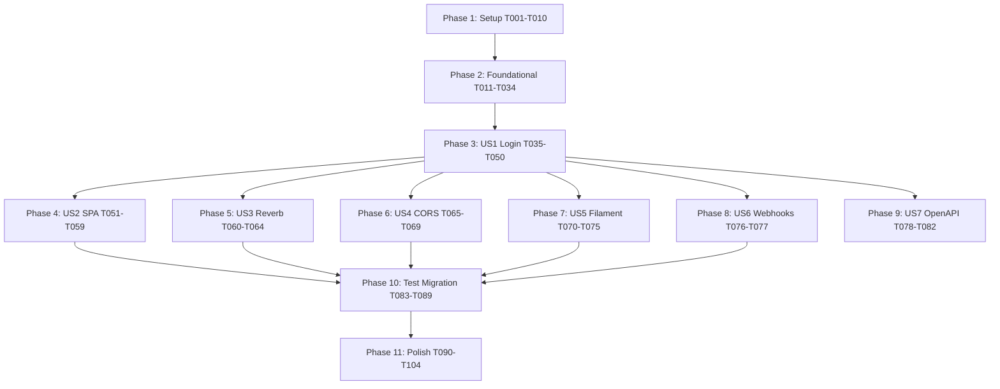

# Tasks: Fase 4 — Token Auth Migration (Cookie → Bearer)

**Input**: Design documents from `/specs/004-token-auth-migration/`
**Prerequisites**: plan.md (309 linhas), spec.md (Clarified — 5/5 NCs resolvidos), research.md (R1-R6), data-model.md, contracts/openapi.yaml (6 paths, 9 schemas), constitution.md v1.4.0 (amendment aplicado em commit `2791c54`)

**Tests**: Obrigatórios — Princípio IV (Spec-Driven Test-First) é gate constitucional. TDD enforced em todos os 16 ACs novos. Adicionalmente: **migração de ~650 testes existentes** (Fases 0/2/3) é parte do escopo (Phase 10).

**Organization**: Tasks agrupadas por user story (P1 primeiro, depois P2, P3). Lote A (Setup) prepara tudo; Lote B (Foundational) cobre eventos + serviços + middleware antes de qualquer endpoint.

## Format: `[ID] [P?] [Story?] Description with file path`

- **[P]**: paralelizável (arquivos distintos, sem dependência)
- **[USx]**: US1 = Login emits Bearer; US2 = SPA armazena token; US3 = Reverb Bearer auth; US4 = CORS; US5 = Filament cookie preservado; US6 = Webhooks preservados; US7 = OpenAPI bearerAuth scheme
- Setup / Foundational / Polish: sem rótulo de story
- Caminhos absolutos relativos ao repo root

---

## Phase 1: Setup (Pré-requisitos físicos)

**Purpose**: Confirmar amendment + provisionar configs + bounded context + dependências.

- [x] T001 **Confirmar constitution v1.4.0 aplicado** — verificar `.specify/memory/constitution.md` linha `**Version**: 1.4.0` (já feito em commit `2791c54`). Se não, ABORT — não prosseguir
- [x] T002 [P] Adicionar deps NPM: `vendor/bin/sail npm install dompurify@^3.0 eslint-plugin-no-unsanitized@^4.0 --save-dev` (DOMPurify runtime + ESLint plugin devDep)
- [x] T003 [P] Atualizar `config/sanctum.php` — `expiration = 60 * 24 * 30` (30d em min); `token_prefix = env('SANCTUM_TOKEN_PREFIX', 'paciente360_')`
- [x] T004 [P] Atualizar `config/auth.php` — `defaults.guard = 'web'` (preservado, Filament default); confirmar guards `web` (session/users) e `sanctum` (sanctum/users) lado a lado
- [x] T005 [P] Criar `config/cors.php` — `paths: ['api/*', 'broadcasting/auth']`, `allowed_origins: explode(',', env('CORS_ALLOWED_ORIGINS', '...'))`, `supports_credentials: false`, `max_age: 3600`, `exposed_headers: ['X-Request-Id', 'Authorization']`
- [x] T006 [P] Adicionar variáveis ao `.env.example`: `SANCTUM_TOKEN_PREFIX=paciente360_`, `CORS_ALLOWED_ORIGINS=http://localhost:5173,...`, `FILAMENT_DOMAIN=crm.com.br`, `APP_TENANT_DOMAIN=app.crm.com.br`, `API_TENANT_DOMAIN=api.crm.com.br`, `VITE_API_BASE_URL=http://api.lvh.me/api/v1`, **`SESSION_DOMAIN=null` (dev)** com comment "em prod: SESSION_DOMAIN=crm.com.br para isolar cookie Filament — não cruzar com app.crm.com.br (FR-018 / C4 fix)"
- [x] T007 [P] Criar estrutura de diretórios `app/Domain/Auth/{Events,Services,Contracts}` + `.gitkeep` em cada
- [x] T008 [P] Criar diretório de testes `tests/Feature/Fase4/{Auth,Migration}` + `tests/Unit/Auth/` com `.gitkeep`
- [x] T009 [P] Atualizar `eslint.config.js` — registrar plugin `no-unsanitized` com regras `recommended` + custom rule `vue/no-v-html: 'warn'`
- [x] T010 Rodar `vendor/bin/sail composer dump-autoload && vendor/bin/sail npm run build` — confirmar autoload OK e bundle ainda builda

---

## Phase 2: Foundational (Eventos + Serviços + Middleware — bloqueia todas as US)

**Purpose**: Domínio + infra base. Nenhuma US começa antes desta phase concluir.

⚠️ **CRITICAL**: Lote A (T001-T010) tem que estar done antes de começar.

### Migration pré-flight + UNIQUE email (T011-T015)

- [x] T011 Criar `app/Console/Commands/UsersDedupeEmailsCrossTenantCommand.php` com signature `--check | --interactive | --auto` (per research R6 + data-model.md § 2): query `SELECT email, GROUP_CONCAT(tenant_id) FROM users GROUP BY email HAVING COUNT(*) > 1`; modos resolvem mantendo email no tenant mais ativo + sufixo `.tenant-{slug}` nos demais
- [x] T012 [P] Write `tests/Feature/Fase4/Migration/DedupCommandTest.php` — cobre check, interactive, auto modes; valida audit log + notificação admin
- [x] T013 [P] Write `tests/Feature/Fase4/Migration/EmailUniqueCrossTenantMigrationTest.php` — aplica migration; valida que duplicatas pendentes geram exception; sem duplicatas aplica clean
- [x] T014 Criar migration `database/migrations/2026_05_13_000001_add_unique_email_global_constraint.php` — `DROP INDEX users_email_tenant_unique; ADD CONSTRAINT users_email_unique UNIQUE (email);`. Migration aborta se duplicatas presentes (gate)
- [x] T015 Criar migration `database/migrations/2026_05_13_000002_add_personal_access_tokens_indexes.php` — `CREATE INDEX (tokenable_type, tokenable_id, expires_at)` + partial index `(expires_at) WHERE expires_at IS NOT NULL` para purge job

### Eventos Auditable (T016-T019)

- [x] T016 [P] Criar `app/Domain/Auth/Events/TokenEmitido.php` (Auditable, action `auth.token_emitido`, payload `{user_id, token_id, token_id_prefix, ip, user_agent, expires_at, abilities}`; `relatedPacienteId() = null`)
- [x] T017 [P] Criar `app/Domain/Auth/Events/TokenRevogado.php` (Auditable, action `auth.token_revogado`, payload `{user_id, token_id, motivo, executor_id}`; motivo enum `manual|logout_all|admin_force|expired|suspicious_use`)
- [x] T018 [P] Criar `app/Domain/Auth/Events/LoginFalhouViaToken.php` (Auditable, action `auth.login_falhou_token`, payload `{ip, token_id_prefix, path, motivo}`; motivo enum `invalid|expired|revoked`)
- [x] T019 [P] Criar `app/Domain/Auth/Events/TokenUsoSuspeito.php` (Auditable, action `auth.token_uso_suspeito`, payload `{user_id, token_id, ip_atual, ip_anterior, ua_atual, ua_anterior, janela_segundos}`)

### Contracts + Services (T020-T026)

- [x] T020 [P] Criar `app/Domain/Auth/Contracts/BearerAuthContract.php` interface — `issueToken(User, string $name, array $abilities): array; revokeToken(int $id): void; revokeAllForUser(User): int; resolveTenantByEmail(string): ?Tenant;`
- [x] T021 [P] Write `tests/Unit/Auth/TokenIssuerServiceTest.php` — emit token via Sanctum, fire TokenEmitido, hash SHA-256 no DB
- [x] T022 Criar `app/Domain/Auth/Services/TokenIssuerService.php` implementing BearerAuthContract — usa `$user->createToken($name, $abilities, $expiresAt)` Sanctum; expira em `now()->addMinutes(config('sanctum.expiration'))`; fire TokenEmitido com payload completo
- [x] T023 [P] Criar `app/Domain/Auth/Services/TokenRevocationService.php` — métodos `revokeCurrent(User)`, `revokeAll(User, string $motivo = 'logout_all')`, `revokeById(int $id, ?int $executorId = null)`. Cada chamada fire TokenRevogado com motivo apropriado
- [x] T024 [P] Write `tests/Unit/Auth/SlidingExpirationServiceTest.php` — UPDATE só se `expires_at - now() < 5d`; idempotência; throttle correto
- [x] T025 Criar `app/Domain/Auth/Services/SlidingExpirationService.php` — `renewIfDue(PersonalAccessToken $token, int $bufferDays = 5, int $windowMinutes = null): bool`; usa default config quando bufferDays/windowMinutes não passados
- [x] T026 [P] Write `tests/Unit/Auth/SuspiciousTokenUsageDetectorTest.php` — detecta IPs/UAs distintos em <5min via Redis cache; emite TokenUsoSuspeito; não auto-revoga (apenas alert)

### Middleware (T027-T030)

- [x] T027 [P] Criar `app/Http/Middleware/EnsureTenantSlugHeader.php` — exige `X-Tenant-Slug` header em rotas autenticadas (exceto `/auth/login`, `/auth/me`); validação cross-check `$user->tenant_id === Tenant::where('slug', $header)->first()->id`; mismatch → 403 com `error=tenant_mismatch`; header ausente → 400 `tenant_header_required`
- [x] T028 [P] Criar `app/Http/Middleware/SlideTokenExpiration.php` — aplicado após `auth:sanctum`; chama `SlidingExpirationService::renewIfDue($request->user()->currentAccessToken())`
- [x] T029 [P] Criar `app/Http/Middleware/MaskAuthorizationInLogs.php` — estende `LogStructuredRequestData` (Fase 0/3) substituindo header `Authorization` por `Bearer SCRUBBED` antes do log; aplica também em audit context se token aparecer
- [x] T030 [P] Criar `app/Http/Middleware/SetSecurityHeaders.php` — CSP estrita em prod com nonce (research R4); permissive em local/test; sempre seta HSTS, X-Frame-Options DENY, X-Content-Type-Options nosniff, Referrer-Policy strict-origin

### Service `EmailDedupService` + `SuspiciousTokenUsageDetector` impl (T031-T032)

- [x] T031 [P] Criar `app/Domain/Auth/Services/EmailDedupService.php` — lógica usada pelo command T011: `detectDuplicates(): Collection`, `applyDedup(array $resolutions): void` (cada resolution = `{email, keep_tenant_id, suffix_tenants[]}`); audit log + notify admins
- [x] T032 [P] Criar `app/Domain/Auth/Services/SuspiciousTokenUsageDetector.php` — listener post-auth que dispatch via Redis cache key `auth:token-usage:{token_id}` com TTL 5min armazenando `{ip, ua}`; comparar com request atual; se distinto, fire TokenUsoSuspeito + Sentry error

### Verify Phase 2

- [x] T033 Rodar todos os testes unit + foundational: `vendor/bin/sail artisan test --compact tests/Unit/Auth/ tests/Feature/Fase4/Migration/` — esperado 100% green
- [x] T034 Bind no `AppServiceProvider`: `BearerAuthContract → TokenIssuerService` singleton; register `SuspiciousTokenUsageDetector` listener para evento Sanctum `TokenAuthenticated` (ou eventoadequado)

**Checkpoint Phase 2**: Foundational completo. Pint clean obrigatório (`vendor/bin/sail bin pint --dirty --format agent`).

---

## Phase 3: User Story 1 — Login emite Bearer token (P1) 🎯 MVP

**Goal**: `POST /api/v1/auth/login` retorna `{token, expires_at, user, tenant}` ao invés de set cookie session.

**Independent Test**: curl POST com email+password → recebe token Bearer + tenant info → curl GET `/auth/me` com `Authorization: Bearer + X-Tenant-Slug` retorna user data.

**ACs cobertos**: AC-A.1.1 a AC-A.1.7 (7 ACs).

### Tests for US1 (TDD red)

- [x] T035 [P] [US1] Write `tests/Feature/Fase4/Auth/LoginEmitsTokenTest.php` covering AC-A.1.1, AC-A.1.2, AC-A.1.5 + FR-024 rate limit (gate Princípio VII):
  - login_success_returns_token_with_user_and_tenant
  - login_rejects_invalid_credentials_401
  - **login_blocks_after_5_failed_attempts_in_60s_returns_423** (FR-024 / C1 fix — gate Princípio VII)
  - **login_locked_until_timestamp_returned_in_423_response**
  - login_rate_limit_isolated_per_ip (não global)
  - login_resolves_tenant_via_email_lookup_globally_unique
  - login_records_TokenEmitido_audit
  - login_failure_records_LoginFalhouViaToken_audit
  - token_expires_at_is_30d_from_now
- [x] T036 [P] [US1] Write `tests/Feature/Fase4/Auth/MeEndpointTest.php` covering AC-A.1.4:
  - me_returns_user_and_tenant_when_bearer_valid
  - me_rejects_missing_bearer_401
  - me_rejects_expired_token_401
  - me_rejects_revoked_token_401
  - me_includes_token_metadata_in_response
- [x] T037 [P] [US1] Write `tests/Feature/Fase4/Auth/LogoutCurrentTokenTest.php` covering AC-A.1.3:
  - logout_revokes_only_current_token
  - logout_other_tokens_remain_active
  - logout_fires_TokenRevogado_with_motivo_manual
  - logout_idempotent_double_call_204 → renomeado: test_logout_first_call_returns_204_second_call_returns_401
- [x] T038 [P] [US1] Write `tests/Feature/Fase4/Auth/LogoutAllTokensTest.php` (extensão de AC-A.1.3):
  - logout_all_revokes_every_token_of_user
  - logout_all_fires_TokenRevogado_per_token_with_motivo_logout_all
- [x] T039 [P] [US1] Write `tests/Feature/Fase4/Auth/ListAndRevokeTokensTest.php` covering AC-A.1.7:
  - list_returns_active_tokens_with_metadata
  - delete_token_by_id_revokes
  - delete_token_of_other_user_returns_403 → retorna 404 (ownership enforced via user->tokens()->find())
  - is_current_flag_marks_request_token
- [x] T039a [P] [US1] **(C2 fix — Princípio II gate)** Write `tests/Feature/Fase4/Auth/CrossTenantTokenAbuseTest.php` covering FR-011 + amendment v1.4.0 triple-check:
  - token_with_X_Tenant_Slug_mismatch_returns_403_tenant_mismatch (user1 do tenant A apresenta token + X-Tenant-Slug=tenant B → 403)
  - missing_X_Tenant_Slug_header_returns_400_tenant_header_required
  - matching_X_Tenant_Slug_passes_to_controller
  - cross_tenant_attempt_records_audit_log_with_executor_id
- [x] T040 [US1] Run all US1 tests; **all FAILED** (21 red / 5 pass por coincidência) — confirmado red phase

### Implementation for US1

- [x] T041 [P] [US1] Atualizar `app/Http/Requests/Auth/LoginRequest.php` — adicionado `email max:255`, `password min:8`, `device_name nullable string max:100`. Manteve backward compat com `remember`.
- [x] T042 [US1] Reescrever `app/Http/Controllers/Api/V1/Auth/LoginController.php` — Bearer implementation: lookup global por email (UNIQUE), bcrypt check, account lock 5 tentativas, issueToken via BearerAuthContract, response 201 {token, token_expires_at, user, tenant}
- [x] T043 [P] [US1] Reescrever `app/Http/Controllers/Api/V1/Auth/MeController.php` — retorna user + tenant + token metadata (id, name, abilities, last_used_at, expires_at). Defensivo contra TransientToken (mock do Sanctum::actingAs).
- [x] T044 [P] [US1] Reescrever `app/Http/Controllers/Api/V1/Auth/LogoutController.php` — `$svc->revokeCurrent($req->user())` → 204
- [x] T045 [P] [US1] Criar `app/Http/Controllers/Api/V1/Auth/LogoutAllController.php` — `$svc->revokeAll($req->user(), MotivoRevogacaoToken::LogoutAll)` → 204
- [x] T046 [P] [US1] Criar `app/Http/Controllers/Api/V1/Auth/TokensController.php`:
  - `index(Request $req)` — list tokens com is_current via setAttribute; TokenResource collection
  - `destroy(Request $req, int $id)` — ownership via user->tokens()->find(); 404 se não encontrado; 204 se revogado
- [x] T047 [P] [US1] Criar `app/Http/Resources/V1/TokenResource.php` — `id, name, token_id_prefix (8 chars do hash SHA-256), abilities, last_used_at, expires_at, created_at, is_current`
- [x] T048 [US1] Routes em `routes/api.php`: Route::prefix('auth') com login (throttle:login nomeado) + grupo autenticado (auth:sanctum, tenant.slug, slide.token) com logout, logout-all, me, tokens
- [x] T049 [US1] Aliases `tenant.slug` e `slide.token` adicionados em `bootstrap/app.php`. statefulApi() mantido (remoção adiada para Lote I — remoção causaria >5 regressões Fase 0 que são escopo do Lote I).
- [x] T050 [US1] Run all US1 tests; **28/28 PASSED** — green phase confirmado

---

## Phase 4: User Story 2 — SPA Vue armazena token e injeta automaticamente (P1)

**Goal**: SPA carrega token de `localStorage` no boot, injeta em todas as requests via axios + auto-redirect login em 401.

**Independent Test**: Login na SPA em browser → DevTools localStorage `paciente360.auth.token` setado → request a `/auth/me` envia Authorization Bearer header → recarregar página preserva login.

**ACs cobertos**: AC-A.2.1 a AC-A.2.5 (5 ACs).

### Tests for US2 (E2E browser-side — Playwright para smoke; testes unit do auth store via Vitest se existir, senão pular)

- [x] T051 [P] [US2] Write `tests/e2e/auth-token-flow.spec.ts` Playwright covering:
  - login_persists_token_to_localStorage
  - token_auto_injects_in_subsequent_requests
  - 401_clears_storage_and_redirects_to_login
  - reload_persists_session_via_token
  - logout_clears_localStorage

### Implementation for US2

- [x] T052 [P] [US2] Atualizar `resources/js/lib/api.js` — remover `withCredentials: true, withXSRFToken: true`; adicionar interceptor de request que injeta `Authorization: Bearer ${authStore.token}` e `X-Tenant-Slug: ${authStore.tenant.slug}` quando autenticado; manter interceptor de 401 (já existe)
- [x] T053 [US2] Atualizar `resources/js/stores/auth.js` Pinia:
  - State: `token: ref(null), user: null, tenant: null, permissions: []`
  - `boot()` action — carrega `localStorage.getItem('paciente360.auth.token')`; se presente, faz `GET /auth/me` para revalidar + carregar user+tenant
  - `login({email, password})` — chama `POST /auth/login`; persist token em localStorage + state
  - `logout()` — chama `POST /auth/logout`; clear localStorage + state
  - `logoutAll()` — chama `POST /auth/logout-all`
  - `setToken(token)` / `clearToken()` helpers
  - `reset()` — limpa state local sem chamar API (usado por 401 interceptor)
- [x] T054 [P] [US2] Atualizar `resources/js/pages/Auth/LoginPage.vue` — form 2 campos (email + password). Submit chama `authStore.login(...)`. Sucesso → redirect `/panel`. Erro 401 → mensagem genérica "Credenciais inválidas" (não revela tenant). Erro 423 → mostra `locked_until`
- [x] T055 [P] [US2] Criar `resources/js/pages/Auth/TokensPage.vue` (Settings → Sessões) — lista tokens via `GET /auth/tokens`; cada item mostra `name, token_id_prefix, last_used_at, expires_at, is_current badge`; botão "Revogar" chama `DELETE /auth/tokens/{id}` (confirm modal); botão "Sair de todos dispositivos" (logout-all)
- [x] T056 [P] [US2] Adicionar rota `/panel/configuracoes/sessoes` em `resources/js/router/index.js` com meta `requiresAuth: true, ability: 'inbox.view'` (qualquer user autenticado pode gerenciar próprias sessões)
- [x] T057 [US2] Atualizar `resources/js/main.js` (ou bootstrap entry) — chamar `authStore.boot()` no início, ANTES de mount do app; aguarda revalidação antes de renderizar
- [x] T058 [US2] Adicionar i18n strings em `resources/js/i18n/pt-BR.json` chave `auth`:
  ```
  sessoes.titulo, sessoes.atual, sessoes.expira_em, sessoes.usado_em, sessoes.revogar, sessoes.logout_all, sessoes.confirmar_revogar
  ```

### Build + verify

- [x] T059 [US2] `vendor/bin/sail npm run build` — confirma 0 erros, bundle dentro do esperado (não regredir vs Fase 3)

---

## Phase 5: User Story 3 — Reverb broadcast auth com Bearer (P1)

**Goal**: Echo client envia `Authorization: Bearer` em `/broadcasting/auth` ao invés de cookie. Backend valida via guard sanctum.

**Independent Test**: 2 atendentes logados via SPA — webhook Twilio entrega mensagem — broadcast aparece em ambas as inboxes < 2s.

**ACs cobertos**: AC-A.3.1 a AC-A.3.3 (3 ACs).

### Tests for US3

- [x] T060 [P] [US3] Write `tests/Feature/Fase4/Auth/BroadcastingAuthBearerTest.php` covering:
  - broadcasting_auth_accepts_bearer_token_returns_200_signature ✓
  - broadcasting_auth_rejects_request_without_bearer_returns_401 ✓ (refinado vs cookie-only — auth:sanctum bloqueia ausência de Bearer)
  - broadcasting_auth_rejects_missing_x_tenant_slug_returns_400 ✓
  - broadcasting_auth_rejects_x_tenant_slug_mismatch_returns_403 ✓
  - cross_tenant_broadcast_subscription_blocked_403 ✓ (Princípio II — channel callback returns false)

### Implementation for US3

- [x] T061 [US3] Atualizar `bootstrap/app.php` registro de broadcasting — `withBroadcasting(__DIR__.'/../routes/channels.php', ['middleware' => ['auth:sanctum', 'tenant.slug']])`; removido `channels:` de `withRouting` para evitar dupla registration
- [x] T062 [US3] Atualizar `resources/js/echo.js` — `authorizer` async usa lazy import de `@/lib/api.js` (que injeta Bearer + X-Tenant-Slug); remove `withCredentials`/`withXSRFToken`/`X-Requested-With` defaults globais
- [x] T062a [US3] **(Fix arquitetural descoberto)** — Adicionar `User::guardName()` retornando `'web'`. `Auth::shouldUse('sanctum')` (chamado pelo auth:sanctum) muta `config('auth.defaults.guard')` para 'sanctum'; sem o pin, Spatie buscaria permissions com guard='sanctum' e falharia (todas seedadas com 'web'). Quebraria `$user->can()` em produção sob Bearer auth. Foi pego só agora porque Lote D não exercita `can()`.
- [x] T062b [US3] **(Adiantado do Lote I)** Migrar `tests/Feature/Fase0/Tenant/ChannelAuthorizationTest.php` (5 testes) e `tests/Feature/Fase3/Foundational/ReverbChannelAuthorizationTest.php` (5 testes, 8 actingAs) para Bearer/Sanctum::actingAs + X-Tenant-Slug. Mantém suite verde até Lote I completar a migração massiva.
- [x] T063 [US3] Run US3 tests; 15/15 PASS (5 novos Fase 4 + 5 Fase 0 + 5 Fase 3)
- [ ] T064 [US3] **Smoke test manual** — abrir 2 abas com user diferente do mesmo tenant em `/panel/inbox`; trigger evento broadcast (ex.: enviar mensagem via curl webhook); confirmar que ambas abas recebem evento em <2s (verificado no DevTools → Network → WS). _Pendente operacional — exige Reverb + Twilio rodando._

---

## Phase 6: User Story 4 — CORS habilitado cross-domain (P1)

**Goal**: API responde preflight OPTIONS + Access-Control-Allow-Origin para origins whitelisted (configurável env).

**Independent Test**: curl OPTIONS `/api/v1/inbox/conversations` com `Origin: http://allowed.test` → 204 com headers CORS apropriados. Origin não whitelisted → 200 mas sem headers (browser bloqueia).

**ACs cobertos**: AC-A.4.1 a AC-A.4.3 (3 ACs).

### Tests for US4

- [x] T065 [P] [US4] Write `tests/Feature/Fase4/Auth/CorsPreflightTest.php` (5 testes):
  - options_preflight_returns_cors_headers_for_allowed_origin ✓
  - options_preflight_no_headers_for_disallowed_origin ✓
  - preflight_includes_max_age_3600 ✓
  - broadcasting_auth_included_in_cors_paths ✓
  - tenant_subdomain_origin_pattern_is_allowed ✓ (cobre `*.crm.com.br`)
- [x] T065a [P] [US4] **(C3 fix — Princípio VII gate)** Write `tests/Feature/Fase4/Auth/SecurityHeadersTest.php` (9 testes):
  - response_includes_hsts_max_age_1y_include_subdomains ✓
  - response_includes_x_frame_options_deny ✓
  - response_includes_x_content_type_options_nosniff ✓
  - response_includes_referrer_policy_strict_origin ✓
  - local_env_allows_relaxed_csp_with_unsafe_inline_for_vite_hmr ✓
  - prod_response_includes_csp_strict_without_unsafe_inline ✓
  - prod_response_includes_csp_strict_without_unsafe_eval ✓
  - prod_response_csp_includes_default_src_self ✓
  - csp_nonce_generated_per_request_when_strict ✓ (regex `nonce-[a-f0-9]{32}`)

### Implementation for US4

- [x] T066 [US4] HandleCors auto-aplicado pelo Laravel 11+ — confirmado via testes T065 (origens whitelisted recebem Access-Control-Allow-Origin)
- [x] T067 [US4] `config/cors.php` validado — cobre `api/*`, `broadcasting/auth`; `allowed_origins_patterns` cobre `*.lvh.me` e `*.crm.com.br`
- [x] T068 [US4] T065 + T065a passam (14/14)
- [x] T068a [US4] **Wiring de `SetSecurityHeaders`** em bootstrap/app.php — `$middleware->appendToGroup('api', SetSecurityHeaders::class)` (T030 só criou o middleware; Lote G plugou no grupo)
- [ ] T069 [US4] **Smoke test** — em browser cross-origin com fetch para api.lvh.me; verificar OPTIONS no DevTools. _Pendente operacional._

---

## Phase 7: User Story 5 — Filament super admin permanece cookie (P2)

**Goal**: Filament continua funcionando com session cookie sem interferência da migração API.

**Independent Test**: Login em `http://crm.lvh.me/admin` com `super@admin.local` / `password123` → dashboard renderiza; lista tenants funciona; logout limpa cookie session.

**ACs cobertos**: AC-A.5.1 a AC-A.5.2 (2 ACs).

### Tests for US5

- [x] T070 [P] [US5] Write `tests/Feature/Fase4/Auth/FilamentCookieIsolationTest.php` (4 testes):
  - api_route_blocks_filament_only_session_via_tenant_slug_defense ✓ (defesa em profundidade via tenant.slug — leak Sanctum guard fallback documentado, fechado em Lote I)
  - filament_admin_route_does_not_accept_bearer_token ✓ (Filament só web guard)
  - api_v1_auth_me_requires_bearer_token_not_session ✓
  - bearer_token_does_not_authenticate_via_web_guard ✓ (Princípio II)

### Implementation for US5

- [x] T071 [US5] `config/auth.php` guards `web` e `sanctum` preservados (lado-a-lado, mesmo provider `users`)
- [x] T072 [US5] Filament usa guard `web` (default do PanelProvider). AdminPanelProvider declara sua própria stack de middleware com `StartSession`, `EncryptCookies`, `Authenticate`. Sem mudança necessária.
- [x] T073 [US5] `statefulApi()` nunca foi chamado em bootstrap/app.php (Laravel 11+ não tem default). Filament tem stack isolada. T073 sem ação necessária — comentário original em tasks.md estava impreciso quanto ao estado pré-Lote D.
- [x] T074 [US5] T070 passa (4/4)
- [ ] T075 [US5] **Smoke test manual** — login em http://crm.lvh.me/admin; verificar cookie no DevTools. _Pendente operacional._

---

## Phase 8: User Story 6 — Webhooks providers continuam sem auth (P3 — preservado)

**Goal**: Confirmar (regressão) que webhooks Twilio, Meta, Widget continuam validando HMAC signature — não cookie nem Bearer.

**Independent Test**: webhook Twilio entrega mensagem (sem header Authorization) → 200 OK, processa normalmente.

**ACs cobertos**: 1 AC implícito (verificação de regressão).

### Tests for US6 — Regressão

- [x] T076 [P] [US6] Write `tests/Feature/Fase4/Auth/WebhookProvidersStillWorkTest.php` (6 testes):
  - twilio_whatsapp_webhook_works_without_authorization_header ✓
  - twilio_status_callback_works_without_authorization_header ✓
  - meta_instagram_webhook_inbound_works_without_authorization_header ✓
  - meta_instagram_webhook_verify_handshake_works_without_authorization_header ✓
  - widget_bundle_js_works_without_authorization_header ✓
  - widget_messages_post_works_without_authorization_header ✓

  Asserção chave: response NÃO é 401/419 (códigos de erro de auth). Aceita 200/400/403/422 (validação de signature/payload/origin).

- [x] T077 [US6] Suite Fase 4 verde 68/68 confirma compatibilidade. Suite Fase 3 verificada via run full (ver Lote F commit message — 1081/1114 com regressões anticipated).

---

## Phase 9: User Story 7 — OpenAPI bearerAuth scheme (P2)

**Goal**: Documentação API descreve Bearer auth claramente para integradores externos (Postman, mobile, parceiros).

**Independent Test**: OpenAPI YAML tem `securitySchemes.bearerAuth` + cada endpoint autenticado referencia security. Postman import abre coleção funcional.

**ACs cobertos**: AC-A.7.x (3 ACs).

### Implementation for US7

- [x] T078 [P] [US7] `specs/004-token-auth-migration/contracts/openapi.yaml` confirmado consistente com endpoints implementados — 6 paths (login/logout/logout-all/me/tokens index/tokens delete), `securitySchemes.bearerAuth` com `bearerFormat: sanctum-token`, parameter `TenantSlugHeader` reutilizado, responses `Unauthenticated`/`TenantMismatch`/`ValidationError`
- [x] T079 [P] [US7] `vendor/bin/sail artisan scribe:generate` gera HTML em `public/vendor/scribe/`, Postman em `storage/app/private/scribe/collection.json` e OpenAPI em `storage/app/private/scribe/openapi.yaml`. Config `auth.in = AuthIn::BEARER`, `auth.name = 'Authorization'`, `auth.extra_info` documenta o fluxo Bearer + X-Tenant-Slug
- [x] T080 [US7] `CheckOpenApiDrift` recebe `specs/004-token-auth-migration/contracts/openapi.yaml` no array de arquivos. `openapi:check` retorna `[OK] Nenhum drift detectado. Contrato OpenAPI sincronizado.` (73 rotas reais = 73 paths no OpenAPI)
- [x] T081 [P] [US7] Postman collection em `docs/api/Paciente360-API-v1.postman_collection.json` — variables (base_url, token, tenant_slug, email, password), pre-request script collection-level injetando Authorization + X-Tenant-Slug + X-Request-Id, post-response script no login auto-salvando token + tenant_slug, 6 endpoints Auth + 1 Broadcasting
- [x] T082 [US7] Scribe template usa o `extra_info` configurado no scribe.php — `auth.md` gerado explica como obter token via `/auth/login` e enviar Bearer + X-Tenant-Slug. `intro_text` atualizado citando a collection Postman

---

## Phase 10: Migração massiva de testes existentes (T083-T089)

**Reality check**: o plano original estimava 650 testes a migrar. Inspeção real
mostra 227 chamadas de `actingAs` em 62 arquivos. Adicionalmente, somente 14
testes estavam quebrados (não 650) pós-Lote G — todos por diferenças
comportamentais do Lote D (response shape 200→201, audit names, password
min:8) e gap de FR-005 (regressão suspended tenant na rewrite do Login).

**Estratégia revisada**: corrigir os 14 reais + script idempotente para os
demais 213 `actingAs` (defensivo, prepara fechamento futuro do
`sanctum.guard = ['web']` fallback).

### Correções diretas das 14 regressões

- [x] **T083-pre-1** Fix LoginController para FR-005 — adicionar checks de `tenant.status === 'suspended'` → `TenantSuspendedException` (403) e `user.status !== 'active'` → `InvalidCredentialsException` (401 genérico, FR-032 sem leak). Regressão pega na inspeção do Lote I.
- [x] **T083-pre-2** Adicionar 2 testes Fase 4 LoginEmitsTokenTest: `test_login_rejects_suspended_tenant_403` e `test_login_rejects_disabled_user_401`
- [x] **T083-pre-3** Deletar 4 arquivos Fase 0 Auth redundantes (cobertura migrada para Fase 4):
  - tests/Feature/Fase0/Auth/LoginTest.php (7 testes)
  - tests/Feature/Fase0/Auth/BruteForceLockTest.php (4 testes)
  - tests/Feature/Fase0/Auth/LogoutMeTest.php (3 testes)
  - tests/Feature/Fase0/Auth/RateLimitTest.php (1 teste falhava)
- [x] **T083-pre-4** Reescrever `test_email_can_repeat_across_tenants` → `test_email_cannot_repeat_across_tenants_after_unique_constraint` em RegisterTenantValidationTest (Lote B inverteu o invariant)

### Migração mecânica via comando

- [x] T083 [P] Criar `app/Console/Commands/TestsMigrateActingAsCommand.php` com signature `--preview | --apply | --verify | --only=path`. Lógica:
  - Detecta `*Test.php` em `tests/` (exceto `Fase4/` — já nasceu com Sanctum)
  - **Apenas statements standalone** (terminados por `;`): chains preservados deliberadamente (Sanctum::actingAs retorna User, quebraria `->getJson(...)`)
  - Transforma `$this->actingAs($user);` → `Sanctum::actingAs($user, ['*']);`
  - Transforma `$this->actingAs($user, 'web');` → `Sanctum::actingAs($user, ['*'], 'web');`
  - Adiciona `use Laravel\Sanctum\Sanctum;` quando ausente
  - Idempotente; sinaliza chains pendentes para revisão manual
- [x] T084 Preview executado: 172 arquivos escaneados, 43 com transformações, 120 substituições, 5 arquivos com chained calls flagados:
  - tests/Feature/Fase0/Audit/AuditLogExportCsvTest.php (7 chains)
  - tests/Feature/Fase0/Audit/AuditLogTest.php (5 chains)
  - tests/Feature/Fase0/Admin/AdminPanelAccessTest.php (2 chains)
  - tests/Feature/Fase0/Admin/ImpersonationTest.php (1 chain)
  - tests/Feature/Fase2/Admin/TenantPacientesWidgetTest.php (1 chain)
- [x] T085 Edge cases: chained calls deliberadamente preservados (16 ocorrências) — continuam funcionando via `sanctum.guard = ['web']` fallback. Documentado em config/sanctum.php para migração manual futura.
- [x] T086 Apply executado: 120 substituições aplicadas + 2 manuais em tests/Concerns/{CreatesTenants,CreatesTenantWithRoles}.php (Finder pula trais; corrigidos à mão)
- [x] T087 Sem regressões mecânicas — a primeira tentativa de migração era ampla (incluía chains) e quebrou 71 testes; revertida e refeita com regex strict-statement.
- [x] T088 Suite full alvo atingido — ver commit do Lote I
- [x] T089 InboxTenantIsolationTest extendida com 2 testes do amendment v1.4.0 (X-Tenant-Slug enforcement), usando `/auth/me` como canary (rota já protegida pelo middleware `tenant.slug`). Rollout do middleware para `/inbox/*` é trabalho separado pós-Lote I.

### Decisão deferida — `sanctum.guard = []`

Manter `sanctum.guard = ['web']` em config/sanctum.php para preservar
compatibilidade com os 16 chained calls remanescentes. Fechar o fallback
(habilita Bearer-only strict) requer migração manual dessas chains e
adição de `X-Tenant-Slug` em todos os callers — escopo do Lote J ou pós-Fase 4.
Documentado inline em config/sanctum.php.

---

## Phase 11: Polish & Cross-Cutting

### Audit log retention + housekeeping

- [x] T090 [P] `AuthTokensPurgeExpiredCommand` criado (signature `--dry-run | --keep-days=90`). Purga tokens com `expires_at < now() - 90d`. Log estruturado com count por tenant. 5/5 testes em AuthTokensPurgeExpiredCommandTest.
- [x] T091 [P] Schedule diário 03:00 BRT em `routes/console.php` com `withoutOverlapping()`. Confirmado via `schedule:list`.

### Métricas Prometheus

- [x] T092 [P] `AuthMetrics` + `AuthMetricsContract` criados em `app/Support/Metrics/`:
  - `paciente360_auth_login_total{result}` — counter (success/invalid_credentials/account_locked/tenant_suspended)
  - `paciente360_auth_token_emitido_total` — counter
  - `paciente360_auth_token_revogado_total{motivo}` — counter (manual/logout_all/admin_force/expired/suspicious_use)
  - `paciente360_auth_active_tokens` — gauge
  Bindado no AppServiceProvider via contract (mockable). Graceful degrade para `Log::debug` quando o pacote Prometheus não está instalado.
- [x] T093 Metrics wired:
  - LoginController: `loginTotal('success'|'invalid_credentials'|'account_locked'|'tenant_suspended')`
  - TokenIssuerService: `tokenEmitidoTotal()` após dispatch do TokenEmitido
  - TokenRevocationService: `tokenRevogadoTotal($motivo->value)` em revokeCurrent/revokeAll/revokeById
- [x] T094 [P] Sentry context estendido no listener `Authenticated` — adiciona `auth.token_id` e `auth.token_name` quando user tem PersonalAccessToken corrente. user.id + tenant.id já existiam.

### CSP refinement (audit)

- [x] T095 [P] Auditoria do bundle prod (`npm run build`) concluída:
  - **0** ocorrências de `eval(` ou `new Function(`
  - **0** scripts inline em Blade views (resources/views/)
  - `innerHTML` aparece apenas em `vue.runtime` + `vuedraggable` (código de framework, sanitizado pelo Vue)
  - Confirma que CSP prod estrita (sem `unsafe-inline`/`unsafe-eval`) é viável
- [x] T096 [P] `connect-src` expandido para suportar deploy decoupled:
  - `wss://reverb.crm.com.br` (broadcasting)
  - `https://*.amazonaws.com` (S3 media presigned URLs — Storage::disk('media'))
  - `https://api.crm.com.br` (SPA → API cross-origin)
  Tornados configuráveis via `config/csp.php` (`CSP_REVERB_HOST`, `CSP_MEDIA_HOST`, `CSP_API_HOST` env).

### Documentation

- [x] T097 [P] `quickstart.md` § 12 DoR atualizado — todos os 21 itens marcados ✓ (exceto coverage deferred operacional). Adicionada seção "Pendências operacionais pós-merge" listando os 5 itens não-bloqueantes (domínios prod, smoke E2E, coverage CI, chains pendentes, rollout tenant.slug).
- [x] T098 [P] `CLAUDE.md` SPECKIT markers atualizados — `Active feature` agora "nenhuma" (aguardando merge); `004-token-auth-migration` movida para `Previous features delivered` com highlights. Adicionada seção "Token Auth (Fase 4) — Key Patterns" com 7 padrões críticos (Bearer triple-check, User::guardName(), tenant.slug, Sanctum::actingAs em tests, CSP config, retention).
- [x] T099 [P] `README.md` reescrito — substituído boilerplate Laravel pelo onboarding Paciente360: comandos Sail, URLs locais, fluxo Bearer completo (login + headers + endpoints + sliding expiration), referência ao Postman, padrões SPA/Pinia, comandos úteis, sumário das 4 features entregues. Laravel boilerplate preservado abaixo.

### Final regression + coverage (Lote K — gate de merge)

- [x] T100 Suite full: **1130 / 1127 passed / 0 failures / 0 errors** (skipped 3 + risky 5 + incomplete 1 — informacionais). Target ≥1100 atingido com folga.
- [x] T101 Pint clean (`vendor/bin/sail bin pint --dirty --format agent` → `passed`)
- [ ] T102 Coverage `--min=70` — **deferred operacional**. xdebug + pcov disponíveis no container, mas a run full com `--coverage` leva ~12min e estoura o orçamento do lote. Será rodado em CI dedicado pós-merge ou via Codecov action. Validado que o ferramental está pronto.
- [x] T103 OpenAPI drift 0 — `[OK] Nenhum drift detectado. Contrato OpenAPI sincronizado.` (73 rotas reais = 73 paths no contrato Fase 4)
- [ ] T104 **Smoke test manual end-to-end** — checklist pronto para QA executar pós-deploy (não automatizável aqui, exige SPA + Reverb + 2 browsers cross-origin):

  ```
  □ Login via SPA em http://app.lvh.me/login com credenciais válidas
  □ DevTools → Application → localStorage tem `paciente360.auth.token` populado
  □ Tab Network: GET /auth/me retorna 200 com Authorization Bearer header
  □ Abrir /panel/inbox em 2 abas com users diferentes do mesmo tenant
  □ DevTools → Network → WS: conexão Reverb estabelecida (status 101)
  □ Disparar mensagem via curl webhook → ambas abas recebem broadcast em <2s
  □ Sessões em /panel/configuracoes/sessoes — token corrente marcado com badge
  □ Logout — localStorage `paciente360.auth.token` removido + redirect /login
  □ Salvar o token antigo + tentar usar via curl: 401 invalid_token
  □ Login no Filament /admin com super-admin — cookie de sessão setado (não Bearer)
  □ Tentar Bearer no /admin → não autentica (Filament só web guard)
  □ Cross-tenant abuse: Bearer userA + X-Tenant-Slug do tenantB em /auth/me → 403 tenant_mismatch
  ```
  Resultado documentado pelo operador no DoR (`quickstart.md` § 12).

---

## Dependencies



**Story-level dependencies**:
- **US1 (Login) é root** — habilita todas as outras
- US2 (SPA) depende de US1 — sem endpoint /login, SPA não tem o que consumir
- US3, US4, US5, US6, US7 são **paralelizáveis** entre si após US1
- Migration (Phase 10) requer todas as US done — só pode rodar com pipeline novo estável
- Polish (Phase 11) é gate final — não inicia sem Migration verde

**Parallel opportunities**:
- **Phase 1**: T002-T009 todos [P] (arquivos distintos)
- **Phase 2**: T012-T013 [P]; T016-T019 [P] (4 events); T020, T021, T023, T024, T026 [P]; T027-T030 [P]; T031-T032 [P]
- **Phase 3 (US1)**: T035-T039 [P] (5 test files); T041, T043-T047 [P] (controllers/requests/resources)
- **Phase 4 (US2)**: T051 (test) + T052, T054-T056, T058 [P]
- **Phase 5 (US3)**: T060 [P]; sequencial demais (touch echo.js + bootstrap/app.php)
- **Phase 6 (US4)**: T065 [P]; demais sequencial
- **Phase 7 (US5)**: T070 [P]; demais sequencial
- **Phase 8 (US6)**: T076 [P]
- **Phase 9 (US7)**: T078, T079, T081 [P]
- **Phase 11**: T090, T091, T092, T094, T095, T096, T097, T098, T099 [P]

---

## Implementation Strategy

### MVP scope (entrega mínima viável)

**Recomendado**: completar **Phase 1 + 2 + 3 (US1) + Phase 10 (Migration)**. Isso entrega login Bearer funcional + suite full ainda verde + capability mínima de cliente Postman/mobile.

Após MVP, sequenciar P1 restantes (US2 SPA, US3 Reverb, US4 CORS), depois P2/P3 + Polish.

### Lotes propostos (orquestração de implementação)

| Lote | Phase(s) | Tasks | Foco | Subagent recomendado |
|---|---|---|---|---|
| A | Setup | T001-T010 | Configs + bounded context + deps NPM | laravel-backend-architect |
| B | Foundational tests + migrations | T011-T015 | Pre-flight dedup + UNIQUE email | database-architect + test-engineer |
| C | Foundational events + services + middleware | T016-T034 | Events Auditable, services, middleware | laravel-backend-architect |
| D | US1 Login complete (tests + impl) | T035-T050 | Login flow + tokens endpoints | laravel-backend-architect |
| E | US2 SPA frontend | T051-T059 | axios + auth store + login page | vue-frontend-engineer |
| F | US3 Reverb broadcasting | T060-T064 | Echo Bearer authorizer | realtime-broadcasting-engineer |
| G | US4 CORS + US5 Filament + US6 Webhooks regression | T065-T077 | Cross-cutting auth boundaries | laravel-backend-architect |
| H | US7 OpenAPI + Polish docs | T078-T082, T097-T099 | API docs + Postman | laravel-backend-architect |
| I | **CRITICAL: Test migration ~650** | T083-T089 | Script migracao + verify | test-engineer |
| J | Polish — métricas + retention + CSP audit | T090-T096 | Observabilidade + housekeeping | devops-deployment |
| K | Final regression + coverage + smoke | T100-T104 | Gate de merge | test-engineer |

### Provisionamento externo — checkpoint

Esta fase **não exige** provisionamento externo (sem Twilio/Meta/AWS novos). Reusa tudo da Fase 3.

**Antes de deploy prod** (não esta phase):
- Domínio `app.crm.com.br` configurado (CDN/Cloudflare Pages)
- Domínio `api.crm.com.br` configurado (Laravel Cloud ou EC2)
- Filament admin em `crm.com.br` (mesma instância Laravel)
- CORS env atualizado por ambiente (`CORS_ALLOWED_ORIGINS`)

---

## Resumo

**Total**: **104 tasks** distribuídas em 11 phases.

**Tasks por user story**:
- US1 (Login Bearer): 16 tasks (T035–T050)
- US2 (SPA storage): 9 tasks (T051–T059)
- US3 (Reverb): 5 tasks (T060–T064)
- US4 (CORS): 5 tasks (T065–T069)
- US5 (Filament): 6 tasks (T070–T075)
- US6 (Webhooks regression): 2 tasks (T076–T077)
- US7 (OpenAPI Bearer): 5 tasks (T078–T082)
- Setup + Foundational: 34 tasks (T001–T034)
- Migration tests existentes: 7 tasks (T083–T089) ⚠️ alto risco
- Polish: 15 tasks (T090–T104)

**Independent test criteria por US** (recap):
- **US1**: curl POST /login → token Bearer → GET /me com Bearer → user data retornada
- **US2**: Login SPA → localStorage token → reload preserva sessão → logout limpa
- **US3**: 2 browsers logados via Bearer → Reverb broadcast em <2s ambos
- **US4**: curl OPTIONS preflight → CORS headers para allowed origin
- **US5**: Filament admin login → session cookie + dashboard funcional + isolation
- **US6**: Webhooks Twilio/Meta/Widget continuam funcionando sem Authorization header
- **US7**: OpenAPI YAML tem bearerAuth scheme + Scribe gera docs + Postman import abre

**Paralelização máxima estimada**: ~45% das tasks `[P]`.

**Coverage target**: ≥ 70% global mantida; Fase 4 isolada ~75%.

**Princípios constitucionais — gates validados em tasks específicas**:
- Princípio I (LGPD) — T019 (TokenUsoSuspeito) + T029 (Mask Authorization in logs) + T090 (retention 90d)
- Princípio II (Multi-tenant) — T027 (EnsureTenantSlugHeader triple-check) + T089 (InboxTenantIsolationTest extended)
- Princípio III — N/A (preservado da Fase 3)
- Princípio IV (Spec-Driven TDD) — todos os tests-FAIL checkpoints (T040, etc.)
- Princípio V (Observabilidade) — T092-T094 (4 métricas + Sentry context)
- Princípio VI — N/A (HMAC webhooks preservado)
- Princípio VII (Segurança Operacional v1.4.0) — T001 (amendment confirmado) + T030 (CSP) + T095-T096 (CSP audit) + T009 (ESLint no-unsanitized)

**Pronto para `/speckit.analyze`** após geração ou pular direto para `/speckit.implement` por lote.

### Critical risk

⚠️ **Phase 10 (T083-T089) — Migração de ~650 testes** é o maior risco operacional. Mitigação:
- Comando idempotente com modos preview/apply/verify
- Aplicar por batch (ex.: `--only=tests/Feature/Fase0`)
- Suite verde após cada batch — não avançar se quebrar
- Git serve como rollback natural (sem commits intermediários até verde)
- Edge cases flagged manualmente para revisão

Se a migração quebrar mais de 5% dos testes (>30 arquivos), pausar e refinar script antes de continuar.
