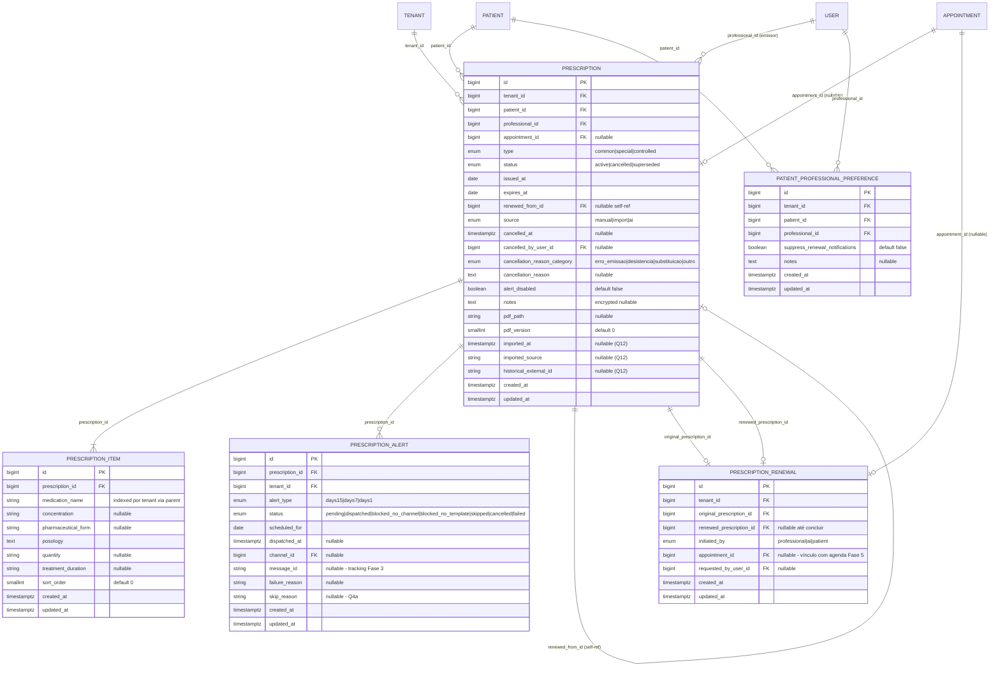

# Data Model — Gestão de Receituários (Fase 7)

**Branch**: `007-gestao-receituario` | **Date**: 2026-05-17

Schema de banco de dados, índices, constraints e relações para a Fase 7. Saída do `/speckit-plan` Phase 1.

> **Princípio**: zero alters em tabelas das fases anteriores (convenção C9 do plan). Todas as 6 tabelas abaixo são novas. Multi-tenancy enforçado por `tenant_id` em cada uma (Princípio II).

---

## 1. Visão geral — Diagrama Mermaid



---

## 2. Tabela: `prescriptions`

Agregado raiz do domínio.

### Colunas

| Coluna | Tipo PG16 | Nullable | Default | Comentário |
|---|---|---|---|---|
| `id` | `bigserial` | NOT NULL | — | PK |
| `tenant_id` | `bigint` | NOT NULL | — | FK `tenants.id` ON DELETE CASCADE — Princípio II |
| `patient_id` | `bigint` | NOT NULL | — | FK `patients.id` ON DELETE RESTRICT — paciente não pode ser deletado se tem receita |
| `professional_id` | `bigint` | NOT NULL | — | FK `users.id` (médico emissor) ON DELETE RESTRICT |
| `appointment_id` | `bigint` | NULL | — | FK `appointments.id` ON DELETE SET NULL (Q10 — nullable) |
| `type` | `prescription_type_enum` | NOT NULL | — | `common` \| `special` \| `controlled` (Portaria 344/98) |
| `status` | `prescription_status_enum` | NOT NULL | `'active'` | `active` \| `cancelled` \| `superseded` (Q3 — substituída por nova receita renovada) |
| `issued_at` | `date` | NOT NULL | — | Data de emissão (no fuso do profissional — convertido em borda) |
| `expires_at` | `date` | NOT NULL | — | Data de validade. Para `special`/`controlled`: `issued_at + 30 days` (fixo, validado server-side). Para `common`: `issued_at + duracao_dias` ∈ `{30,60,90,180}` (Q1) |
| `renewed_from_id` | `bigint` | NULL | — | Self-FK `prescriptions.id` ON DELETE SET NULL — cadeia explícita de renovação (Q3) |
| `source` | `prescription_source_enum` | NOT NULL | `'manual'` | `manual` \| `import` \| `ai` |
| `cancelled_at` | `timestamptz` | NULL | — | Timestamp do cancelamento (UTC) |
| `cancelled_by_user_id` | `bigint` | NULL | — | FK `users.id` (médico emissor ou Admin Clínica) |
| `cancellation_reason_category` | `cancellation_reason_category_enum` | NULL | — | `erro_emissao` \| `desistencia_paciente` \| `substituicao` \| `outro` (Q3) |
| `cancellation_reason` | `text` | NULL | — | Texto livre obrigatório quando categoria preenchida (≤500 chars — enforce em FormRequest) |
| `alert_disabled` | `boolean` | NOT NULL | `false` | Opt-out de alerta — válido apenas se `type = common` (Q4b). Trigger DB valida |
| `notes` | `text` | NULL | — | Observações livres. Cast `'encrypted'` no model (Princípio I) |
| `pdf_path` | `varchar(512)` | NULL | — | Path S3 da versão CORRENTE: `prescriptions/{tenant_id}/{prescription_id}/v{pdf_version}.pdf` |
| `pdf_version` | `smallint` | NOT NULL | `0` | Versão atual do PDF. Incrementa a cada substituição (Q7b) |
| `imported_at` | `timestamptz` | NULL | — | Timestamp da importação (suporte futuro — Q12) |
| `imported_source` | `varchar(100)` | NULL | — | Sistema legado de origem |
| `historical_external_id` | `varchar(255)` | NULL | — | ID da receita no sistema legado (idempotência de import) |
| `created_at` | `timestamptz` | NOT NULL | `now()` | Padrão Laravel |
| `updated_at` | `timestamptz` | NOT NULL | `now()` | Padrão Laravel |

### Constraints adicionais

```sql
-- Validade fixa para especial/controlada (Portaria 344/98)
ALTER TABLE prescriptions ADD CONSTRAINT chk_prescription_validity_by_type
  CHECK (
    (type IN ('special','controlled') AND (expires_at - issued_at) = 30)
    OR
    (type = 'common' AND (expires_at - issued_at) BETWEEN 30 AND 180
                    AND (expires_at - issued_at) IN (30, 60, 90, 180))
  );

-- expires_at >= issued_at (defensivo)
ALTER TABLE prescriptions ADD CONSTRAINT chk_prescription_expiry_after_issue
  CHECK (expires_at >= issued_at);

-- Alert disabled apenas para 'common'
ALTER TABLE prescriptions ADD CONSTRAINT chk_prescription_alert_disabled_only_common
  CHECK (alert_disabled = false OR type = 'common');

-- Cancelamento coerente: status='cancelled' ↔ cancelled_at + category preenchidos
ALTER TABLE prescriptions ADD CONSTRAINT chk_prescription_cancellation_consistency
  CHECK (
    (status = 'cancelled' AND cancelled_at IS NOT NULL AND cancellation_reason_category IS NOT NULL AND cancelled_by_user_id IS NOT NULL)
    OR
    (status != 'cancelled' AND cancelled_at IS NULL)
  );

-- historical_external_id único por tenant quando preenchido (idempotência de import)
CREATE UNIQUE INDEX uq_prescriptions_historical_per_tenant
  ON prescriptions (tenant_id, historical_external_id)
  WHERE historical_external_id IS NOT NULL;
```

### Índices

```sql
-- Multi-tenant query principal (relatório, listagem)
CREATE INDEX idx_prescriptions_tenant_status_expires
  ON prescriptions (tenant_id, status, expires_at);

-- Filtro por tipo no relatório
CREATE INDEX idx_prescriptions_tenant_type_expires
  ON prescriptions (tenant_id, type, expires_at);

-- Filtro por profissional + paciente (lookup do médico)
CREATE INDEX idx_prescriptions_tenant_professional
  ON prescriptions (tenant_id, professional_id, expires_at DESC);

CREATE INDEX idx_prescriptions_tenant_patient
  ON prescriptions (tenant_id, patient_id, issued_at DESC);

-- ⭐ Índice parcial para auditoria de controladas (briefing)
-- Justificativa: queries de "todas as controladas vencendo nos próximos 30d"
-- ou "auditoria de controladas do tenant X" são frequentes e seletivas.
-- Índice parcial reduz tamanho e acelera scan.
CREATE INDEX idx_prescriptions_controlled_audit
  ON prescriptions (tenant_id, expires_at, status)
  WHERE type = 'controlled';

-- Cadeia de renovações (lookup "esta receita foi renovada por qual?")
CREATE INDEX idx_prescriptions_renewed_from
  ON prescriptions (renewed_from_id)
  WHERE renewed_from_id IS NOT NULL;

-- Para o Job diário de alertas — procurar receitas vencendo em D+15/7/1
CREATE INDEX idx_prescriptions_active_expiring
  ON prescriptions (expires_at, status)
  WHERE status = 'active' AND alert_disabled = false;
```

### Justificativa dos índices compostos

- `(tenant_id, status, expires_at)` — atende AC-8.4.1 (listagem default ordenada por validade) e AC-8.4.6 (p95 ≤ 1,5s). Tenant é seletivo + status é cardinalidade baixa + expires_at fecha o range.
- `(tenant_id, type, expires_at)` — filtro por tipo no relatório (AC-8.4.3). Permite separar comum/especial/controlada sem scan adicional.
- `(tenant_id, professional_id, expires_at DESC)` — perfil médico abre "minhas receitas" — ordenação DESC pega as mais recentes primeiro.
- `(tenant_id, patient_id, issued_at DESC)` — timeline do paciente (Fase 2) ordena por data de emissão.
- **`WHERE type = 'controlled'`** — índice parcial para auditoria e relatórios de conformidade. ~5-10% do volume típico → índice 90% menor que o equivalente full.
- `(expires_at, status) WHERE status='active' AND alert_disabled=false` — Job diário escaneia apenas receitas elegíveis a alerta.

---

## 3. Tabela: `prescription_items`

### Colunas

| Coluna | Tipo PG16 | Nullable | Default | Comentário |
|---|---|---|---|---|
| `id` | `bigserial` | NOT NULL | — | PK |
| `prescription_id` | `bigint` | NOT NULL | — | FK `prescriptions.id` ON DELETE CASCADE |
| `medication_name` | `varchar(255)` | NOT NULL | — | Texto livre (Q9) |
| `concentration` | `varchar(100)` | NULL | — | Ex.: "50mg", "10mg/ml" |
| `pharmaceutical_form` | `varchar(100)` | NULL | — | Ex.: "comprimido", "solução oral" |
| `posology` | `text` | NOT NULL | — | Texto livre (Q9 — sem estrutura granular nesta fase) |
| `quantity` | `varchar(100)` | NULL | — | Ex.: "30 comprimidos", "1 caixa" |
| `treatment_duration` | `varchar(100)` | NULL | — | Ex.: "30 dias", "uso contínuo" |
| `sort_order` | `smallint` | NOT NULL | `0` | Ordem de exibição na receita |
| `created_at` | `timestamptz` | NOT NULL | `now()` | — |
| `updated_at` | `timestamptz` | NOT NULL | `now()` | — |

### Constraints

```sql
-- Cardinalidade aplicada no nível de aplicação:
-- - Receita 'controlled' = exatamente 1 item (Q2 + Portaria 344/98)
-- - Receita 'common' ou 'special' = 1-10 itens
-- DB enforça apenas o mínimo via deferred-check trigger:
CREATE OR REPLACE FUNCTION enforce_controlled_single_item()
RETURNS TRIGGER AS $$
BEGIN
  IF EXISTS (
    SELECT 1 FROM prescriptions p
    WHERE p.id = NEW.prescription_id
      AND p.type = 'controlled'
  ) THEN
    IF (SELECT COUNT(*) FROM prescription_items WHERE prescription_id = NEW.prescription_id) > 1 THEN
      RAISE EXCEPTION 'Controlled prescriptions must have exactly 1 item (Portaria 344/98)';
    END IF;
  END IF;
  RETURN NEW;
END;
$$ LANGUAGE plpgsql;

CREATE TRIGGER trg_prescription_items_controlled_singleton
  AFTER INSERT ON prescription_items
  FOR EACH ROW EXECUTE FUNCTION enforce_controlled_single_item();

-- Limite superior (10) enforçado via FormRequest no app; trigger defensiva opcional
```

### Índices

```sql
-- Buscar itens da receita
CREATE INDEX idx_prescription_items_prescription
  ON prescription_items (prescription_id, sort_order);

-- Autocomplete histórico por médico (Q2)
-- "Quais medicamentos o médico X já prescreveu nos últimos 12 meses?"
-- Usa join com prescriptions; índice composto não necessário se prescriptions tem (tenant_id, professional_id)
-- mas índice em medication_name acelera o GROUP BY DISTINCT:
CREATE INDEX idx_prescription_items_medication_name_trgm
  ON prescription_items USING gin (medication_name gin_trgm_ops);
-- Requer extensão pg_trgm já habilitada na Fase 2
```

---

## 4. Tabela: `prescription_alerts`

Materializa os 3 checkpoints por receita.

### Colunas

| Coluna | Tipo PG16 | Nullable | Default | Comentário |
|---|---|---|---|---|
| `id` | `bigserial` | NOT NULL | — | PK |
| `prescription_id` | `bigint` | NOT NULL | — | FK `prescriptions.id` ON DELETE CASCADE |
| `tenant_id` | `bigint` | NOT NULL | — | FK `tenants.id` — denormalizado para query Job diário (evita join) |
| `alert_type` | `alert_type_enum` | NOT NULL | — | `days15` \| `days7` \| `days1` |
| `status` | `alert_status_enum` | NOT NULL | `'pending'` | `pending` \| `dispatched` \| `blocked_no_channel` \| `blocked_no_template` \| `skipped` \| `cancelled` \| `failed` |
| `scheduled_for` | `date` | NOT NULL | — | Data esperada do disparo (= `prescription.expires_at - {15,7,1} days`) |
| `dispatched_at` | `timestamptz` | NULL | — | Timestamp efetivo do disparo (UTC) |
| `channel_id` | `bigint` | NULL | — | FK `channels.id` (Fase 3) — canal usado |
| `message_id` | `varchar(255)` | NULL | — | ID da mensagem retornado pelo serviço de mensageria |
| `failure_reason` | `varchar(255)` | NULL | — | Erro técnico se `status='failed'` |
| `skip_reason` | `varchar(100)` | NULL | — | `'checkpoint_past_at_creation'` ou `'recipient_opted_out'` (AC-8.2.4, AC-8.2.8) |
| `created_at` | `timestamptz` | NOT NULL | `now()` | — |
| `updated_at` | `timestamptz` | NOT NULL | `now()` | — |

### Constraints

```sql
-- Idempotência: 1 alerta por (receita, tipo)
-- Garante AC-8.2.1 (exatamente 1 evento por checkpoint).
ALTER TABLE prescription_alerts ADD CONSTRAINT uq_prescription_alerts_idempotency
  UNIQUE (prescription_id, alert_type);
-- Nota: NÃO incluir scheduled_for no UNIQUE — se a data de validade da receita mudasse,
-- novo alerta seria criado e a idempotência quebraria. Mas expires_at é IMUTÁVEL após save (Q3),
-- então (prescription_id, alert_type) é suficiente.
```

### Índices

```sql
-- Job diário consulta: "quais alertas precisam disparar hoje?"
CREATE INDEX idx_prescription_alerts_dispatch_queue
  ON prescription_alerts (scheduled_for, status)
  WHERE status = 'pending';

-- Relatório operacional: alertas falhados por tenant
CREATE INDEX idx_prescription_alerts_tenant_status
  ON prescription_alerts (tenant_id, status, scheduled_for DESC)
  WHERE status IN ('failed', 'blocked_no_template', 'blocked_no_channel');

-- Lookup alertas de uma receita (timeline)
CREATE INDEX idx_prescription_alerts_prescription
  ON prescription_alerts (prescription_id, alert_type);
```

### Justificativa da denormalização `tenant_id`

`tenant_id` está em `prescriptions` (join trivial). Por que duplicar em `prescription_alerts`?

1. **Job diário** processa alerts globalmente e precisa agrupar por tenant para métricas (`prescription_alerts_dispatched_total{tenant}`). Sem `tenant_id` denormalizado, exige join em todo loop.
2. **Multi-tenant scope global** do model: `PrescriptionAlert` aplica `BelongsToTenant` direto sem join.
3. **Trade-off**: ~8 bytes a mais por row × ~3 rows por receita. Em 50k receitas/tenant × 100 tenants = 15M alerts → 120MB extras. Aceitável.

---

## 5. Tabela: `prescription_renewals`

Tabela de junção explícita (Q3 + convenção C7 do plan).

### Colunas

| Coluna | Tipo PG16 | Nullable | Default | Comentário |
|---|---|---|---|---|
| `id` | `bigserial` | NOT NULL | — | PK |
| `tenant_id` | `bigint` | NOT NULL | — | FK `tenants.id` — denormalizado |
| `original_prescription_id` | `bigint` | NOT NULL | — | FK `prescriptions.id` ON DELETE CASCADE (receita que está sendo renovada) |
| `renewed_prescription_id` | `bigint` | NULL | — | FK `prescriptions.id` ON DELETE SET NULL (nova receita criada — nullable durante o fluxo de "iniciado mas não concluído") |
| `initiated_by` | `initiated_by_enum` | NOT NULL | — | `professional` \| `ai` \| `patient` |
| `appointment_id` | `bigint` | NULL | — | FK `appointments.id` ON DELETE SET NULL — consulta de renovação vinculada (AC-8.3.2) |
| `requested_by_user_id` | `bigint` | NULL | — | FK `users.id` — quem iniciou a renovação (médico ou Sistema/IA) |
| `created_at` | `timestamptz` | NOT NULL | `now()` | — |
| `updated_at` | `timestamptz` | NOT NULL | `now()` | — |

### Constraints

```sql
-- Não permite renovar duas vezes a mesma receita (cadeia 1→1)
-- (Se médico/IA criar duas renovações para a mesma receita, é bug — DB enforça)
CREATE UNIQUE INDEX uq_prescription_renewals_original_completed
  ON prescription_renewals (original_prescription_id)
  WHERE renewed_prescription_id IS NOT NULL;

-- original ≠ renewed (evita auto-referência absurda)
ALTER TABLE prescription_renewals ADD CONSTRAINT chk_renewal_distinct
  CHECK (original_prescription_id IS NULL OR renewed_prescription_id IS NULL OR original_prescription_id != renewed_prescription_id);
```

### Índices

```sql
-- Lookup "esta receita já foi renovada?"
CREATE INDEX idx_prescription_renewals_original
  ON prescription_renewals (original_prescription_id);

-- Lookup "esta consulta corresponde a qual renovação?"
CREATE INDEX idx_prescription_renewals_appointment
  ON prescription_renewals (appointment_id)
  WHERE appointment_id IS NOT NULL;

-- Métricas: renovações iniciadas pela IA por tenant
CREATE INDEX idx_prescription_renewals_ai_metric
  ON prescription_renewals (tenant_id, created_at)
  WHERE initiated_by = 'ai';
```

### Por que tabela separada (e não FK direta em `appointments`)

- **Convenção C7 do plan**: sem migration retroativa em fase anterior.
- Permite **vinculação tripla** (`original_prescription`, `renewed_prescription`, `appointment`) — uma tabela `appointments.prescription_id` cobriria apenas 1 das 3 relações.
- Permite estado intermediário "renovação iniciada pela IA mas paciente ainda não confirmou agendamento" (`renewed_prescription_id IS NULL AND appointment_id IS NULL`).
- Auditoria de "quem iniciou" (`initiated_by`) fica em local dedicado, fora do agregado de consulta.

---

## 6. Tabela: `patient_professional_preferences`

Opt-out de notificações por par paciente-médico. Embora Q13 tenha decidido "sem opt-out individual nesta fase", a tabela é introduzida agora como **preparação estrutural** para fase futura — sem feature visível ao usuário (default `suppress=false`).

### Colunas

| Coluna | Tipo PG16 | Nullable | Default | Comentário |
|---|---|---|---|---|
| `id` | `bigserial` | NOT NULL | — | PK |
| `tenant_id` | `bigint` | NOT NULL | — | FK `tenants.id` |
| `patient_id` | `bigint` | NOT NULL | — | FK `patients.id` ON DELETE CASCADE |
| `professional_id` | `bigint` | NOT NULL | — | FK `users.id` ON DELETE CASCADE |
| `suppress_renewal_notifications` | `boolean` | NOT NULL | `false` | Q13 — futuro |
| `notes` | `text` | NULL | — | Anotações livres do médico sobre o paciente |
| `created_at` | `timestamptz` | NOT NULL | `now()` | — |
| `updated_at` | `timestamptz` | NOT NULL | `now()` | — |

### Constraints

```sql
-- Único par paciente-médico por tenant
ALTER TABLE patient_professional_preferences ADD CONSTRAINT uq_patient_professional
  UNIQUE (patient_id, professional_id);
-- Nota: não inclui tenant_id porque patient e professional já são tenant-scoped via FK
-- (cross-tenant é impossível porque patients/users já têm tenant_id próprio).
```

### Índices

```sql
CREATE INDEX idx_pp_pref_tenant
  ON patient_professional_preferences (tenant_id);
```

---

## 7. Settings de tenant (extend)

Migration 7 (`extend_tenants_settings_with_prescription_keys`) adiciona chaves ao JSONB `tenants.settings` (sem ALTER de coluna — apenas seed dos defaults):

```text
{
  "modules": {
    "prescriptions": {
      "enabled": false  // default off — gate de plano (Princípio VIII)
    }
  },
  "prescriptions": {
    "retention_years": 5,                          // R-7P-13 (flag para upgrade a 20a)
    "pdf_max_size_mb": 10,                         // Q7c
    "common_max_duration_days": 180,               // Q1 — teto
    "alert_steps_days": [15, 7, 1],                // fixos por enquanto
    "alert_debounce_hours": 4,                     // Q4d
    "signed_url_ttl_minutes": 15,                  // R-7P-08
    "controlled_max_items": 1,                     // Portaria 344/98
    "general_max_items": 10                        // Q2
  }
}
```

---

## 8. Spatie Permissions (seeder)

Migration 7 popula 7 abilities (Princípio II convention):

| Permission name | Guard | Atribuível a |
|---|---|---|
| `prescription.create` | `web` | role `medico` |
| `prescription.view` | `web` | roles `medico`, `atendente`, `recepcionista`, `admin_clinica` |
| `prescription.update` | `web` | role `medico` (restrito ao emissor — Policy enforce) |
| `prescription.cancel` | `web` | roles `medico`, `admin_clinica` |
| `prescription.view_controlled` | `web` | role `medico` (apenas emissor — Policy enforce), `admin_clinica` |
| `prescription.export` | `web` | roles `admin_clinica`, `medico` |
| `prescription_alert.configure` | `web` | roles `admin_clinica`, `medico` (próprias receitas) |

---

## 9. ENUMs PostgreSQL

```sql
CREATE TYPE prescription_type_enum AS ENUM ('common', 'special', 'controlled');
CREATE TYPE prescription_status_enum AS ENUM ('active', 'cancelled', 'superseded');
CREATE TYPE prescription_source_enum AS ENUM ('manual', 'import', 'ai');
CREATE TYPE cancellation_reason_category_enum AS ENUM ('erro_emissao', 'desistencia_paciente', 'substituicao', 'outro');
CREATE TYPE alert_type_enum AS ENUM ('days15', 'days7', 'days1');
CREATE TYPE alert_status_enum AS ENUM ('pending', 'dispatched', 'blocked_no_channel', 'blocked_no_template', 'skipped', 'cancelled', 'failed');
CREATE TYPE initiated_by_enum AS ENUM ('professional', 'ai', 'patient');
```

> **Trade-off**: ENUMs PG16 vs. tabela de lookup. Decidido por ENUM porque os valores são estáveis (Portaria 344/98 não muda quinzenalmente) e ENUM tem melhor performance/storage. Migration futura para adicionar valor exige `ALTER TYPE ... ADD VALUE` (suportado desde PG 12).

---

## 10. Eventos de domínio (resumo)

7 eventos publicados — payloads detalhados em `app/Events/Prescription/*.php`. Auto-discovered pelo Laravel 13.

| Evento | Trigger | Payload mínimo | Consumidor principal |
|---|---|---|---|
| `PrescricaoCriada` | INSERT em `prescriptions` | `prescriptionId, tenantId, patientId, professionalId, type, expiresAt` | Timeline Fase 2 + audit |
| `PrescricaoAtualizada` | UPDATE em `prescriptions` (apenas `notes` ou `pdf_path`) | `prescriptionId, changedFields[]` | Timeline + audit |
| `PrescricaoCancelada` | UPDATE `status='cancelled'` | `prescriptionId, cancelledByUserId, categoryReason, cancelledAt` | Timeline + `CancelAlertScheduleOnCancellation` |
| `PrescricaoControladaVisualizada` | `PrescriptionResource` serializa receita controlada | `actorUserId, prescriptionId, viewedAt, ip, userAgent` | `LogControlledPrescriptionAccess` → audit |
| `ReceitaProximaDoVencimento` | `DispatchPrescriptionAlertJob` ao disparar checkpoint | **7 campos fixos** sem PII clínica (Q5) | Mensageria Fase 3 + IA futura + Reverb broadcast |
| `ReceitaVencida` | Job diário `ExpireActivePrescriptionsJob` | `prescriptionId, patientId, expiredAt` | Relatório + timeline |
| `RenovacaoSolicitadaPelaIA` | INSERT em `prescription_renewals` com `initiated_by='ai'` e `appointment_id` populado | `prescriptionId, patientId, professionalId, appointmentId` | `EnqueueInboxTaskOnAiRenewal` → Inbox Fase 3 (Q13) |
| `ReceitaRenovada` | UPDATE `prescription_renewals.renewed_prescription_id` setado | `oldPrescriptionId, newPrescriptionId, renewedAt` | Timeline + `CancelAlertScheduleOnRenewal` |

---

## 11. Volumetria estimada (12 meses)

Para sizing de índices e particionamento futuro:

| Tabela | Estimativa por tenant/ano | 100 tenants ativos |
|---|---|---|
| `prescriptions` | ~5.000 receitas | 500.000 rows |
| `prescription_items` | ~12.000 (1-3 itens/receita média) | 1.200.000 rows |
| `prescription_alerts` | ~15.000 (3 alerts/receita) | 1.500.000 rows |
| `prescription_renewals` | ~1.500 (30% das receitas renovam) | 150.000 rows |
| `patient_professional_preferences` | ~1.000 | 100.000 rows |

**Conclusão**: nenhuma tabela atinge volume que demande particionamento no MVP. Considerar particionamento de `prescription_alerts` por `scheduled_for` (range partitioning anual) se passar de 10M rows — revisão em 18 meses.

---

## 12. Migrations — ordem de aplicação

```text
2026_05_17_000001_create_prescriptions_table.php
2026_05_17_000002_create_prescription_items_table.php
2026_05_17_000003_create_prescription_alerts_table.php
2026_05_17_000004_create_prescription_renewals_table.php
2026_05_17_000005_create_patient_professional_preferences_table.php
2026_05_17_000006_extend_tenants_settings_with_prescription_keys.php
2026_05_17_000007_seed_prescription_abilities.php
```

> **Importante**: nenhuma migration altera tabelas das fases anteriores (`patients`, `users`, `tenants`, `appointments`). FKs apontam para tabelas existentes mas não modificam-nas.

---

**FIM DO DATA-MODEL** — 6 tabelas, 7 enums, ~25 índices, 7 abilities Spatie, 7 eventos de domínio.
